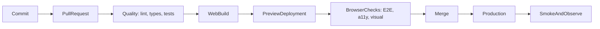

Frontend CI/CD 是把一個 commit 轉化成證據，最終成為 release 的系統。它不只是一份 YAML：它定義哪些檢查必須通過、哪個 artifact 值得信任、誰可以 promote，以及 production 不健康時團隊如何復原。

本文使用一個**虛構的** TypeScript 產品：包含 React web app 與共享 packages。像 `pnpm deploy:web` 這類 command 是刻意保留的 provider-neutral 邊界；真實團隊會用所選 hosting 平台實作它們。示例 artifact 是靜態 `dist` 目錄。Server-rendered React app 產出的 bundle 形狀不同，但規則不變：**只 build 一次、記錄 digest、test 那些 bytes，再 promote 同一個 artifact**。React Native 的交付——EAS Workflows、stage secrets、store submission——見 [用 EAS Workflows 做 React Native CI/CD](/notes/react-native-ci-cd-with-eas-workflows)。

<br />

---

## 1. CI、Continuous Delivery 與 Continuous Deployment

三個術語承諾的事情不同。

| Practice                        | Promise                                   | Typical trigger           |
| ------------------------------- | ----------------------------------------- | ------------------------- |
| **Continuous Integration (CI)** | 每次變更都經常合併並自動驗證              | Pull request 或 push      |
| **Continuous Delivery**         | 每個獲接受的 commit 都產生可發佈 artifact | CI 成功後由人工批准       |
| **Continuous Deployment**       | 每個獲接受的 commit 都自動發佈            | Release branch 的 CI 成功 |

React web 可以支援兩種 delivery model。團隊通常可在數分鐘內發佈 immutable artifact，並把流量切換到該版本。Production 是否必須人工批准，是 **policy** 選擇，不是平台限制。

不要因 pipeline 執行了 `build` 就稱它為「continuous deployment」。只留在 CI runner 上的 build 並未 delivery 到任何地方。

<br />

---

## 2. 一個接近 Production 的示例

假設 workspace 有清晰邊界：

```text
apps/
  web/                  React web application
packages/
  api-client/           typed transport and generated contracts
  domain/               framework-independent business rules
  ui-tokens/            shared colors, spacing, and typography
scripts/
  deploy-web.mjs        provider adapter for preview and production
.github/workflows/
  pull-request.yml
  release-web.yml
```

具體用哪種 monorepo tool 不如這一條重要：每個 check 都必須能在本機用與 CI 相同的 command 執行。

```json title="package.json"
{
  "packageManager": "pnpm@10.15.0",
  "scripts": {
    "format:check": "prettier --check .",
    "lint": "eslint . --max-warnings=0",
    "typecheck": "tsc -b --pretty false",
    "test": "vitest run --coverage",
    "build:web": "pnpm --filter web build",
    "test:e2e:web": "playwright test",
    "smoke:web": "pnpm test:e2e:web --grep @smoke",
    "deploy:web": "node scripts/deploy-web.mjs"
  }
}
```

Pin package-manager version 並 commit lockfile。若 `package.json` 與 lockfile 不一致，`pnpm install --frozen-lockfile` 應失敗；CI 不可靜默 resolve 另一套 dependency graph。

<br />

---

## 3. End-to-End Pipeline

Validation path 應保持快速。Preview 與 production 是同一個 artifact，只是 traffic pointer 不同。



一個實用目標：

1. **Push 前：**format 與 lint 已修改檔案。
2. **Pull request：**install、lint、format、type-check、test、build 和 scan。「scan」必須證明什麼，見 [DevSecOps](/notes/devsecops)。
3. **Preview：**deploy web artifact；針對 URL 跑 browser、accessibility 與 visual checks。
4. **Merge：**由已 review 的 commit 建立 production candidate。
5. **Release：**promote 同一個 artifact，不要重新 build。
6. **Verify：**執行 smoke tests，觀察 errors、performance 與 business signals。
7. **Recover：**把 production traffic 指回 last known-good release。

<br />

---

## 4. 用 GitHub Actions 建立 Pull-Request CI

由 least privilege、取消過時 runs、deterministic installation 和 parallel jobs 開始。

```yaml title=".github/workflows/pull-request.yml"
name: Pull request

on:
  pull_request:

permissions:
  contents: read

concurrency:
  group: pr-${{ github.event.pull_request.number }}
  cancel-in-progress: true

env:
  NODE_VERSION: "22"
  PNPM_VERSION: "10.15.0"

jobs:
  quality:
    runs-on: ubuntu-latest
    timeout-minutes: 15
    steps:
      - uses: actions/checkout@v4
      - uses: pnpm/action-setup@v4
        with:
          version: ${{ env.PNPM_VERSION }}
      - uses: actions/setup-node@v4
        with:
          node-version: ${{ env.NODE_VERSION }}
          cache: pnpm
      - run: pnpm install --frozen-lockfile
      - run: pnpm format:check
      - run: pnpm lint
      - run: pnpm typecheck
      - run: pnpm test

  web-build:
    needs: quality
    runs-on: ubuntu-latest
    timeout-minutes: 15
    steps:
      - uses: actions/checkout@v4
      - uses: pnpm/action-setup@v4
        with:
          version: ${{ env.PNPM_VERSION }}
      - uses: actions/setup-node@v4
        with:
          node-version: ${{ env.NODE_VERSION }}
          cache: pnpm
      - run: pnpm install --frozen-lockfile
      - run: pnpm build:web
      - uses: actions/upload-artifact@v4
        with:
          name: web-${{ github.sha }}
          path: apps/web/dist
          if-no-files-found: error
          retention-days: 7
```

在較大型系統，可把 Node 和 package manager setup 抽成 **composite action** 或 reusable workflow。不要為第一天的三行 YAML 過早 abstraction；當多個 workflows 必須保持同步時才抽取。

### 為何這個結構有效

- `permissions: contents: read` 拒絕 write access，除非某個 job 明確需要。
- `concurrency` 在 pull request 收到新 commit 後取消過時 run。
- `timeout-minutes` 防止 deadlocked test 無限佔用 runner。
- `needs` 讓 dependencies 可見，獨立 jobs 可 parallel 執行。
- Artifact name 包含 commit SHA，較容易追蹤 provenance。
- Package-store cache 加快 install，但不把 `node_modules` 當作 deployable artifact。

如要提高 supply-chain assurance，可把 third-party actions pin 到完整 commit SHA，再用 update bot 提出升級。`@v4` 這類 version tags 易讀，但屬於 mutable references。

<br />

---

## 5. 按成本與信號設計 Quality Gates

快速且 deterministic 的 checks 放前面；昂貴並依賴 environment 的 checks 放後面。

| Gate               | 證明什麼                                 | Failure 應阻擋         |
| ------------------ | ---------------------------------------- | ---------------------- |
| Prettier / ESLint  | Syntax 一致並遵守 agreed static rules    | Pull request           |
| `tsc --noEmit`     | Type contracts 可正確組合                | Pull request           |
| Unit tests         | Pure logic 與 domain rules 正確          | Pull request           |
| Component tests    | 用戶可觀察的 component behavior 正常     | Pull request           |
| Web build          | Bundler 與 production config 有效        | Pull request           |
| Browser E2E        | 關鍵 journeys 在 real browser 正常       | Merge 或 release       |
| Accessibility      | 沒有嚴重 automated WCAG violations       | Merge                  |
| Visual regression  | 經 review 的頁面沒有非預期改變           | Merge，baseline 需批准 |
| Performance budget | Bundle 與 key journeys 保持在 limits 內  | Merge 或 release       |
| Post-release smoke | Deployed system 可連接且可用             | 繼續 rollout           |

Coverage 是 supporting evidence，不是目標。即使 pipeline 有 95% line coverage，也可能漏掉壞掉的 login redirect、hydration mismatch，或在 CDN 後無法載入的 JavaScript chunk。

只有在 flaky test 有 owner、reason 與 expiry date 時才 quarantine。盲目 retry 會隱藏間歇性 production risk。

<br />

---

## 6. Preview、Browser Tests 與 Promotion

Preview deployment 把 E2E 從「app 能在 localhost 啟動」提升為「candidate 能跨越真實 hosting boundary 正常工作」。

```yaml title="Preview and browser checks"
web-preview:
  needs: web-build
  runs-on: ubuntu-latest
  environment: preview
  permissions:
    contents: read
    pull-requests: write
  outputs:
    url: ${{ steps.deploy.outputs.url }}
  steps:
    - uses: actions/checkout@v4
    - uses: actions/download-artifact@v4
      with:
        name: web-${{ github.sha }}
        path: apps/web/dist
    - id: deploy
      env:
        DEPLOY_TOKEN: ${{ secrets.WEB_PREVIEW_TOKEN }}
      run: |
        url="$(pnpm deploy:web --environment preview --artifact apps/web/dist)"
        echo "url=$url" >> "$GITHUB_OUTPUT"

web-e2e:
  needs: web-preview
  runs-on: ubuntu-latest
  timeout-minutes: 20
  steps:
    - uses: actions/checkout@v4
    - uses: pnpm/action-setup@v4
      with:
        version: "10.15.0"
    - uses: actions/setup-node@v4
      with:
        node-version: "22"
        cache: pnpm
    - run: pnpm install --frozen-lockfile
    - run: pnpm exec playwright install --with-deps chromium
    - run: pnpm test:e2e:web
      env:
        BASE_URL: ${{ needs.web-preview.outputs.url }}
```

Deploy command 是 adapter：上傳指定 artifact 並打印 URL。它不可重新 build。應該只 build 一次、記錄 digest、test 該 artifact，再 promote 相同 bytes。

### Frontend-specific preview gates

- 執行少量但能保護 revenue、authentication、data loss 與 navigation 的 journeys。
- 用 Axe 掃描代表性頁面，但仍保留 manual accessibility testing，因為自動化無法評估所有 WCAG requirements。
- 在固定 viewport sizes 與 fonts 下 capture visual baselines。
- 限制 compressed JavaScript budget，調查大型 route-level 變更。
- 在穩定 environment 執行 Lighthouse 或 user-flow performance tests；noise 大的 synthetic score 應先 warning，穩定後才 blocking。
- 把 source maps 上傳到 error-monitoring system；若產品需要，避免 source maps 可被公開 listing。

### Production promotion

在 GitHub `production` Environment 設定 required reviewers。Production job 應接收已 test artifact 的 identifier 或 digest：

```yaml title="Production promotion"
deploy-production:
  needs: [web-preview, web-e2e]
  if: github.ref == 'refs/heads/main'
  runs-on: ubuntu-latest
  environment: production
  permissions:
    contents: read
    id-token: write
  steps:
    - uses: actions/download-artifact@v4
      with:
        name: web-${{ github.sha }}
        path: apps/web/dist
    - run: pnpm deploy:web --environment production --artifact apps/web/dist
    - run: pnpm smoke:web
      env:
        BASE_URL: https://example.invalid
```

當 provider 支援時，`id-token: write` 可讓 OpenID Connect 獲取 short-lived cloud credentials。它比 permanent access keys 安全。只授予 deployment job，不要授予 pull-request workflow。

<br />

---

## 7. Configuration、Artifacts 與 Rollback

Browser code 無法保存 secret。任何嵌入 web bundle 的值——包括使用 `PUBLIC_` 之類 convention 的 variables——都必須視為 public。

分開管理：

- **Build-time public configuration：**API origin、analytics project ID、feature defaults。
- **Runtime server configuration：**只供 server functions 或 backend-for-frontend 使用的 credentials。
- **Deployment credentials：**只供 deployment job 使用。

團隊要決定 config 是 bake 進每個 artifact，還是在 runtime inject。Baked config 較簡單並容易 reproduce；runtime config 可讓同一 artifact 跨 environments，但需要經過設計的 loading mechanism。

靜態 React build 與 server-rendered React app 在這裡的失敗方式不同。Vite `dist` 沒有 private server runtime：所有到達 client 的 `import.meta.env` 都是 public。Next.js 或類似 server bundle 可以把 secrets 留在 server，但前提是那些值從未被 inline 進 Client Component 或 public environment prefix。

Rollback 流程：

1. 保留以 digest 或 release ID 定址的 immutable releases。
2. 把 production alias 或 traffic pointer 指回 last known-good release。
3. 只 purge 必須改變的 CDN entries；fingerprinted assets 應保持 immutable。
4. Rollback 後執行 smoke checks。
5. 保存 logs 與 failed artifact 供 diagnosis。

重新 build 舊 Git commit 不如 promote 原始 artifact 安全，因為 dependencies、base images 與 external build services 可能已改變。

Percentage canary 可選但有用。Feature flags 可以隱藏一條 risky path，而不必 rollback 整個 release；但 flag 不能替代一次 traffic switch 就能復原的 immutable artifact。

<br />

---

## 8. Secret Boundaries 與 Deployment Identity

Web deployment 看起來簡單，也因此更容易做錯：一把帶 production scope 的 preview token，就足以發佈錯誤的站點。

- 把 production deploy credentials 限制在 protected GitHub Environment 與 trusted branches。
- Preview deployments 使用另一把、權限更低的 token。
- 永不把 production secrets 暴露給來自 forks 的 pull requests。
- 避免對 untrusted code checkout 使用 `pull_request_target`；它可能把可寫 secrets 與攻擊者控制的 code 組合在一起。
- Mask 敏感 output，並確保 shell tracing 不會打印 credentials。
- 在到期前 rotate deploy tokens、cloud roles 與 monitoring keys。
- 優先使用 short-lived identity federation，而不是 long-lived access keys。

Pull-request workflow 不應能 deploy production。Production job 不應能執行 untrusted pull-request code。即使兩者在同一 repository，這兩套 identity 也必須分開。

<br />

---

## 9. Reusable Workflows，而不是 YAML Monolith

Pipeline 變大時，要分開 responsibilities：

```text
pull-request.yml       orchestration and PR permissions
release-web.yml        production web policy
reusable-node.yml      install, lint, types, unit tests
reusable-preview.yml   download artifact, deploy, emit URL
```

以明確 inputs 呼叫 reusable workflows；只有必要時才傳 secrets：

```yaml title="Reusable quality workflow"
jobs:
  quality:
    uses: ./.github/workflows/reusable-node.yml
    with:
      node-version: "22"
    secrets: {}
```

Policy 留在 caller：

- 哪些 branches 或 tags trigger；
- 哪個 environment 必須 approve；
- 授予甚麼 permissions；
- failure 是否阻止 promotion。

Mechanics 留在 reusable workflow：

- toolchain setup；
- deterministic install；
- build commands；
- artifact naming 與 upload。

避免用一份 workflow 加數十個 conditionals 同時處理 preview、staging 與 production。否則很難理解每條 path 取得哪些 permissions 與 secrets。

<br />

---

## 10. Observability 是 Delivery 的一部分

Green deployment command 只能證明平台接受了 artifact。

Web deploy 後：

- request health page 與一個 critical authenticated journey；
- 偵測 console errors 與 failed asset requests；
- verify app exposed release identifier；
- 比較新舊 release 的 error rate、latency 與 key business signals；
- 確認 source maps 把 stack traces 對應到正確 commit。

在 logs 與 telemetry 加上 release identity：commit SHA 與 artifact digest。缺少這些資料，就難以證明和逆轉「release 後 errors 上升」。

<br />

---

## 11. 常見 Failure Modes

| Symptom                                | Likely cause                                                            | First response                                             |
| -------------------------------------- | ----------------------------------------------------------------------- | ---------------------------------------------------------- |
| CI 本機成功但 runner 失敗              | Runtime 未 pin、lockfile drift、case-sensitive path、hidden local state | 在 clean container reproduce；比較 tool versions           |
| 舊 PR deploy 覆蓋較新 preview          | 缺少 concurrency 或 environment-specific release ID                     | 取消 stale runs；preview names 加 PR ID                    |
| E2E 間歇性變紅                         | Shared data、animation/timing assumptions、unstable selector            | Capture traces；隔離 state；等待 observable behavior       |
| Production 與 preview 不同             | Rebuilt artifact 或 build-time variables 不同                           | Promote tested digest；記錄 configuration                  |
| Web deploy 成功但 users 看到混合 files | Mutable filenames 或 CDN cache headers 錯誤                             | Fingerprint assets；不要把 HTML 當 immutable cache         |
| Deploy 後 client routes 404            | Hosting 只 serve files；缺少 SPA fallback 或 SSR routing                | 先配置 platform fallback，再把 deploy 視為 green           |
| Source maps 可被公開 listing           | Maps 與 assets 一起上傳且沒有 access control                            | Maps 只上傳到 error service；阻止 public listing           |
| Rollback 復原 code 但未復原 behavior   | Backend/schema/config change 非 backward-compatible                     | 使用 expand-contract changes 與 version-aware flags        |

Failure summary 應直接連到 traces、screenshots、logs、artifacts 與 commit。沒有 diagnostic context 的 notification 只會製造 noise。

<br />

---

## 12. 合理的 Adoption Order

不要在一個 pull request 建造最終平台。

1. 先令 lint、type-check、unit tests 與 web build 在本機 deterministic。
2. 每個 pull request 都執行，並設定 branch protection。
3. Upload immutable artifacts，記錄 commit SHA。
4. 加入 web previews 與小型 Playwright release-blocking suite。
5. 加入 accessibility、visual 與 performance signals。
6. 用 environment approval 與 short-lived credentials 保護 production。
7. 加入 post-release verification、演練過的 traffic rollback，以及可選 canary。
8. 量度 duration、failure rate、flaky tests 與 deployment recovery time。

成熟 pipeline 不是 jobs 最多的 pipeline，而是能快速提供可信證據、把 privileged work 減到最少、promote 真正測試過的 artifact，並令 recovery 成為日常操作的 pipeline。

Native binaries、over-the-air JavaScript 與 Expo EAS 見 [用 EAS Workflows 做 React Native CI/CD](/notes/react-native-ci-cd-with-eas-workflows)。
