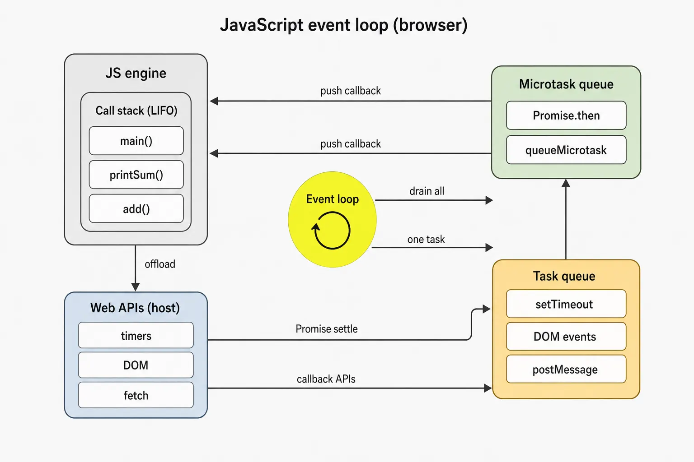
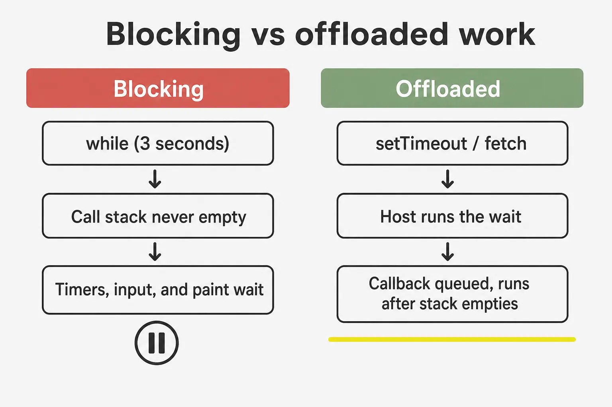
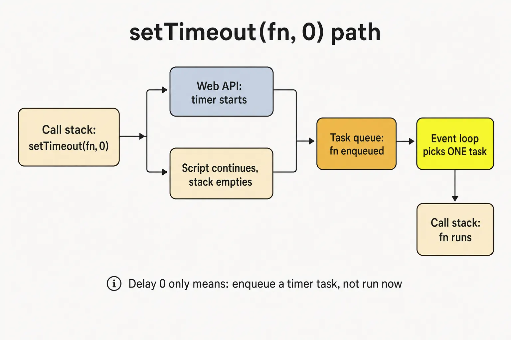
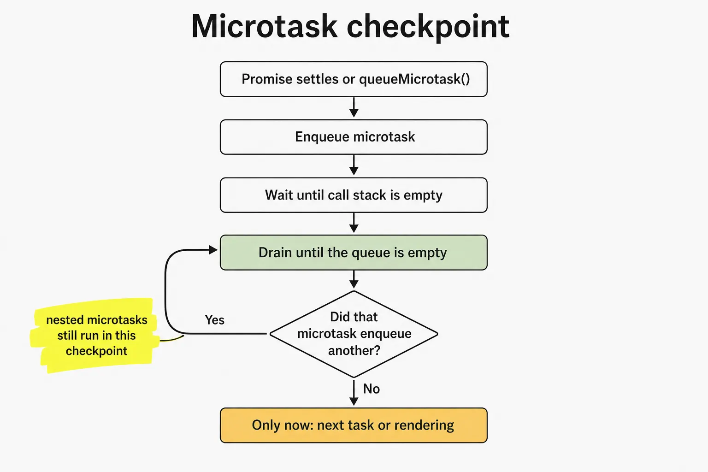
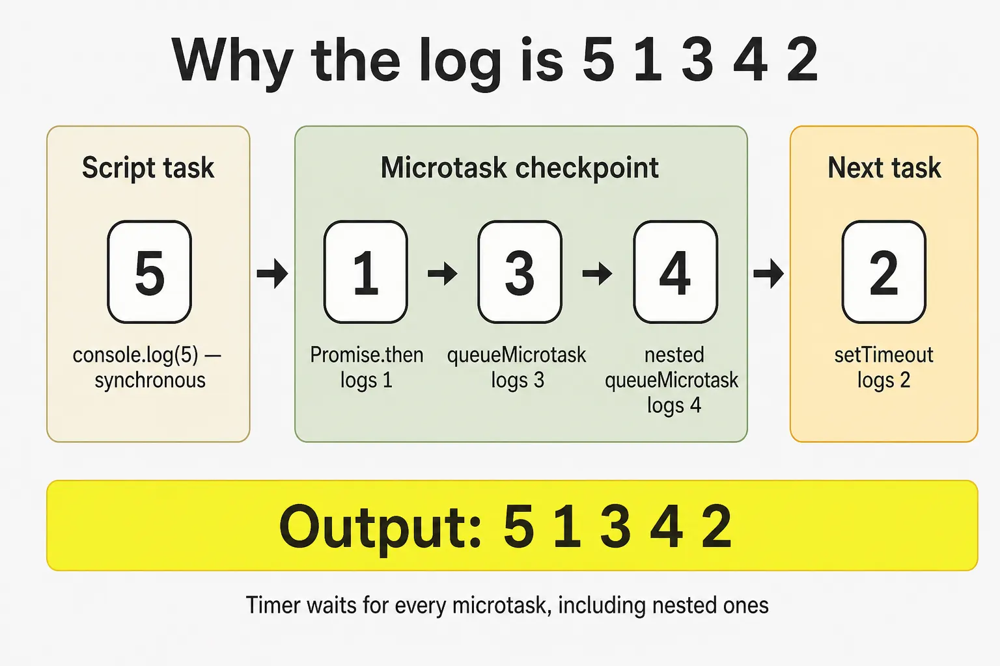
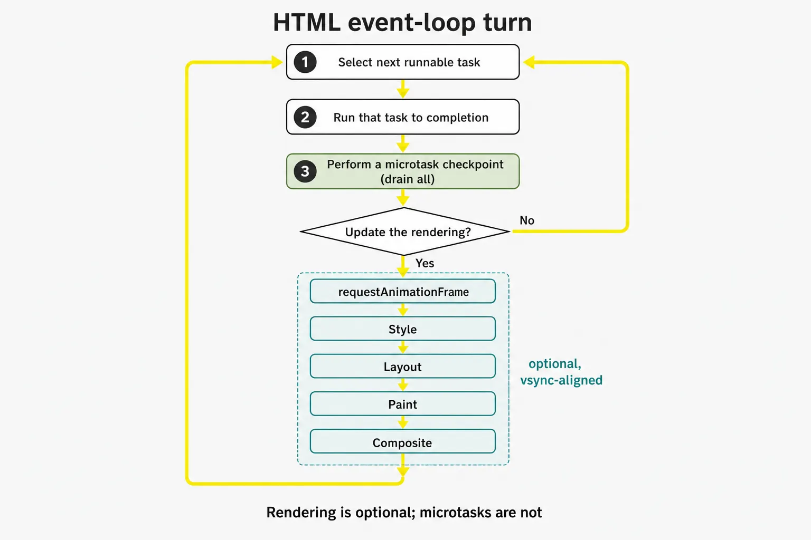
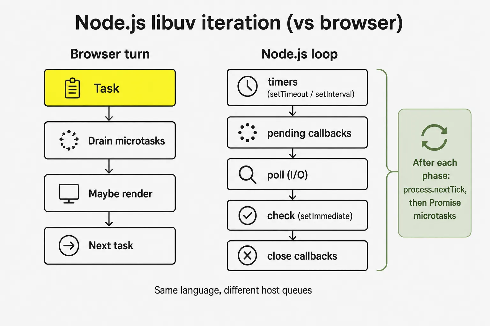

JavaScript 是 single-threaded。這不代表 timer 在走、或 network response 抵達時，browser 就閒著。它的意思是：**engine 一次只跑一段 JavaScript**，在 **call stack** 上；而 **host**——browser、Node.js、Deno——在背景做其他工作，稍後再請 engine 跑 callbacks。

負責這次交接的協調者是 **event loop**。它不是 JavaScript 語言功能。ECMAScript 規定 functions 如何互相呼叫、Promise jobs 如何被 queue。HTML Standard 規定 browser 如何把這些 jobs、timers、input、networking 與 rendering 變成重複的一輪：跑一個 **task**、排空 **所有 microtasks**、也許 **update the rendering**，然後再取下一個 task。

這篇筆記依 [Lydia Hallie 的可視化](https://www.youtube.com/watch?v=eiC58R16hb8) 同樣順序走完這個模型：stack、host APIs、task queue、microtask queue，然後是經典的 `5 1 3 4 2` 排序謎題。在影片的 recap 之後，會繼續進入 WHATWG algorithm、rendering starvation、作為另一個 host 的 Node.js，以及 workers。同一套 runtime 的概覽版是 [JavaScript 核心概念](/notes/core-javascript-concepts)。

<br />



<br />

同步程式碼在 stack 上跑。Host APIs 在 stack 外做完工作並 enqueue 一個 callback。每當 stack 為空，event loop 優先處理 **microtask queue** 並把它完全排空，然後才把 **一個** task 推上 stack。

---

## 1. Call Stack

**Call stack** 是 engine 目前正在執行什麼的 last-in, first-out 紀錄。呼叫 function 會 push 一個 **execution context**。return 或 throw 會把它 pop 掉。只有最頂端的 frame 在跑。

<br />

```ts
function add(a: number, b: number): number {
  return a + b
}

function printSum(): void {
  const result = add(2, 3)
  console.log(result)
}

printSum()
```

<br />

Stack 會成長為 `printSum` → `add`，再隨著每個 function return 而縮小。在這些 frames 還在的時候，沒有別的東西能跑——沒有 timer callback、沒有 click handler、沒有 Promise `.then`。JavaScript 不會為了去做別的事而搶佔目前這個 function。

這就是 single-threaded 的約束。緊密的 loop 不會「分享 thread」。它佔有 thread：

<br />

```ts
const start = Date.now()
while (Date.now() - start < 3000) {
  // The page cannot paint, handle clicks, or fire timers.
}
```

<br />



<br />

有用的問題不是「這是不是 asynchronous？」而是：**這會把 frame 留在 stack 上，還是會 return、讓 host 把工作做完？**

---

## 2. Web APIs 是 Host，不是 Engine

V8、JavaScriptCore 與 SpiderMonkey 負責 evaluate JavaScript。它們不實作 `setTimeout`、`document.querySelector` 或 `fetch`。那些是 **Web APIs**：host 暴露給 script 的介面。

當 script 呼叫 callback-based host API 時，典型路徑是：

1. 這次呼叫在 stack 上跑，幾乎立刻 return。
2. Host 開始真正的工作——timer、network request、DOM listener。
3. 工作完成時，host **不會**把 callback 推進 stack。它把它放到 queue，等 event loop。

<br />

```ts
console.log("A")

setTimeout(() => {
  console.log("C")
}, 1000)

console.log("B")

// A, B, then C after the timer and after the stack is empty
```

<br />

`setTimeout` 本身是 synchronous。它只是 **schedule**。Delay 參數交給 host。一秒後 host 有一個就緒的 callback。這個 callback 是在 1000ms、1004ms，還是更晚才跑，取決於 stack 與下面要講的 queues——不是只取決於 timer。

同樣的切分也適用於其他 callback-based APIs：`addEventListener`、`XMLHttpRequest`、`MessageChannel`、舊的 Node `fs.readFile(path, cb)`。完成發生在 host。恢復執行則經過 queue。

Promise-based APIs 仍然用 host 做 I/O。差別在於 **continuation** 加入哪一條 queue。`fetch(url).then(onResponse)` 在 host 裡等 network，Promise settle 之後把 `onResponse` 排成 **microtask**。這個區別就是本篇其餘部分。

---

## 3. Task Queue

HTML Standard 稱這些為 **tasks**。非正式寫作常說 **macrotasks**。Timers、user input、`postMessage`、解析一段 classic `<script>`，以及許多 networking callbacks，都會變成 tasks。

對大多數除錯來說，一條簡化規則就夠用：

- Event loop 跑 **一個** 被選中的 task。
- 然後做一次 **microtask checkpoint**。
- 只有在那之後，才會考慮下一個 task。

因此巢狀的 `setTimeout` 不能在父級目前這一輪裡繼續跑。它排程的是 **未來** 的工作：

<br />

```ts
const order: string[] = []

setTimeout(() => {
  order.push("timeout-1")
  setTimeout(() => {
    order.push("timeout-2")
  }, 0)
}, 0)

setTimeout(() => {
  order.push("timeout-3")
}, 0)

// Typical order: timeout-1 → timeout-3 → timeout-2
```

<br />

一條全域 FIFO queue 只是卡通。Host 維護多個 **task sources**——timer、DOM manipulation、user interaction、networking、history traversal——而且可能有不只一條 queue。Event loop 從某個 source **選出** 一個可跑的 task。理論上某個 source 可能被餓死；實務上「一個 task，然後 microtasks」這個心智模型仍能預測你的程式碼會做什麼。

Script evaluation 本身就是一個 task。你載入的檔案，或 parser 執行的 classic script，就是這個故事的第一個 task。Module 或 script **頂層**發生的一切，都是那個 task 跑到完成。

---

## 4. `setTimeout(fn, 0)` 不是立刻執行

Delay 為 `0` 的意思是「一旦你被允許跑 timer task 就盡快」，不是「在下一行之前」。Host 也可能 clamp 巢狀 timers——HTML 規定 nesting level 到 5 之後最少 4ms——但 clamp 是次要的。主要延遲來自 event loop。

<br />



<br />

Callback 必須等 **以下全部**：

- 目前這個 task 結束，且 stack 清空。
- 目前已 queue 的每一個 microtask，以及那些 microtasks 再 enqueue 的每一個 microtask。
- 任何已經在等的更早 tasks。

這就是為什麼零延遲 timer 仍然會輸給 `Promise.resolve().then(...)` 與 `queueMicrotask(...)`。Timer 已經就緒。它只是在錯誤的 queue。

---

## 5. Microtask Queue

**Microtasks** 是多數入門解釋會漏掉的一塊。當一個 task 結束、JavaScript execution context stack 為空之後，host 會做一次 **microtask checkpoint**：跑最舊的 microtask，重複直到 queue **清空**。

會 enqueue microtasks 的來源：

- Promise reaction jobs：`.then`、`.catch`、`.finally`
- `await` 之後的 `async` function continuation
- `queueMicrotask(fn)`
- `MutationObserver` callbacks

<br />



<br />

「排空直到清空」是重要規則。一個 microtask 若呼叫 `queueMicrotask` 或 resolve 另一個 Promise，會把工作加進 **同一輪** checkpoint。那些工作會在下一個 timer、click 或 paint 之前跑完。

<br />

```ts
const order: string[] = []

setTimeout(() => {
  order.push("task")
}, 0)

queueMicrotask(() => {
  order.push("micro-1")
  queueMicrotask(() => {
    order.push("micro-2")
  })
})

Promise.resolve().then(() => {
  order.push("promise")
})

// After the timeout finally runs:
// micro-1 → promise → micro-2 → task
```

<br />

`queueMicrotask` 與 `Promise.resolve().then` 共用一條 queue。順序就是它們被 schedule 的順序。它們不是比較快的 thread。它們是 **同一條 thread 上優先級更高的 queue**。

風險是好處的另一面。無界的 microtask 鏈永遠回不到 task queue，也回不到 rendering：

<br />

```ts
function starve(): void {
  queueMicrotask(starve)
}

starve()
// Timers, clicks, and frames wait until this stops.
```

<br />

這不是理論。一個總是再 schedule 下一個 `then` 的 Promise `then`，或一個從不 yield 到 task 的 `await` loop，可以在沒有任何 `while` 的情況下把頁面凍住。

`await` 是建在 Promises 上的語法，不是第二套 scheduler。`async` function 永遠回傳 Promise。碰到 `await` 會暫停該 function，讓目前的 stack unwind。等 awaited value settle 後，函式其餘部分會被 queue 成 microtask。即使 `await Promise.resolve()` 也會 yield。它不會在下一行同步繼續。

---

## 6. 把 Callback Promisify 會移動 Continuation

把 callback-based API 包進 Promise，並不會把 host 工作變成 microtask。它改變的是 host task 跑完 **之後**發生什麼。

<br />

```ts
function delay(ms: number): Promise<void> {
  return new Promise((resolve) => {
    setTimeout(resolve, ms)
  })
}

delay(0).then(() => {
  console.log("then")
})
```

<br />

`setTimeout` 仍然 schedule 一個 **task**。當那個 task 跑起來，它呼叫 `resolve`。Promise settle 之後，才把 `.then` handler 排成 **microtask**。這個 microtask 會在下一個 timer 或 click 之前跑，但在 resolve 這個 Promise 的 **timer task 之後**。

比較：

<br />

```ts
Promise.resolve().then(() => console.log("microtask first"))
setTimeout(() => console.log("task second"), 0)

delay(0).then(() => console.log("microtask after its timer task"))
```

<br />

第一個 `.then` 在目前這個 task 期間就被 queue，所以它贏下第一輪 checkpoint。`delay(0).then` 必須等它的 timer task 跑過才能跑。Promisify 會讓 **continuation** 相對已經 queue 的 microtasks 變晚，相對更後面的 tasks 變早。

這就是影片裡 "promisify" 那一段：host API 仍然走 task queue；Promise reactions 仍然走 microtask queue。你必須知道自己站在 `resolve` 的哪一邊。

---

## 7. Walkthrough：為什麼 log 是 `5 1 3 4 2`

Hallie 的挑戰是最短、卻能逼出模型每一塊的程式：

<br />

```ts
Promise.resolve().then(() => console.log(1))

setTimeout(() => console.log(2), 10)

queueMicrotask(() => {
  console.log(3)
  queueMicrotask(() => console.log(4))
})

console.log(5)

// 5, 1, 3, 4, 2
```

<br />

**在 script task 期間**，stack 仍在跑這個 module：

1. `Promise.resolve()` 建立一個已經 fulfilled 的 Promise。`.then` 立刻把它的 handler 排進 **microtask** queue。還沒有任何 log。
2. `setTimeout` 把 callback 與 10ms delay 交給 host。Host 啟動 timer。Callback 此時還不在任何 JS queue 上。
3. `queueMicrotask` 排入第二個 microtask。
4. `console.log(5)` 是 synchronous。它印出 **5**。
5. 與此同時 timer 可能到期。到期時 host 把 `() => console.log(2)` 排進 **task** queue。那仍然不是下一個該跑的 queue。

Script task 結束。Stack 為空。

**Microtask checkpoint：**

6. 最舊的 microtask：Promise handler。印出 **1**。
7. 下一個：`queueMicrotask` callback。印出 **3**，再 queue 另一個 microtask。
8. Checkpoint 還沒結束。巢狀 callback 跑起來，印出 **4**。
9. Microtask queue 清空。

**下一個 task：**

10. Timer callback 被推上 stack，印出 **2**。

<br />



<br />

即使 10ms timer 在 checkpoint 之前還沒到期，log 仍然會是 `5 1 3 4 2`——timer 只是稍晚一點加入 task queue。Microtasks 不等 timer。Timer 等 microtasks。

把 `queueMicrotask` 換成另一個 `Promise.resolve().then`，這些數字仍在同一類 queues。謎題重點不是 `queueMicrotask` 這個特別 API，而是 **stack 何時清空**，以及 **每個 callback 加入了哪一條 queue**。

---

## 8. HTML Event-Loop Algorithm

可視化是地圖。HTML Standard 是領地。簡化後、但更接近 spec 的 browser event-loop 一輪：

<br />



<br />

卡通通常跳過的三個細節：

**只要 JS stack 為空，checkpoint 就可以跑**，不只在某個被命名的 "turn" 結束時。Promise reactions 從不打斷 resolve 它們的那個 function。它們在該 stack unwind 之後立刻跑。

**Rendering 是可選的。** Browser 對齊的是螢幕刷新——常常是 60Hz 或 120Hz——而不是「每個 task 之後」。跳過一次 rendering opportunity 是正常的。因為 main thread 忙碌而跳過每一次 opportunity，才是 jank。

**`requestAnimationFrame` 不是 microtask。** 它在 "update the rendering" 期間跑，在 checkpoint 之後、style 與 layout 之前。把 DOM writes 排進 rAF，是讓它們對齊一個 frame。在那裡做沉重計算仍然會擋住 paint；只是把這次擋住對準 vsync。

[Browser 裡的 Critical Rendering Path](/notes/critical-rendering-path-in-the-browser) 就是那個 rendering 分支裡發生的事：style、layout、paint、composite。Event loop 決定這個分支 **何時**被允許跑。長 task 會延遲它。永遠排不空的 microtask 鏈會無限延遲它，因為 checkpoint 必須先結束。

這種耦合解釋了為什麼「async」JavaScript 仍然會掉 frames。緊密 loop 裡的 `await` yield 的是 microtasks，不是 tasks。要給 browser 機會 paint 或處理 input，工作必須回到一個 **task**——`setTimeout`、有的地方的 `scheduler.yield()`、`MessageChannel`，或 Worker。

---

## 9. Node.js 是另一個 Host

語言相同。Loop 不同。Node.js 由 **libuv** phases 驅動，不是 HTML 的「task、microtasks、也許 render」。

一次 Node iteration 的精簡圖：

<br />



<br />

| Mechanism | Browser | Node.js |
| --- | --- | --- |
| Timer callback | Task（timer source） | `timers` phase |
| Promise `.then` / `queueMicrotask` | Microtask queue | Microtask queue，在 `nextTick` 之後 |
| `process.nextTick` | 不存在 | 在目前 operation 之後、Promises 之前排空 |
| `setImmediate` | 不存在 | `check` phase |
| `setTimeout(fn, 0)` vs `setImmediate` | N/A | 順序取決於你從哪個 phase schedule |
| Rendering | "Update the rendering" | 沒有；這是 server |

<br />

`process.nextTick` 是鋒利的邊緣。它 **不是** HTML 意義上的 microtask，而且優先級 **高於** Promise jobs。`nextTick` loop 會餓死 I/O，就像 microtask loop 會餓死 rendering。若你要的是「這個 stack 之後、I/O 之前」，又不想插隊到 Promise queue 前面，優先用 `queueMicrotask` 或 Promise。

不要把 browser 的排序謎題搬到 Node 還指望同一份 log。從 main module schedule 的 `setImmediate` 與 `setTimeout(fn, 0)` 出名地不保證順序。從 I/O callback 裡，`setImmediate` 通常會贏，因為同一輪 iteration 裡 `check` 接在 `poll` 後面。

Deno 與 Bun 在 timers 與 microtasks 上更接近 browser，然後加上各自的 I/O。可攜規則仍然是：**要認識 host 的 queues，而不只是語言的 Promises。**

---

## 10. Workers 有自己的 Loops

**Web Worker**、**Shared Worker** 或 **Service Worker** 不是同一條 loop 上的第二個 stack。它是另一個 agent：自己的 heap、自己的 call stack、自己的 task 與 microtask queues、自己的 event loop。

`postMessage` 是 host API。訊息被 serialize、傳遞，並在接收端 agent 的 loop 上被 queue 成 **task**。Worker 可以在頁面的 loop 正在 paint 時計算。它不能碰頁面的 DOM。共享記憶體需要 `SharedArrayBuffer` 與明確協調；它不會把兩條 loops 合併。

這才是 browser JavaScript 真正取得 parallelism 的方式：另一條 event loop，透過 tasks 交談。把 `while` offload 到 worker，會釋放頁面的 stack。它不會讓 worker 自己的 stack 變得可搶佔。Worker 仍然能用長 task 或 microtask 鏈餓死 **它自己的** timers 與 **它自己的** message handlers。

---

## 11. 什麼會進哪一條 Queue

| API | Queue | Notes |
| --- | --- | --- |
| Sync function call | Call stack，立刻 | 擋住其他一切 |
| `setTimeout` / `setInterval` | Task | Delay 是下限 |
| `addEventListener` callback | Task | User-interaction 或其他 DOM source |
| `postMessage` / `MessageChannel` | Task | 用來 yield 給 rendering 很有用 |
| `fetch` completion then `.then` | Host I/O，然後 microtask | Network 本身不是 microtask |
| `Promise.then` / `.catch` / `.finally` | Microtask | 即使 Promise 已經 settled |
| `queueMicrotask` | Microtask | 與 Promise jobs 同一條 queue |
| `async` function after `await` | Microtask | `await` 永遠 yield |
| `MutationObserver` | Microtask | 在同一輪 checkpoint 跑 |
| `requestAnimationFrame` | Rendering | Microtasks 之後、paint 之前 |
| `requestIdleCallback` | Idle task | 不是 microtask；負載高時可能永不跑 |
| `process.nextTick` | Node nextTick queue | 每個 phase 裡，在 Promise microtasks 之前 |
| `setImmediate` | Node `check` phase | Poll 之後 |

<br />

當 log 順序讓你意外時，三個問題通常就能定位：

1. **現在 stack 上是什麼？** 那段程式碼永遠先跑完。
2. **什麼被 queue 成 microtask？** 它們全部會在下一個 task 與 rendering 之前跑完。
3. **什麼必須等下一個 task？** Timers、input、messages，以及下一段 script。

背下 `5 1 3 4 2` 不如能對任何片段畫出這三個桶。Event loop 不是魔法，也不是 parallelism。它是一條政策：單一 thread 何時被允許跑下一個 callback。
