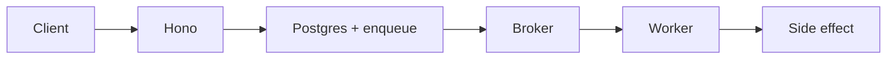
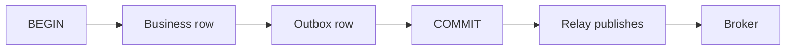

Request cycle 不適合放慢、突發、或必須在這個 process 掛掉之後還活著的工作。**Message queue** 是 producer 與 consumer 之間的 durable buffer。HTTP handler 做完 authenticate、persist intent、enqueue，然後返回 **202**。

Typed API 一路到 production 的 protect、monitor 與 recover 見 [用 Hono、Drizzle、Zod OpenAPI 與 SST 打造 Backend APIs](/notes/backend-apis-hono-sst)。Stages 與 deploy loop 見 [用 SST 管理 AWS 基礎設施與 DevOps](/notes/using-sst-for-aws-infra-and-devops)。這篇 note 講的是 queue。

<br />

---

## Pattern Map

| Pattern | Typical input | Reach for it when |
| --- | --- | --- |
| Async offload | HTTP request | Response 不需要做完的結果 —— email、thumbnails、invoices |
| Fan-out | One event, many subscribers | 多個獨立 consumers 必須看到同一次 write |
| Buffering | Spike vs worker capacity | Inbound RPS 可以跳；workers 不該跟著跳 |
| Reliability | Side effect that must retry | 工作必須在這個 process 消失之後還發生 |

<br />

---

## 1. 為什麼需要 queue

Queue **decouple** producer 與 consumer。Producer 不等 side effect。Consumer 不必在 write 的那一刻在線。

<br />

- **Decouple.** Hono 先 return。一個 worker——也許在另一個 process，也許更晚——再去做 email、webhook、search index。
- **Buffer.** 10x spike 是 queue-depth 問題，不是 API-fleet 問題。Ingest 跟 requests 擴；workers 跟 depth 擴。
- **Retry.** 接住 request 的那個 process 可以死。Broker 仍然握著 message。必須在這台機器消失之後發生的工作，屬於 queue。

<br />

**Failure:** 在 request 裡做 CRM sync、emails 與 domain workflows，於是 spike 打垮 API，provider 的 retries 再把它放大。Ingest 是 write-ahead log。其他都是 consumer。

<br />

---

## 2. Producer、broker、consumer

三個角色。**Producer** 寫一條 message。**Broker** 把它 durable 存下來再發出去。**Consumer** 做完工作然後 **ack**。

<br />



<br />

- Handler 保持薄：validate、persist intent、enqueue、**202**。Status row 是用戶稍後能讀到的東西。
- Broker 是 shock absorber——這套 stack 上是 SQS，或等價物。它不是 business write 的 source of truth。Postgres 才是。
- Worker pull、apply、ack。如果它在 ack 之前 crash，broker 會再 deliver 一次。

<br />

```ts title="src/routes/invoices.ts"
app.post("/invoices/:id/send", async (c) => {
  const { id } = c.req.valid("param")
  const eventId = c.req.header("idempotency-key") ?? crypto.randomUUID()

  await db.transaction(async (tx) => {
    await tx.update(invoices).set({ status: "queued" }).where(eq(invoices.id, id))
    await tx.insert(outbox).values({
      id: eventId,
      type: "invoice.send",
      payload: { invoiceId: id },
    })
  })

  return c.json({ id, status: "queued" }, 202)
})
```

<br />

**Failure:** enqueue 還沒有被 durable 記下來的工作。Crash 等於 lost intent。如果 queue 掛了也必須發生，**request 裡的 database write** 才是 source of truth；queue 只是 relay。

<br />

---

## 3. 留在 request 還是離開

工作留在 request cycle，當用戶 **沒有答案就無法繼續**。它離開，當 HTTP response 不需要做完的結果。

<br />

| Stays synchronous | Leaves for a queue |
| --- | --- |
| Password check | Email、outbound webhooks |
| 螢幕上的 price | Thumbnails、search indexing |
| UI 馬上要展示的 payment **authorization** | Invoices、flaky third parties |

<br />

即便同步路徑也保持薄。Authenticate、persist、return。Payment authorization 是 UI 現在需要的 yes 或 no；扣卡與發收據不是同一份工作。

<br />

**Failure:** **sync-over-async** —— enqueue 然後堵住 socket 等到 worker 做完。Broker 的 latency、timeout 與 retry policy 現在成了 HTTP request 的 latency。另一個是 persist 之前就返回 **200**：crash 等於 lost events。

<br />

---

## 4. Queue vs pub/sub vs stream

**Queue** 把每條 message 交給 **一個** consumer。**Pub/sub** 把同一條 message 交給 **每一個** subscriber。**Stream** 是可 replay 的 log：consumers 握著 offset，可以再讀。

<br />

| Shape | Who gets the message | Reach for it when |
| --- | --- | --- |
| Queue | N 個 competing consumers 中的一個 | 一份 job 只該跑一次 —— 發這張 invoice |
| Pub/sub | Every subscriber | 一次 write，多個獨立反應 —— cache bust、notify、audit |
| Stream | 每個 consumer group，按 offset | Replay、多個獨立 readers、有序 history |

<br />

- Queue 上的 competing consumers 提高 throughput。它們不 fan out。如果兩個 services 都必須看到這筆 order，那是 pub/sub，或從 outbox 餵兩條 queues。
- Stream（Kafka、Kinesis）不是更好的 queue。它是 log。Offsets、retention 與 replay 才是重點。把它當一次性 work queue 是浪費這個模型。
- Redis pub/sub 是 **bus**，不是 broker：沒有 durability，沒有 retry。適合跨 instances 的 WebSocket fan-out。不適合 invoices。

<br />

**Failure:** 一條 queue、兩個都需要這個 event 的 consumers，然後稱之為 fan-out。其中一個永遠看不到 message。另一個是只在 process 內 publish——一台機器上能用，另外三台沉默。

<br />

---

## 5. Delivery semantics

**At-most-once** 是 send and forget：duplicates 少見，**允許 loss**。**At-least-once** 是 retry until ack：**允許 duplicates**，不允許 loss。Production 裡大多數 brokers 是 at-least-once。

<br />

- Application space 裡的「exactly-once」通常是 at-least-once **加上 idempotent consumer**。Broker 會 deliver 兩次。Consumer 必須讓兩次都安全。
- Lambda 可以兩次 invoke 同一個 handler。Client timeout 不是 negative acknowledgment。Network 是帶可變 delay 的 lossy queue。即便 slide 寫 exactly-once，也按 at-least-once 設計。
- Publishers 保持無聊：同一把 key，同一份 payload。Consumers 仍然保持 idempotent，因為 retries 還是會發生。

<br />

**Failure:** 把 broker 的「exactly-once」checkbox 當成 inbox 的替代。FIFO SQS 在一個 window 內去重。它不能讓 window 之後、crash 發生在 side-effect 中途、或第二個 producer 之後的 double charge 變得不可能。

<br />

---

## 6. Idempotent consumers

給定 at-least-once：穩定的 **event id**、帶 unique constraint 的 **inbox** 表，**database effects 與 inbox insert 在同一筆 transaction**。Durable write **之後** 再 **ack**。

<br />

```sql
CREATE TABLE inbox (
  event_id   uuid PRIMARY KEY,
  processed_at timestamptz NOT NULL DEFAULT now()
);

-- same transaction as the business effect
INSERT INTO inbox (event_id) VALUES ($1);
UPDATE invoices SET status = 'sent' WHERE id = $2;
```

<br />

- Side effects 做成 **upserts**，不要盲 increment。`UPDATE … SET sent_at = now() WHERE sent_at IS NULL` 可以安全 retry。`SET send_count = send_count + 1` 不行。
- 對 Stripe 或 email，先 persist 一行 operation，ack 之前帶上 provider 的 **idempotency key**。Provider 是另一個 at-least-once 系統。
- `event_id` 上的 unique constraint 就是 lock。Check-then-insert 會 race；`ON CONFLICT` 是一條 statement。Schema 才是 API —— [SQL 核心概念](/notes/core-sql-concepts)。

<br />

**Failure:** 在 side effect 之前 ack，或做了 side effect 卻不記錄 id——retry 就會 double-charge。Catch 了 errors 仍然 ack，於是 poison message 消失。At-least-once 只有在 failure **nack**、success **idempotent** 時才有用。

<br />

---

## 7. Dual-write 與 outbox

Dual-write 是：`COMMIT` business row，然後再 publish。Process 可以死在兩者之間。Row 在，message 不在。或者 message 在，row 已經 rollback。

<br />



<br />

- **Outbox** 修掉它：在 **同一筆 Postgres transaction** 裡寫入 business row 與 outbox row。Relay 再 publish 到 broker。Delivery 仍然是 at-least-once，所以 consumers 保持 idempotent。
- Distributed transactions 不跨 services 跑。Two-phase commit **堵在 in-doubt transactions 上**，並把每個 participant 的 availability 綁在一起。每個 service 的 database 保持 transactional；協調靠 messages。
- **Saga** 是一串 local transactions。第三步失敗，就對第一步和第二步跑 **compensations**。Compensation 不是 undo。Payment compensation 是一筆 **refund**，有自己的 audit——durable 且 retryable。

<br />

**Failure:** 跳過 outbox，指望 `COMMIT` 之後再 send 就夠了。第一次 crash 就會失敗。把 compensation 當成 distributed transaction 的 rollback 是另一個——錢已經動了。

<br />

---

## 8. Ordering 與 competing consumers

**FIFO 是 per key 的**，不是 global。一條有許多 consumers 的 queue 提高 throughput，同時 **打破 order**——除非必須保持順序的 messages 共享一把 key。

<br />

- SQS standard：盡力 order、at-least-once、幾乎無限 throughput。SQS FIFO：按 `MessageGroupId`，在 deduplication window 內 exactly-once，更低 throughput。
- Kafka / Kinesis：order 在 **partition** 內部。選 partition key 的方式與選 FIFO group 一樣——`invoiceId`，而不是 `tenantId`，如果一個 tenant 能把 log 打成 hot-spot。
- Competing consumers：N 個 workers 從一條 queue pull。Throughput 可擴。同一張 invoice 的兩條 messages 可以同時跑，除非它們共享一個 group，或 consumer 用 row lock 序列化。

<br />

**Failure:** 在一條熱 queue 上要求 global order，然後加 consumers 來「修 latency」。Latency 下降了。Invoice 在生成之前就被發出去。Order 是 keying 問題，不是 replica-count 問題。

<br />

---

## 9. Retry、jitter、DLQ

先分類。Timeouts、503s、lock contention、「connection reset」——**retry**。Validation errors、400s、未知 event types——**不要 retry**；它們不會自癒，卻會永遠佔著 consumer。

<br />

- 四個控制：**exponential backoff**（`base * 2^attempt`，帶 cap）、**jitter** 讓一萬個 workers 不會在同一毫秒醒來、**max attempts** 讓 poison 不能轉一整夜、天花板之後進 **dead-letter queue**，DLQ depth 上升時要有 metric 與 page。
- Retry 住在 **queue** 裡（visibility timeout、內建 backoff）或同形狀的 library——不是 handler 裡的 `while`。只 retry **idempotent** handlers。
- 沉默的 DLQ 是多了幾步的 lost business event。Depth 是 page，不是 dashboard 上的好奇。

<br />

**Failure:** retry 一個非 idempotent 的 POST，或永遠 retry 且沒有 DLQ，於是一份壞 JSON 坐在熱 partition 上。共享 outage 之後 **沒有 jitter** 的 backoff 是 thundering herd。

<br />

---

## 10. Backpressure

Workers 按 **queue depth** 擴，不按 inbound RPS。API 吸收；worker fleet 才是 throttle。

<br />

- Visibility timeout 必須 **比 handler 長**。如果 timeout 在 worker 還在跑時觸發，另一個 consumer 會拿走同一條 message——inbox 必須扛得住這份 duplicate。
- 給每個 worker cap concurrency。一個打開二十個 Postgres sessions、又被允許無限 in-flight messages 的 handler，會在 queue 看起來還不夠深之前耗盡 pool。
- SIGTERM 時：停止 fetch，做完當前 messages，deadline 到了就 **nack**，最後才關 DB pool。只 drain HTTP 卻讓 consumers 跑到被 kill，就是 in-flight jobs 再被 deliver 一次外加 502 的原因。

<br />

**Failure:** 按 RPS autoscaling API，worker count 卻是常數。Queue 無界增長，visibility timeouts 堆起來，每次 retry 看起來都像更多 traffic。另一個是 handler 要調一個 45 秒的 third party，visibility timeout 卻是 30s。

<br />

---

## 11. Broker 怎麼選

Broker 是 durability 與 delivery 的合同，不是品牌。這套 stack 上 AWS 的預設是 **SQS**，跟 API 一樣經 SST 接線 —— [用 SST 管理 AWS 基礎設施與 DevOps](/notes/using-sst-for-aws-infra-and-devops)。

<br />

| Broker | Shape | Reach for it when |
| --- | --- | --- |
| **SQS** | Queue，at-least-once，optional FIFO | AWS 上的預設 work queue。Lambda 或 worker fleet 來 consume。 |
| **RabbitMQ** | Queue + routing | 複雜 routing keys、已有 AMQP ops、還不在 AWS 上。 |
| **Kafka / Kinesis** | Replayable log | 多個獨立 readers、有序 history、replay。 |
| **Redis lists / streams** | Fast，更弱的 durability | Ephemeral jobs、caches、fan-out。不是錢。 |

<br />

- 「做這份 job」的 production 預設是 SQS standard。需要一把 key 保持有序、且 throughput 允許時才用 FIFO。
- 把 Kafka 當 work queue、卻沒有把 offsets 當成產品，通常是多了 ops 的 SQS。把 Redis 當 invoice broker，是在賭 failover 時 AOF 不會丟掉一次 write。
- Handler 仍然不必認識 broker。Adapter 負責 enqueue。Tests 可以換 adapter。Inbox 與 outbox 留在 Postgres。

<br />

**Failure:** 因為「以後也許需要 replay」而選 Kafka，然後把 consumer groups 當成 competing-consumer queues，再奇怪為什麼一個 crash 的 reader 會卡住一個 partition。或者把 invoice send 的唯一副本放進 Redis list。

<br />

---

## 12. Tenant 與 traces

一個處理「generate invoice」的 worker，如果 message 上沒有 tenant，consume 時也不做 membership check，就會寫進它碰巧握著的那條 database connection。

<br />

- 每條 message 帶上已驗證 request 裡的 `organizationId`。Consumer 為那個 org 打開 RLS transaction。如果 client 能 enqueue，tenant 不能只從 job payload 取。Isolation 只活在 Hono 裡，少一個 filter 就會漏 —— [用 Hono、Better Auth、Drizzle 與 Postgres RLS 打造 Multi-Tenant 後端](/notes/multi-tenant-backend-drizzle-hono-better-auth)。
- **Correlation id** 在 edge 出生，並複製到這次 request 去過的每個地方。每條 queue message 把它放進 **attributes**，不只放進可能被剝掉的 JSON body。**W3C `traceparent`** 是結構化形式。
- 缺了就生成，永遠不要拿它做 auth，並且給它建 index。用戶說「14:02 失敗了」，就能從 gateway span 跳到處理那次 SQS hop 的 worker。

<br />

**Failure:** 只有 HTTP 上的 ids——consumer 打一條新 uuid，trail 死在 queue。Worker 信任 payload 裡的 `organizationId` 卻沒有 RLS。Queue 沒有洩漏。Consumer 洩漏了。

<br />

---

## Recap Q&A

<Accordion type="single" collapsible>
  <AccordionItem value="mq-when">
    <AccordionTrigger>1. 什麼時候該讓 request 離開 request cycle，進 queue？</AccordionTrigger>
    <AccordionContent>

      - 工作離開 request cycle，當 **HTTP response 不需要做完的結果**，或工作慢、突發、必須 **在這個 process 消失之後還能 retry**。Email、outbound webhooks、thumbnails、invoices、search indexing、flaky third parties——那就是 **queue**。Authenticate、persist intent、enqueue、返回 **202**。
      - 用戶沒有答案就無法繼續時，它保持同步：password check、螢幕上的 price、UI 馬上要展示的 payment **authorization**。即便如此 handler 也保持薄。
      - 如果 queue 掛了也必須發生，**request 裡的 database write** 才是 source of truth；queue 只是 relay。
      - **Failure:** **sync-over-async** —— enqueue 然後堵住 socket 等到 worker 做完。另一個是 enqueue 還沒有被 durable 記下來的工作——crash 等於 lost intent。

    </AccordionContent>
  </AccordionItem>

  <AccordionItem value="mq-delivery">
    <AccordionTrigger>2. At-least-once 實際上要求 consumer 做什麼？</AccordionTrigger>
    <AccordionContent>

      - **At-most-once** 是 send and forget：duplicates 少見，**允許 loss**。**At-least-once** 是 retry until ack：**允許 duplicates**，不允許 loss。Production 裡大多數 brokers 是 at-least-once。
      - Application space 裡的「exactly-once」是 at-least-once **加上 idempotent consumer**：穩定的 **event id**、**inbox** unique constraint、**effects 與 inbox insert 在同一筆 transaction**。Durable write **之後** 再 **ack**。
      - Side effects 做成 **upserts**，不要盲 increment。對 Stripe 或 email，ack **之前** 帶上 provider 的 idempotency key。
      - **Failure:** 在 side effect 之前 ack，或做了 side effect 卻不記錄 id。At-least-once 只有在 failure **nack**、success **idempotent** 時才有用。

    </AccordionContent>
  </AccordionItem>

  <AccordionItem value="mq-outbox">
    <AccordionTrigger>3. 為什麼 COMMIT-then-publish 是 dual-write，outbox 改了什麼？</AccordionTrigger>
    <AccordionContent>

      - 先 `COMMIT` business row，再 publish：process 可以死在兩者之間。Row 在而 message 不在——或反過來。
      - **Outbox** 在 **同一筆 Postgres transaction** 裡寫入 business row 與 outbox row。Relay 再 publish 到 broker。Delivery 仍然是 at-least-once，所以 consumers 保持 idempotent。
      - Distributed transactions 不跨 services 跑。協調靠 messages。**Saga** 是 local transactions 加上 **compensations**——refund，不是 undo。
      - **Failure:** 跳過 outbox，指望 `COMMIT` 之後再 send 就夠了。第一次 crash 就會失敗。

    </AccordionContent>
  </AccordionItem>

  <AccordionItem value="mq-retry">
    <AccordionTrigger>4. 怎麼 retry 一個失敗的 worker，同時不毒化 queue？</AccordionTrigger>
    <AccordionContent>

      - 先分類。Timeouts、503s、lock contention——**retry**。Validation errors、400s、未知 event types——**不要 retry**。
      - 四個控制：帶 cap 的 **exponential backoff**、**jitter**、**max attempts**、天花板之後的 **dead-letter queue**——DLQ depth 上升時要有 metric 與 page。
      - Retry 住在 **queue** 裡，不是 handler 裡的 `while`。只 retry **idempotent** handlers。Visibility timeout 必須比 handler 長。
      - **Failure:** 永遠 retry 且沒有 DLQ，於是一份壞 JSON 坐在熱 partition 上。共享 outage 之後 **沒有 jitter** 的 backoff 是 thundering herd。沉默的 DLQ 是多了幾步的 lost business event。

    </AccordionContent>
  </AccordionItem>

  <AccordionItem value="mq-shapes">
    <AccordionTrigger>5. 什麼時候 queue 是錯的形狀——該用什麼代替？</AccordionTrigger>
    <AccordionContent>

      - **Queue** 把每條 message 交給 N 個 competing consumers 中的 **一個**。適合「發這張 invoice」。
      - **Pub/sub** 把同一條 message 交給 **每一個** subscriber。適合一次 write、多個獨立反應。Redis pub/sub 是 bus，不是 broker——適合 WebSocket fan-out，不適合 invoices。
      - **Stream** 是可 replay 的 log。Offsets、retention 與 replay 才是重點。把 Kafka 當一次性 work queue 是浪費這個模型。
      - **Failure:** 一條 queue、兩個都需要這個 event 的 consumers，然後稱之為 fan-out。其中一個永遠看不到 message。

    </AccordionContent>
  </AccordionItem>
</Accordion>
