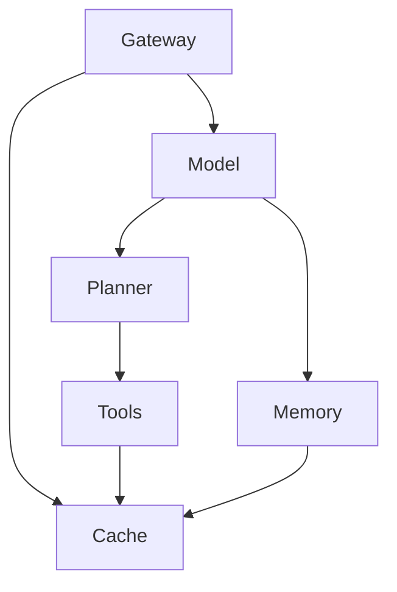
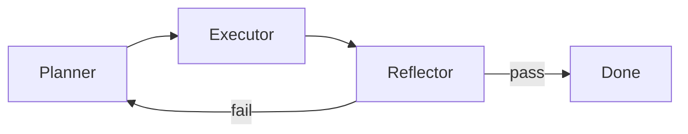

Production agents 死在 harness，不是死在 model。更強的 LLM 取代不了 identity checks、retry bounds、cache invalidation，或 capacity isolation。Model 選下一步動作。System 決定那個動作允不允許、能跑多久、錯了之後怎麼辦。

白白說大模型用一組 ByteDance 風格的面試題走同一片地，見 [Agent系統架構與工程落地十連問快問快答](https://www.youtube.com/watch?v=x-s1Dbp4BE4)。這份 note 是那十題對 **Mastra**、**Hono**、**Better Auth**、**Pinecone** stack 的 production 讀法。Tokens 住在哪裡，見 [Agent memory 的四個層級](/notes/four-levels-of-agent-memory)。Documents 怎麼變成可搜，見 [如何搭建一套 RAG 系統](/notes/how-to-build-a-rag-system)。Cache 與 queues 跟 [System Design 裡的 Caching](/notes/caching-in-system-design) 和 [System Design 裡的 Message Queues](/notes/message-queues-in-system-design) 是同一套 primitives。

<br />

---

## 1. 六層 production 形狀

不要先畫框。先講清楚誰被允許做什麼。Production agent 是普通後端本來就有的六層，model 坐在 request 中間：

<br />



<br />

| Layer        | Job                                                                 | 在這套 stack                                                |
| ------------ | ------------------------------------------------------------------- | ---------------------------------------------------------- |
| **Gateway**  | Authenticate、rate-limit、route session                             | Hono + Better Auth。Agent 跑之前先做 org membership        |
| **Model**    | Infer，決定下一步                                                   | LLM。不是 identity 的來源                                  |
| **Memory**   | 讀寫對話與長期 context                                              | Mastra `Memory` 加一個 store                               |
| **Planner**  | 把 intent 拆成帶 acceptance criteria 的可執行步驟                   | Agent loop，或一個 bound 這個 loop 的 Mastra workflow      |
| **Tools**    | 碰世界：APIs、databases、search                                     | `createTool` 配 Zod schemas                                |
| **Cache**    | 重用熱結果。永遠不是第二個 source of truth                          | Redis 或同等物，有 key、有 version                         |

Gateway 像機場安檢：貴的東西還沒開始就先跑。Session、`userId`、`organizationId` 來自 verified Better Auth session 與 membership check，再放進 Mastra `requestContext` — 同一份契約見 [用 Hono、Better Auth、Drizzle 與 Postgres RLS 打造 Multi-Tenant 後端](/notes/multi-tenant-backend-drizzle-hono-better-auth)。Model 從不挑選 tenant。

**Failure：** 把 org、role、或 namespace 放進 model 填得了的 tool argument。那是洩漏，不是 feature。

<br />

---

## 2. Plan、execute、reflect 當成 state machine

有用的 agent 不是「再想硬一點」。它是一台有三個角色的 **state machine**：

- **Planner** — 產出有序步驟，每步帶 acceptance check。複雜 intent 變成系統其餘部分跟得上的 flow。
- **Executor** — 按那個順序呼叫 tools 與 models。它跟計畫走。它不發明新的 product surface。
- **Reflector** — 用 acceptance check 驗證結果。失敗時 **帶著失敗原因重新 plan**，像導航在路被堵住之後重算。

<br />



<br />

沒有硬停止，loop 會一直救自己，把 context window 燒掉。三道鎖不是可選的：

1. **Max retry rounds** — re-plan 的上限，不是建議。
2. **Per-step timeout** — hung 的 tool 是失敗的一步，不是更長的等待。
3. **Human fallback** — 高風險或耗盡的路徑停下來等人。

**Failure：** 無界的 ReAct loop。那是帶 chat UI 的 token 焚化爐。

<br />

---

## 3. Memory 是條理，不是長度

更長的 context 不是更好的 memory。無法被寻址、過期、或 invalidation 的 memory，只是更大的 prompt。Ops 視角是四層。這不是 [Agent memory 的四個層級](/notes/four-levels-of-agent-memory) 裡 Mastra 的 token-level 切法 — 那篇講的是 *tokens 住在哪裡*。這張表講的是 *durable data 住在哪裡*：

<br />

| Tier | 放什麼                                | Typical store                         | 何時讀                             |
| ---- | ------------------------------------- | ------------------------------------- | ----------------------------------- |
| **L1** | Short-term session context（熱）    | Redis、session cache                  | 每個 turn                           |
| **L2** | Rolling session summary             | 壓在 thread 旁邊的 compressed text    | raw window 裝不下時                 |
| **L3** | 長期 user 或 org profile            | Vector recall                         | 跨 sessions 的稀疏 facts            |
| **L4** | 不能漂的業務事實                    | Postgres / 產品資料庫                 | 價格、庫存、entitlements、policy    |

L4 是 source of truth。跟 Postgres 打架的 vector hit 是過期 index，不是更好的答案。

Cache keys 必須比「這個 user」更細。可重用的形狀是 `userId + sessionId + toolId + result`，每個 key 綁 **TTL**、**version**、以及一條 **active invalidation** 路徑。亂的 cache 比沒有 cache 更糟：髒列會污染之後每一個 turn。

**Failure：** 把 context window 當成產品資料庫，或 cache tool results 卻沒有 version，於是價格改了永遠進不來。

<br />

---

## 4. 按 scale 選 vector store

選你真正有的 QPS 與 tenancy model，不是上週 demo 裡的那一個。

<br />

| Store        | Fit                                      | 選錯的代價                                                      |
| ------------ | ---------------------------------------- | -------------------------------------------------------------- |
| **Chroma**   | Local prototypes。上手快                 | 沒有認真的 distribution。Corpus 長大，query quality 就掉        |
| **Pinecone** | Managed hybrid search。這份 repo 的路徑  | Data 住在 vendor。QPS 與 dimension 上升，成本跟著升            |
| **Milvus**   | Private、cloud-native、storage/compute 分離 | 你自己運維。回報是 billion-scale retrieval                   |

高 QPS 的商品搜尋不是「更多 vectors」。Category、price、stock 是 **filters**，不是 neighbors。RAG note 已經用 `namespace = organizationId` 切單一 Pinecone hybrid index。在 corpus 與 concurrency 真的需要自建 cluster 之前，留在那條路上。

**Failure：** 把 SKUs 當散文 embed，然後指望 cosine similarity 執行「這個地區有貨」。

<br />

---

## 5. Function-calling 的裝甲

Tool call 是帶著 production credentials 的不信任實習生。Model 的 JSON 與 side effect 之間有五道檢查：

1. **Schema validation** — call 符合 Zod（或 JSON Schema）契約。
2. **Parameter completion** — server-owned fields 從 `requestContext` 填，不從 model 填。
3. **Permission check** — 這個 session 真的可以對這列呼叫這個 tool。
4. **Idempotency** — 退款、寫入、發送帶 key，retry 不是雙重扣款。
5. **Result validation** — tool output 先整形，再進 context window。

同一個 tool 失敗兩次，就 **circuit-break**：

- 記下 error class，把那個 tool **從當前 context 拿掉**，讓 model 轉不起來。
- 切斷 executor，把錯誤餵回 planner，強制新 plan。
- 回 **rule-based fallback**，而不是再一次 hallucinated call。
- 在 token 帳單與用戶體驗一起崩之前，轉給人。

Permission checks 的 identity 是 session，絕不是 tool args 裡的 role 字串。

**Failure：** 解析 free-text「function calls」，或因為 model 又問了一次就重試 mutating tool。

<br />

---

## 6. Tool descriptions 是合約

Description 是 model 真正會讀的說明書。模糊的 tools 會重疊。重疊的 tools 會被叫去做錯的工作。合約有四塊：

- **Purpose** — 何時呼叫。
- **Boundaries** — 碰哪些 data。
- **Input constraints** — 必填欄位與格式。
- **Forbidden uses** — 絕對不能做什麼，以及改叫哪個 tool。

庫存查詢不是價格查詢。Description 不寫清楚，model 就會用同一個 tool 做兩件事。

<br />

```ts title="src/mastra/tools/query-inventory.ts"
import { createTool } from "@mastra/core/tools"
import { z } from "zod"

export const queryInventory = createTool({
  id: "query-inventory",
  description:
    "Call when the user asks whether a specific item is for sale or in stock in a region. Requires item_id (numeric) and region_code (province/city/district). Do not use this for price, coupons, recommendations, rankings, or shop search — call query-price or the matching catalog tool instead.",
  inputSchema: z.object({
    itemId: z.string().regex(/^\d+$/).describe("Numeric product id"),
    regionCode: z.string().min(1).describe("Standardized region code"),
  }),
  execute: async ({ itemId, regionCode }, { requestContext }) => {
    const organizationId = requestContext.get("organizationId")
    return lookupStock({ organizationId, itemId, regionCode })
  },
})
```

<br />

`organizationId` 從 context 讀，不從 schema 讀。Model 不能靠發明一個 id 去跨 tenant 購物。

**Failure：** 一個「什麼都做」的 `search` tool，description 只有一句話。

<br />

---

## 7. 按 corpus 決定 chunk size

沒有萬能的 chunk size。單位是 **semantic integrity 加 recall accuracy**，而且隨檔案變：

<br />

| Corpus                   | Size / shape                 | Rule                                                                   |
| ------------------------ | ---------------------------- | ---------------------------------------------------------------------- |
| **Customer-service FAQ** | 300–500 characters           | 一題一答一個 chunk。不要跨兩則 FAQ                                     |
| **Technical docs**       | 800–1200 characters          | 沿 Markdown headings 與 fenced code 切。絕不從中間剖開 code block      |
| **Product records**      | Structured JSON / metadata   | Price、material、stock、reviews 當欄位。用 filter 取，不是用段落       |

Layout-aware parsing（RAG note 裡的 Reducto）是讓這些切法成真的 ingest step。這節只講政策。不要在 chat turn 裡再切一次。

**Failure：** 在 FAQ corpus 上滑 2k-token window。Retrieval 會回錯誤的問題配上看起來對的答案。

<br />

---

## 8. 當 retrieval 不相關

單靠 vector similarity 是開盲盒。Top hits 答不了問題，就按這個順序 debug：**chunking → index → rank**。然後用 RAG read path 上已經有的四個槓桿：

1. **Hybrid search** — BM25（或 sparse）對 exact tokens，dense vectors 對 paraphrase。單獨哪個都不夠。
2. **Query rewrite** — embed 之前先正規化用戶說法（「Apple phone」→「iPhone」），讓 index 看到它被建出來時用的詞。
3. **Reranker** — 先撈寬候選，打分，只留前兩三條。把二十個 chunks 倒進 window，就是 relevance 死掉的方式。
4. **Hard business filters** — brand、price range、in-stock、`organizationId`。這些是 predicates，不是 similarities。

**Failure：** 把 `topK` 加到看起來對為止。那是用更大的 prompt 把壞 index 藏起來。

<br />

---

## 9. Latency 看 P95，不是平均

用戶要的是 **趕快看到東西**，不是等完整 graph。優化尾巴：

- **Parallelize** 沒有資料依賴的 tools。兩個 call 互不依賴，就一起開（`Promise.all`）。預設串行是自己造成的 P95。
- **Cache** 高頻、相同的 queries 進 Redis。答案不可能變時，跳過 model。
- **Precompute** 昂貴的 aggregations。一條寫 snapshot 的 cron，比每個 turn 都 join 的 tool 便宜。
- **Route** 簡單 intents 給小 model。大 model 留給需要它的決策。
- **Stream** 部分 tokens。長工作應該 async，帶看得見的進度，而不是安靜的 30 秒 request。
- **Time out**。不回來的外部 API 是失敗的一步。切斷，然後 reflect。永遠等下去，P95 就變成 P100。

**Failure：** 在一個串行扇出五個 tools 的 chat 上量 mean latency，然後怪 model。

<br />

---

## 10. Scale 無狀態那一側

負載下的做法是 **把無狀態 orchestration 跟有狀態 storage 拆開**。

- **Gateway** — 在 agent loop 之前 rate-limit、queue、shed load。它是水壩，不是 passthrough。
- **Stateless workers** — plan/execute/reflect 過程、Hono handlers、沒有 local session files 的 Mastra runs。Horizontal scale（依 queue depth 與 P95 的 HPA）可以在幾秒內加 replicas。
- **Stateful resources** — model API concurrency、vector-index connection pools、第三方 tool quotas。這些不會因為加 pods 就變大。設上限，把等待者隔開。

把 **long tasks** 跟 **short tasks** 分開。一次佔 model slot 好幾分鐘的 research crawl，若跟「我的訂單狀態？」共用一個 pool，會把短請求餓死。

**Failure：** 把 agent loop 跑在 web process 裡，然後指望 Kubernetes 去複製 Postgres connections 和 vendor RPM limit。

<br />

---

Model 仍然選下一步動作。Harness 把 retries、identity、cache、capacity 框住，讓那個選擇不能把產品一起拖垮。上面十題是這句話的面試形式。影片在 [這裡](https://www.youtube.com/watch?v=x-s1Dbp4BE4)。
