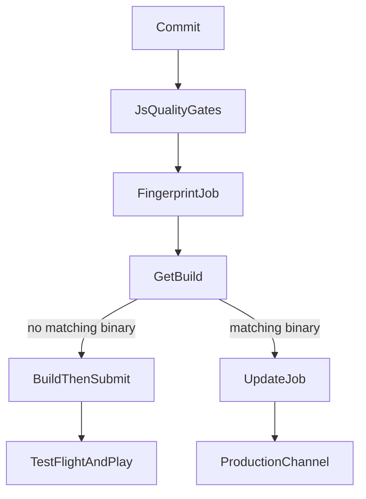
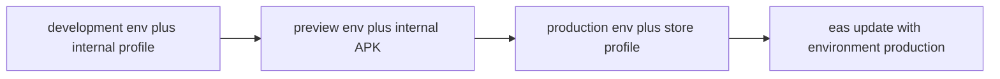
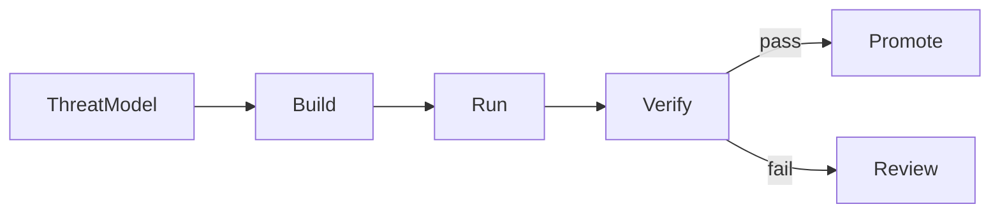

React Native CI/CD 是把一個 commit 轉成 signed binary、over-the-air JavaScript bundle，或兩者皆有的系統——並且能在裝置已經裝上之後停掉一次壞的 release。它不是一份跑 `eas build` 的 YAML。它決定哪個 native surface 值得信任、一個 job 可以讀哪個 environment、誰可以 submit 到 store，以及 crash-free sessions 下跌時團隊如何復原。

Provider-neutral 的 web pipeline 見 [React 的 Frontend CI/CD](/notes/frontend-ci-cd-for-react)。整體安全流程見 [DevSecOps](/notes/devsecops)。裝置威脅模型見 [React Native 裡的 Security](/notes/security-in-react-native)。本文是 Expo playbook：**EAS Workflows** 編排 Build、Submit 與 Update，JavaScript quality gates 則留在 GitHub Actions 或其他組織 CI。

本文使用一個**虛構的** Expo app，以 Continuous Native Generation 發佈。Native `ios/` 與 `android/` 目錄是 generated，不是 committed。基線與 [深入理解 React Native](/notes/understanding-react-native-in-depth) 相同：Expo 是 orchestrator；React Native 是 renderer；EAS 是 delivery adapter。

<br />

---

## 1. Mobile CD 不是 Web CD

在 web，團隊通常可以發佈一個 immutable artifact，並在數分鐘內把流量切過去。在 React Native，Apple 與 Google 仍擁有時間線的一部分。自動化可以令 build 持續 **deliverable**。它不能跳過 store review、signing，也不能假裝已安裝的 binary 能從每部裝置拔走。

Expo app 可以送到三個 target。用哪個 EAS service，取決於改了什麼：

| Target | EAS service | 何時使用 |
| --- | --- | --- |
| App stores | EAS Build 與 EAS Submit | 新 release、native code、permissions、SDK upgrades |
| 已安裝裝置 | EAS Update | 能放進已安裝 native runtime 的 TypeScript 與 assets |
| Web | EAS Hosting | 與 native 並行的 Expo Router web app |

EAS Build 編譯 native binary，需時數分鐘到數小時。EAS Update 在已經包含對應 native surface 的 binary 裡替換 JavaScript bundle，需時數秒。Config plugin、新的 Expo Module、permission 或 SDK bump 需要新 binary。EAS Update 無法憑空創造它們。這份合約與 [深入理解 React Native](/notes/understanding-react-native-in-depth) 對 prebuild 與 Metro 的區分相同。

不要因為觸發了 cloud build 就稱 pipeline 為「continuous deployment」。停在 expo.dev 的 binary 尚未 delivered。令舊 client crash 的 update 不是 hotfix。

<br />



<br />

---

## 2. EAS 是四個服務、一個 Dashboard

**EAS Workflows** 是 Expo 的 CI/CD 服務。Workflows 跑在 EAS-hosted 的 Linux 與 macOS workers。它們自動化 builds、over-the-air updates、store submissions、Maestro tests，以及 EAS Hosting deploys。EAS project 連到 GitHub 之後，push、pull request、label、cron schedule 或 App Store Connect event 都能啟動一次 run。任何 workflow 也可以用 `eas workflow:run` 啟動，不論 `on` trigger 如何設定。

另外三個服務是 Workflows 串起來的 primitives：

| Service | Job | 產出 |
| --- | --- | --- |
| **EAS Build** | `type: build` | `eas.json` 某個 profile 的 signed 或 simulator binary |
| **EAS Submit** | `type: submit` / `type: testflight` | 上傳到 Play Console 或 App Store Connect |
| **EAS Update** | `type: update` / `type: update-rollout` | channel 或 branch 上的 JavaScript bundle |

沒有 `needs` 的 jobs 預設平行執行。`needs` 等成功。`after` 等完成，不論 upstream 成功或失敗。Artifacts、logs 與 test results 都落在 expo.dev。

Expo 自己的建議：Expo 形狀的工作——builds、updates、submissions、Maestro——用 Workflows。Pipeline 依賴 Docker、custom runners 或大型非 mobile job graph 時，改用其他 CI。這不是貶低。Workflows 是 purpose-built；GitHub Actions 是 general-purpose。

文件寫明的平台限制：**沒有 shared workflow files**（每份 YAML 獨立；custom functions 只能重用 step sequences）以及 **沒有 matrix builds**。

<br />

---

## 3. Project Contract

假設一個 CNG workspace：

```text
app/                    Expo Router screens
app.config.ts           dynamic config; reads process.env
eas.json                build, submit, and CLI policy
.eas/workflows/         EAS Workflows YAML
.maestro/               thin device journeys
package.json
```

`eas build:configure` 寫入預設 `eas.json` profiles。名稱是慣例，不是魔法——profile 可以叫 `foo`——但三個預設對應團隊真正的發佈方式：

```json title="eas.json"
{
  "build": {
    "development": {
      "developmentClient": true,
      "distribution": "internal",
      "environment": "development"
    },
    "preview": {
      "distribution": "internal",
      "environment": "preview"
    },
    "production": {
      "environment": "production"
    }
  }
}
```

- **development** 包含 `expo-dev-client`。永不 submit 到 store。Internal distribution 把它放到實體裝置；iOS Simulator variant 需要獨立 profile 上的 `"ios": { "simulator": true }`。
- **preview** 是給 QA 的 production-like build：沒有 dev tools，internal distribution。Android preview 通常是 APK；store production 是 AAB。
- **production** 是 store binary。經 TestFlight 或 Play 安裝，不是 sideload，除非 Android 明確設 `"buildType": "apk"`。

Production signing 設定一次，不是寫在 pull-request YAML：

```sh
eas credentials:configure-build -p android -e production
eas credentials:configure-build -p ios -e production
```

`eas update:configure` 安裝 `expo-updates` 並接好 channels。該 library 第一次進入 binary 之後，需要一次新的 native build。

先用 templates 建立 workflows，再改：

```sh
npm install -g eas-cli
eas workflow:create --template build
eas workflow:create --template deploy
eas workflow:run .eas/workflows/build.yml
```

`deploy` template 會 fingerprint project，native characteristics 變了就 build 並 submit；已有 matching binary 就 publish update。

<br />

---

## 4. Stages 與 Environment Secrets

Stage 不是 Git branch。它是 Build、Update、Workflows 與 Hosting **用同一套方式 resolve 的 named variables**。本機 `.env` 是給 laptop 用的。它們被 gitignore，所以 remote job 看不到——除非有人 commit 了它們，那是 leak，不是 workflow。

EAS 預設三個 environments：`development`、`preview`、`production`。Custom names 在 Enterprise 與 Production plans 才有。一個 variable 可以活在一個或多個 environment。



### Build profile 對應 environment

在每個 profile 明確設 `environment`。省略時 EAS 會推斷：

- `distribution` 是 `store` → `production`
- `developmentClient` 是 `true` → `development`
- 其餘 → `preview`

```sh
eas env:set --name EXPO_PUBLIC_API_URL --value https://api.example.com --environment production --visibility plaintext
eas env:list --environment production
eas env:pull --environment production
```

`eas env:pull` 為該 environment 寫一份本機 `.env`。檔案保持 gitignored。Secret-visibility 的值不會寫出來。

EAS Update 在 SDK 55 或之後，`--environment` 是必填。該 flag **只**用指定的 EAS environment，並忽略本機 `.env`，令 update bundle 與用同一 environment build 的 binary 一致。Secret-visibility variables 在 update 過程不可用：它們在 EAS servers 以外讀不到，也不該是 bundle 需要的值。

```sh
eas update --environment production
eas env:exec --environment production 'npx sentry-expo-upload-sourcemaps dist'
```

### Workflow job environment

省略 `jobs.<job_id>.environment` 時，預設依 job type 而定：

| Job | Default environment |
| --- | --- |
| `build` | Profile 在 `eas.json` 的 `environment`，或上述推斷規則 |
| `submit` | 繼承被 submit 的 build |
| `maestro` / `maestro-cloud` | `preview` |
| `fingerprint`、`update`、`deploy`、custom | `production` |

Fingerprint 與 update jobs 要明確設 `environment`，與配對的 build 一致。在 `production` 算出的 fingerprint 不會 match 用 `preview` variables 建成的 binary。那是錯的 hash，不是 flaky job。

```yaml title=".eas/workflows/fingerprint-and-build.yml"
name: Fingerprint and build

jobs:
  fingerprint:
    type: fingerprint
    environment: production
  build_ios:
    needs: [fingerprint]
    type: build
    params:
      platform: ios
      profile: production
```

### Visibility

| Visibility | 誰能讀 | 用途 |
| --- | --- | --- |
| **Plain text** | Dashboard、EAS CLI、job logs | Public config：`EXPO_PUBLIC_API_URL`、`APP_VARIANT` |
| **Sensitive** | Dashboard（toggle）、EAS CLI；job logs 會 obfuscate | Laptop 必須看到的 tokens，例如 `SENTRY_AUTH_TOKEN` |
| **Secret** | 只有 EAS servers；logs 會 obfuscate | Job-time 值：`NPM_TOKEN`、`google-services.json` 檔 |

Expo 的規則寫兩次，因為團隊最常跳過：**client-side code 裡的任何東西都是 public**。`EXPO_PUBLIC_*` 會 inline 進 Metro bundle。`app.json` 的 `extra` 也在 bundle 裡。Hermes bytecode 只是令隨便讀慢一點，不是加密。Secret visibility **不能**保護你 embed 進 app 的值。它存在是為了讓 build job 安裝 private npm packages，或讀 runner 需要的檔案。這句與 [React Native 裡的 Security](/notes/security-in-react-native) 相同：binary 持有 public identifiers 與 user-bound tokens，不是 authority。

Scope 是 project-wide 或 account-wide。Account-wide variables 在 job 上與 project variables merge。類型是 strings 或 files。像 `GOOGLE_SERVICES_JSON` 這種 file variable，在 runner 上是一條 path：

```js title="app.config.ts"
export default {
  android: {
    googleServicesFile:
      process.env.GOOGLE_SERVICES_JSON ?? "/local/path/to/google-services.json",
  },
}
```

Plain-text 與 sensitive variables 在 EAS CLI resolve dynamic app config 時可用。Secret variables 不行：它們永不離開 EAS servers。

### Promotion 規則

每個 environment 一個 API origin、一個 bundle identifier、一個 update channel。不要靠事後改 env，把 preview binary promote 成 production。Public config 在 build 或 update 時 bake。真正的 secrets 留在 server——與 web app 同一套 Hono / Better Auth API。Signing material 與 store API keys 永不出現在 pull-request jobs。

<br />

---

## 5. Workflow Files、Triggers 與 Pre-Packaged Jobs

Workflows 放在專案根的 `.eas/workflows/`，就像 GitHub Actions 放在 `.github/workflows/`。Trigger syntax 看起來很熟。差別是 pre-packaged jobs：`type: build` 帶上 worker、Xcode 或 Android SDK、credentials 與 artifact upload。常見路徑不需要自製 `runs-on`。

```yaml title=".eas/workflows/build.yml"
name: Create Production Builds

on:
  push:
    branches: ["main"]

jobs:
  build_android:
    type: build
    params:
      platform: android
      profile: production
  build_ios:
    type: build
    params:
      platform: ios
      profile: production
```

Triggers（來自 syntax reference）：

- `on.push`、`on.pull_request`、`on.pull_request_labeled`、`on.pull_request_comment`、`on.ref_delete`
- `on.schedule.cron`
- `on.workflow_dispatch` 加上 inputs
- `on.app_store_connect`（`app_version`、`build_upload`、`external_beta`、`beta_feedback`），需先在 project 設定 App Store Connect connection
- `eas workflow:run` 與 REST API，有沒有 `on` block 都可以

Production pipeline 真正會用的 pre-packaged jobs：

| `type` | 角色 |
| --- | --- |
| `build` | `android` 或 `ios` 某個 profile 的 native binary |
| `fingerprint` | Native-characteristic hashes（`android_fingerprint_hash`、`ios_fingerprint_hash`）。**只支援 CNG**——committed `ios/` 或 `android/` 會令此 job 失敗 |
| `get-build` | 符合 fingerprint、profile 或其他 filters 的既有 EAS build |
| `update` | 把 OTA bundle publish 到 channel 或 branch |
| `update-rollout` | 改變收到 update 的使用者百分比 |
| `submit` | 把 build 送到 Play 或 App Store Connect |
| `testflight` | Upload 及／或 submit 到 TestFlight |
| `maestro` | 對某個 `build_id` 跑 simulator/emulator flows（文件標為 **alpha**） |
| `repack` | 替換既有 binary 裡的 JS bundle 並 re-sign——給 tests 用的 build-time update |
| `require-approval` | Human gate；approve 是成功，reject 是失敗 |
| `github-comment` | 帶 QR code 或 build link 的 PR comment |
| `slack` | Notification |
| `branch-delete` | git ref 刪除時清理 update branch |
| `deploy` | EAS Hosting |
| `doc` | Run log 裡的 Markdown |

Custom jobs 用 `steps`、`eas/checkout`、`eas/install_node_modules` 與 `set-output`。Fingerprint 與 build jobs 應優先用 EAS environment variables，而不是 inline `env`，令 hashes 保持一致。Inline `env` 會覆蓋所選 environment，而且計算 hash 的每一處都要重複。

在 worker 上用 `${{ env.VARIABLE_NAME }}` 或 `process.env.NAME` / `$NAME` 讀變數。

<br />

---

## 6. Preview：先 Fingerprint，再 Update 或 Build

大多數 pull requests 改的是 TypeScript，不是 native code。每次改 docs 都 rebuild iOS，浪費 macOS worker 與 signing slot。官方 pattern 是 fingerprint → get-build → 有 binary 就 update，沒有就 build。

```yaml title=".eas/workflows/preview.yml"
name: Build or update preview

on:
  pull_request:
    branches: ["main"]

jobs:
  fingerprint:
    type: fingerprint
    environment: preview

  android_get_build:
    needs: [fingerprint]
    type: get-build
    params:
      fingerprint_hash: ${{ needs.fingerprint.outputs.android_fingerprint_hash }}
      platform: android
      profile: preview

  android_update:
    needs: [android_get_build]
    if: ${{ needs.android_get_build.outputs.build_id }}
    type: update
    environment: preview
    params:
      channel: preview
      platform: android

  android_build:
    needs: [android_get_build]
    if: ${{ !needs.android_get_build.outputs.build_id }}
    type: build
    params:
      platform: android
      profile: preview
```

iOS 重複同一套 get-build / update / build。加一個 `github-comment` job，讓 reviewers 不用離開 pull request 就能安裝 preview。

Fingerprint 雜湊 native characteristics：dependencies、native project files、configuration。`environment` 要與 build profile 對齊。優先用 EAS environment variables，而不是 job-level `env`，令 fingerprint、build、update 解析到同一組值。

JavaScript quality gates——format、lint、`tsc`、Jest、React Native Testing Library——仍屬於每個 pull request。放在 GitHub Actions 或 custom Workflows job。EAS 不能取代 [如何在 React Native 寫 Tests](/notes/how-to-write-tests-in-react-native)。

<br />

---

## 7. Production：官方 Deploy Workflow

文件裡「deploy to production」workflow，在 push 到 `main` 時：

1. 在 `production` environment 雜湊 native characteristics。
2. 每平台查找既有 production build。
3. 沒有就 build 並 `submit`。
4. 有就在 `production` branch publish update。

```yaml title=".eas/workflows/deploy.yml"
name: Deploy to production

on:
  push:
    branches: ["main"]

jobs:
  fingerprint:
    name: Fingerprint
    type: fingerprint
    environment: production
  get_android_build:
    name: Check for existing android build
    needs: [fingerprint]
    type: get-build
    params:
      fingerprint_hash: ${{ needs.fingerprint.outputs.android_fingerprint_hash }}
      profile: production
  get_ios_build:
    name: Check for existing ios build
    needs: [fingerprint]
    type: get-build
    params:
      fingerprint_hash: ${{ needs.fingerprint.outputs.ios_fingerprint_hash }}
      profile: production
  build_android:
    name: Build Android
    needs: [get_android_build]
    if: ${{ !needs.get_android_build.outputs.build_id }}
    type: build
    params:
      platform: android
      profile: production
  build_ios:
    name: Build iOS
    needs: [get_ios_build]
    if: ${{ !needs.get_ios_build.outputs.build_id }}
    type: build
    params:
      platform: ios
      profile: production
  submit_android_build:
    name: Submit Android Build
    needs: [build_android]
    type: submit
    params:
      build_id: ${{ needs.build_android.outputs.build_id }}
  submit_ios_build:
    name: Submit iOS Build
    needs: [build_ios]
    type: submit
    params:
      build_id: ${{ needs.build_ios.outputs.build_id }}
  publish_android_update:
    name: Publish Android update
    needs: [get_android_build]
    if: ${{ needs.get_android_build.outputs.build_id }}
    type: update
    params:
      branch: production
      platform: android
  publish_ios_update:
    name: Publish iOS update
    needs: [get_ios_build]
    if: ${{ needs.get_ios_build.outputs.build_id }}
    type: update
    params:
      branch: production
      platform: ios
```

這是對一個**決策**的 Continuous Delivery，不是把每個 commit Continuous Deployment 到每部手機。Store review 仍會發生。Update 仍須符合已安裝的 runtime version。Expo 的 update FAQ 寫得很清楚：App Store 與 Play 的 guidelines 約束 update 的**內容**，不只是機制。行為變更往往仍需 review。之後的 store binary 應包含同一修復，令新安裝不必永遠依賴 OTA。

Runtime version policy 是相容性閘門。`fingerprint` policy 在 native characteristics 改變時更新 runtime。手動 `runtimeVersion` 字串是完全控制，也是完全責任。送出呼叫已安裝 binary 沒有的 native module 的 JavaScript，就是 crash loop。`expo-updates` 可能 rollback 到上一個可用 update；不要設計成以為它一定救得了你。

Update 不健康時，把上一個 update republish 蓋上去——這是 Expo 文件裡的 revert——若 native surface 錯了，再跟一發 store binary。

<br />

---

## 8. Approvals、TestFlight、Rollout 與 App Store Connect

Store submission 是 privileged work。組織要求時，前面加一道 human gate：

```yaml title="Approval before submit"
jobs:
  require_approval:
    name: Submit to stores?
    needs: [build_ios, build_android]
    type: require-approval
  submit_ios:
    needs: [require_approval]
    type: submit
    params:
      build_id: ${{ needs.build_ios.outputs.build_id }}
```

`require-approval` 沒有 parameters。Approve 是成功；reject 是失敗。`needs` 它的 jobs 只在 approve 後跑。`after` 它可以依 `failure()` 分支。

先走 TestFlight 與 Play internal testing，再上 production tracks。`type: testflight` 負責 upload，並可選擇 submit。用**同一顆** binary 在 tracks 之間 promote；不要為每個 track rebuild。

`update-rollout` 改變已 publish update 的使用者百分比。當 production JavaScript 是 blast radius 時，與 `require-approval` 配對。監察 crash-free sessions，再擴大或 republish 上一個 update。

App Store Connect triggers 補上 store 擁有的那一段。在 Project settings → General → Connections 接好 app 之後：

```yaml title=".eas/workflows/asc-ready.yml"
name: React to App Store Connect events

on:
  app_store_connect:
    app_version:
      states:
        - ready_for_review
        - waiting_for_review

jobs:
  send_slack_notification:
    type: slack
    environment: production
    params:
      webhook_url: ${{ env.SLACK_WEBHOOK_URL }}
      message: "App version is ready for review or waiting for review."
```

跑 workflow 前，先在 `production` environment 建立 `SLACK_WEBHOOK_URL`。

Tag-based releases 是另一種 production trigger。Expo 的 CI/CD tutorial 把 version tags 當成 `main` deploy 的延伸：同一套 fingerprint 決策，更慢的人為節奏。

<br />

---

## 9. React Native Pipeline 上的 DevSecOps

[DevSecOps](/notes/devsecops) 是 Build / Run / Verify。本節把該模型套到 Expo。它不取代應用層安全。UI 仍不是 authorization。API 仍 authenticates 每一次呼叫。



### Build——什麼進入 graph

React Native 有**三條** dependency graphs：npm、Gradle、CocoaPods。Frozen JavaScript lockfile 必要但不充分。專案產生 Podfile.lock 與 Gradle lockfile 時要 commit；review config plugins 與 `app.config.ts`，就像 native 團隊 review Xcode project。在 CNG 之下，那些檔案**就是** native project。

- 每個 pull request 做 secret scanning。阻擋 committed `.env`、keystores、`.p8` keys，以及持有 server key 的 `google-services.json`。File-type EAS secrets 存在，就是為了讓那些檔案永不進 git。
- 對 npm **以及** native modules 做 software composition analysis。
- GitHub Actions 當 JS gate 時，把 third-party actions pin 到完整 commit SHA。Version tags 是 mutable。
- `EXPO_PUBLIC_*` 與 `extra` 的審查屬於 code review，不是之後才做的 security pass。

### Run——pipeline identity

當另一套 CI 觸發 EAS 時，`EXPO_TOKEN`（或 SSO-backed robot user）就是 EAS 的 machine identity。能 submit production 的 token，絕不能給來自 forks 的 `pull_request`。

- 分開 EAS environments，令 preview job 解析不到 production secrets。
- Signing 放在 `eas credentials`，不是 CI runner 上的 base64 blobs。Store API keys（App Store Connect `.p8`、Play service account）屬於 submit 與 TestFlight jobs，政策要求時放在 approval 之後。
- 經 Expo GitHub app、在已連結的 repository 觸發 production Workflows。不要用帶 write-capable secrets 的 `pull_request_target` 去 checkout 不信任的 code。
- CI 上的 internal ad hoc iOS builds，要 refresh provisioning profile，令新登記裝置被包含：build job 設 `refresh_ad_hoc_provisioning_profile: true`，或 `eas build --non-interactive` 加 `--refresh-ad-hoc-provisioning-profile`。

當 profile 必須從 CI re-sign 時，可選的 Apple repair credentials：`EXPO_ASC_API_KEY_PATH`、`EXPO_ASC_KEY_ID`、`EXPO_ASC_ISSUER_ID`、`EXPO_APPLE_TEAM_ID`、`EXPO_APPLE_TEAM_TYPE`。那些是 store-identity secrets，不是 app-bundle constants。

### Verify——promote 前的證據

| Gate | 證明什麼 | 阻擋 |
| --- | --- | --- |
| Lint、types、Jest / RNTL | JS 行為與合約 | Pull request |
| Secret scan + SCA | 沒有新 credential 或已知壞 dependency | Pull request |
| Fingerprint + get-build | Native surface 對上已知 binary，或需要新的 | Release 決策 |
| Maestro（thin suite） | Simulator/emulator 上的關鍵 journeys | Merge 或 release |
| `require-approval` | 有人接受 store 或 production OTA 風險 | Submit / rollout |
| 按 version 的 crash-free sessions | 已發佈 artifact 可居住 | 繼續 rollout |

Fingerprint 加 get-build 是 native 層的 provenance：你 promote 一顆已知 binary，或承認需要新的。你不會默默用另一個 Xcode rebuild「同一個」commit。

OTA 不是安全逃生口。Store guidelines 仍然適用。Runtime-incompatible update 是可靠性事故。回應順序：

1. 停下 `update-rollout`，或 republish 上一個 update。
2. 停下 store phased release。
3. 合約允許時，用 server flag 關掉功能。
4. Native surface、entitlements 或 SDK 錯了，就出 hotfix binary。

把 release identity——commit SHA、fingerprint hash、app version、build number——掛上 telemetry。沒有它，「release 之後 errors 上升」只是感覺。

<br />

---

## 10. EAS 上的 Maestro

便宜的 tests 留在 Jest。Maestro 證明 native seams：Android Back、permission sheets、鍵盤蓋住按鈕。這份分工見 [如何在 React Native 寫 Tests](/notes/how-to-write-tests-in-react-native)。Expo 的 `maestro` job 文件標為 **alpha**。把它當 thin release-blocking suite，不是 Jest graph 的第二份複本。

```yaml title="Maestro against a simulator build"
jobs:
  test:
    type: maestro
    environment: preview
    params:
      build_id: ${{ needs.build_ios_simulator.outputs.build_id }}
      flow_path: ./maestro/flows
```

Android emulator tests 需要 nested-virtualization worker（錄屏或用重系統映像時用 `linux-large-nested-virtualization`）。`shards` 是 experimental。`retries` 預設 0；`retry_failed_only` 預設 true。Maestro 從 job 讀 `MAESTRO_*` environment variables。

要令 pull-request E2E 便宜：fingerprint → get-build → 有 matching binary 就 `repack`，否則 `build`，然後 Maestro。Repack 重新 bundle JavaScript、換進舊 binary、再 re-sign。那是一到兩分鐘的 test binary，不是完整 native compile。

穩定 device tests 的方式與測試文相同：固定 simulator versions、隔離帳號、accessibility IDs、失敗時留 artifacts。隔離 flake 要有 owner 與到期日，不是無限 retry。

<br />

---

## 11. Hybrid：JS 用 GitHub Actions，Native 用 EAS

大多數組織已有 GitHub Actions（或 GitLab、CircleCI、Bitbucket）。Expo 同時寫了完整 Workflows 遷移與 hybrid：lint 與 unit tests 留在公司其餘部分所在之處；native 工作交給 EAS。

在 EAS dashboard 連結 GitHub repository，並安裝 Expo GitHub app。然後在 workflow 檔加 `on.push`，或從 Actions 呼叫 Workflows。

官方「從 GitHub Actions 觸發 build」形狀（版本以 EAS Build CI 頁為準）：

```yaml title=".github/workflows/eas-build.yml"
name: EAS Build
on:
  workflow_dispatch:
  push:
    branches:
      - main
jobs:
  build:
    name: Install and build
    runs-on: ubuntu-latest
    steps:
      - uses: actions/checkout@v5
      - uses: actions/setup-node@v6
        with:
          node-version: 24
          cache: npm
      - name: Setup Expo and EAS
        uses: expo/expo-github-action@v8
        with:
          eas-version: latest
          token: ${{ secrets.EXPO_TOKEN }}
      - name: Install dependencies
        run: npm ci
      - name: Build on EAS
        run: eas build --platform all --non-interactive --no-wait
```

`--no-wait` 在 build **被觸發**後就結束。Actions job 變綠，只證明 EAS 接受了工作，不證明 IPA 存在。EAS 編譯期間你不會被收 Actions minutes。只有下一步必須看到完成的 binary 時，才拿掉 `--no-wait`。

同一頁也寫了 Travis、GitLab、Bitbucket、CircleCI：`npx eas-cli build --platform all --non-interactive --no-wait` 加上 `EXPO_TOKEN`。

JS gates 留在 Actions、fingerprint 決策留在 EAS：

```yaml title="Lint, then eas workflow:run"
- name: Setup EAS
  uses: expo/expo-github-action@v8
  with:
    eas-version: latest
    token: ${{ secrets.EXPO_TOKEN }}
- name: Run EAS Workflow
  run: eas workflow:run .eas/workflows/deploy.yml --wait --json
```

`--wait --json` 是文件寫明的做法：等到 workflow 結束再 parse job outputs。Production token 仍不可給 fork pull requests。

CI 要能 non-interactive 之前，先在 laptop 對每個 platform 跑一次 `eas build`，令 project id、identifiers 與 credentials 存在。

<br />

---

## 12. Enterprise Alternatives

EAS Workflows 是想要一個 dashboard、不想養 macOS fleet 的 Expo CNG app 的預設。當組織已標準化另一套 mobile CI、不能把 source 送到 Expo workers，或需要 Docker 與 custom runners 時，它是錯的預設。最後一種，Expo 自己也這樣寫。

| 做法 | 何時用 | 取捨 |
| --- | --- | --- |
| **EAS Workflows** | Expo/RN、fingerprint/repack/update 是一等公民、managed signing | 沒有 matrix、沒有 shared YAML、只有 Expo 形狀的 jobs |
| **GitHub Actions + EAS CLI** | 組織標準 JS CI；EAS 當 native backend | 仍要管 `EXPO_TOKEN`；`--wait` 會消耗 Actions minutes |
| **Bitrise** | Native + RN 混合艦隊、visual editor、SSO / enterprise plans、Fastlane step | 你自己設定 Gradle/Xcode/signing；OTA 不是 EAS Update |
| **Codemagic** | YAML `codemagic.yaml`、builder 上 Expo prebuild、App Store Connect API publish | 比 pre-packaged Expo jobs 更多 shell；CNG apps 若沒 commit `ios/` 必須在 CI prebuild |
| **Self-hosted macOS 上的 Fastlane** | Air-gapped、Apple Developer Enterprise Program、銀行筆電政策 | 你擁有 Ruby（建議 3.3+）、Bundler、Match 或 ASC API keys、Xcode pins |

Fastlane 仍是許多 stack——包括 EAS 自己的 iOS path——底下的 store-automation 層。官方 Fastlane setup 是 Bundler + `Gemfile`、`bundle exec fastlane`、UTF-8 locale，以及 App Store Connect API 認證——不是 shared CI user 上的 Apple ID + app-specific password。

不要在 **App Center**（已 retired）或 **Classic Updates** 開新工作。`expo publish` 不能再建立新 updates。既有 Classic Updates 仍服務舊 binaries；遷移到 EAS Update 或 self-hosted `expo-updates` server。

受規管的團隊仍可用 EAS Build 當 compiler，把 promotion policy 留在 GitHub Environments 或 Bitrise pipelines。Fingerprint 決策可以在任何 CI 用 `@expo/fingerprint` 跑，只要 hashes 有存。約束是 identity：能上傳 production binary 或 publish production channel 的人，就是一把 deploy key，必須當 deploy key 對待。

<br />

---

## 13. Failure Modes 與 Adoption Order

| 症狀 | 可能原因 | 先做什麼 |
| --- | --- | --- |
| Fingerprint 永不 match 已知 build | Job `environment` ≠ profile environment；只有一邊有 inline `env`；committed `ios/`/`android/` | 對齊 environments；保持 CNG；丟掉 inline `env` |
| Preview update 指向 production API | `eas update` 用錯 `--environment`，或 custom job 預設了 `production` | 在 update job 設 `environment:`；要求 `--environment` |
| Secret 進了 binary | `EXPO_PUBLIC_*` 或 `extra` 拿著 credential | Rotate；把 authority 移到 API；secret visibility 不能 un-bake bundle |
| CI 綠、沒有 IPA | `--no-wait` 只證明 EAS 接受了 trigger | `--wait` 或先看 expo.dev 再稱 delivered |
| iOS ad hoc 缺了新裝置 | 過期 provisioning profile | `refresh_ad_hoc_provisioning_profile: true` |
| OTA crash loop | JS 期望 binary 沒有的 native module | Republish 上一個 update；出 binary；收緊 runtime policy |
| Store 拒絕 binary | Privacy manifest、encryption、SDK policy | `submit` 前先 validate；合規 ownership 要明確 |
| Fork PR 看到 production secrets | Token 給了來自 forks 的 `pull_request`，或用了 `pull_request_target` | Scope tokens；production 只從 Expo GitHub app、trusted refs 觸發 |

不要在一個 pull request 建造最終平台。

1. 令 lint、type-check 與 Jest 在本機 deterministic（`test:ci`）。
2. 每個 pull request 都跑。
3. 為 development 與 preview 設定 `eas.json` profiles 與 `eas credentials`。
4. 把 variables 放進 EAS environments；gitignore `.env*`；永不把 secrets 放進 `EXPO_PUBLIC_*`。
5. 加 preview workflow：fingerprint → get-build → update 或 build。
6. 對 simulator 或 repacked binary 加 thin Maestro suite。
7. 設定 production credentials 與 `eas update:configure`。
8. 採用官方 deploy workflow；政策要求時在 store submit 前加 `require-approval`。
9. Hybrid 或完整 Workflows：JS gates 在組織 CI、native 在 EAS——或只用 Workflows，若組織接受 Expo 的限制。
10. 演練 rollback：republish update、停下 rollout、停下 store phase。量度 duration、flake rate 與 recovery time。

成熟 pipeline 不是 job types 最多的那條。它是從 fingerprint 決定 build 還是 update、把 stage secrets 留在擁有它們的 environment、promote 已知 binary，並把 OTA 當成受相容性約束的 delivery path——而不是繞過 store 的方法。
