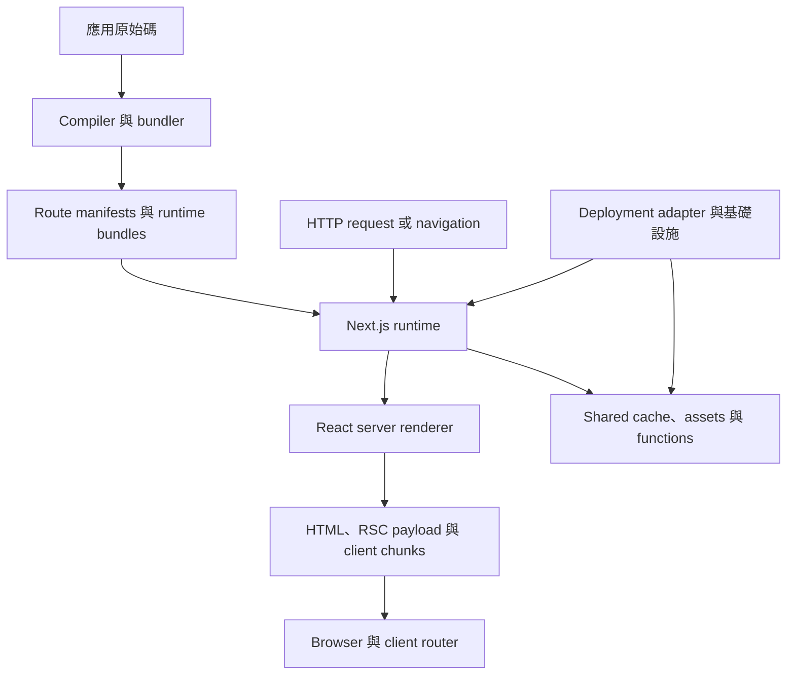
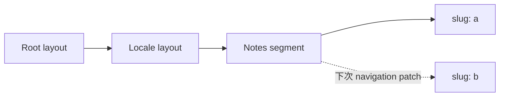
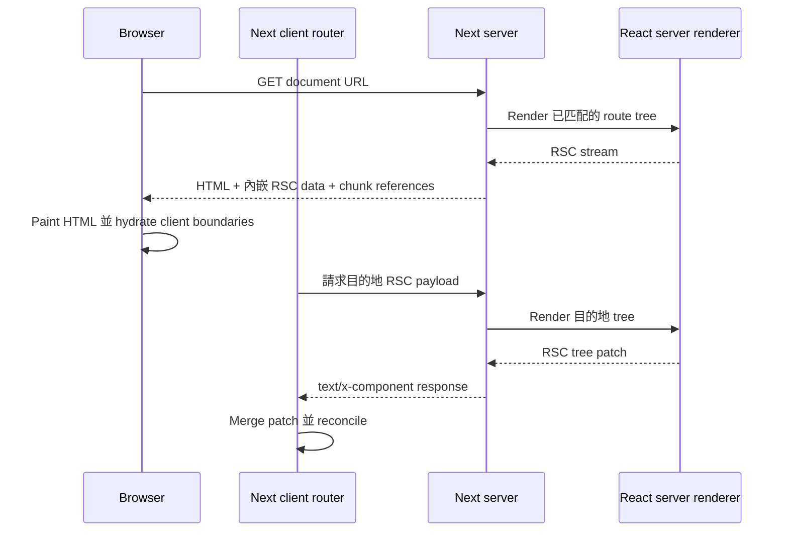
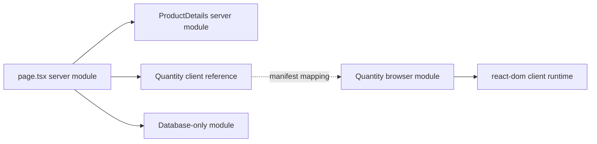
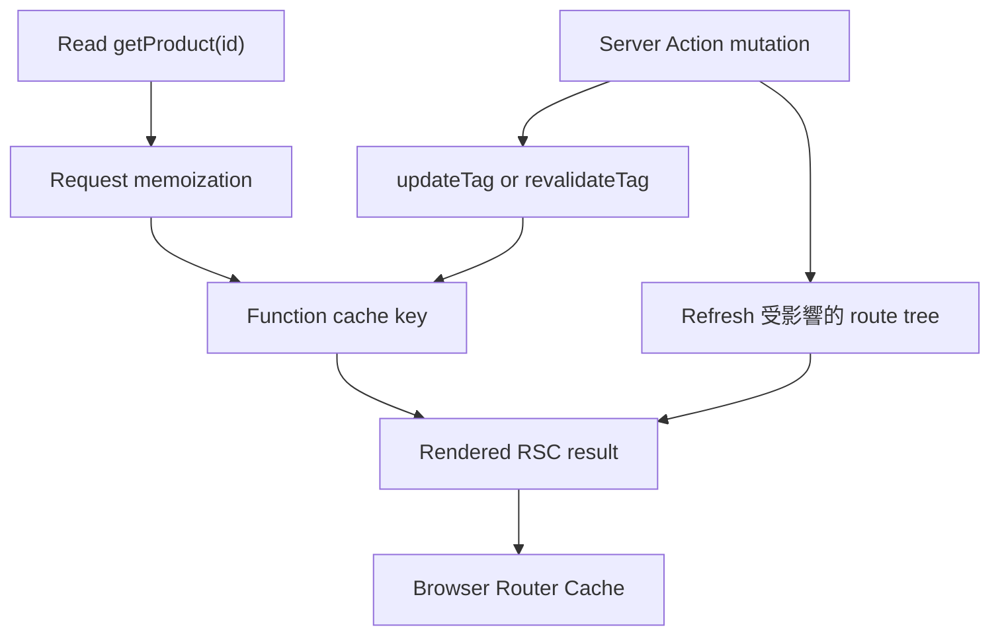
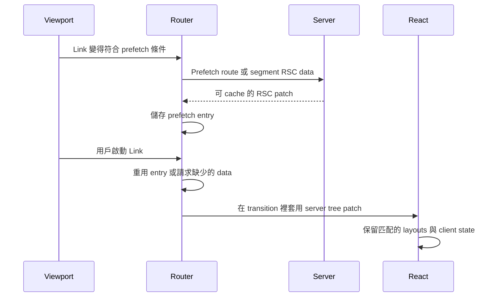
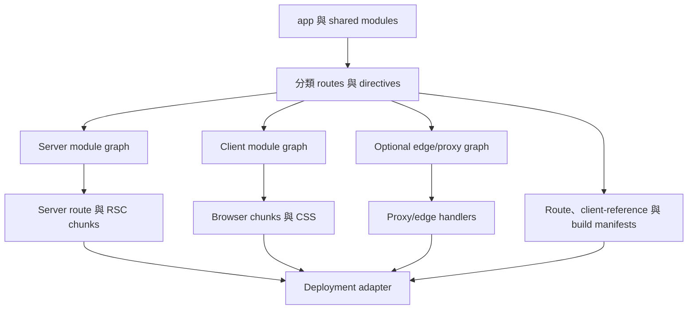
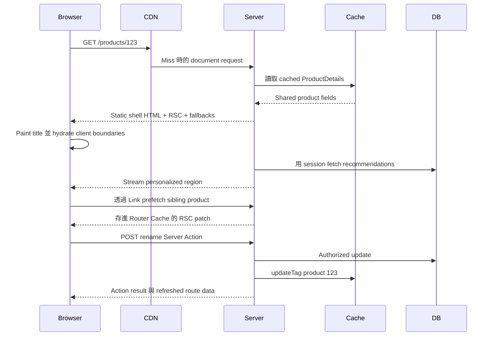

Next.js 常被介紹成「帶有 file-system routing 與 server-side rendering 的 React」。這個描述並沒有錯，但壓縮得太厲害，解釋不了為什麼加上 `'use client'` 會改變 bundle、為什麼一個 request 回傳 HTML 而另一個回傳 `text/x-component`、為什麼讀取 cookie 會改變工作何時發生，或為什麼 invalidate server data 不一定會取代瀏覽器裡已有的內容。

更有用的模型是：Next.js 是圍繞 React 的 **orchestrator**。在 build time，它把一棵 source tree 轉成數個 module graphs 與 routing manifests。在 runtime，它選出一棵 route tree、協調 data 與 caches、請 React 產生 Server Component stream、可選擇把該 stream 轉成 HTML，並提供足夠資訊讓 client router 在不 reload document 的情況下 merge 稍後的 server results。

<br />

```text
source modules
  → classify routes and server/client boundaries
  → emit server, client, and optional edge artifacts
  → match a request to a route tree
  → resolve cached and request-time work
  → produce a React Server Component payload
  → optionally produce and stream HTML
  → hydrate client boundaries
  → fetch and merge later route-tree patches
```

<br />

這篇文章針對 **Next.js 16.2.11 App Router**（這個 repository 裡是 React 19.2.4），並假設你已熟悉 React、HTTP、JavaScript runtimes、Suspense 與 cache invalidation。它區分三種陳述：

- 一條 **React 規則**，例如 render purity，或 client-bound values 必須 serializable。
- 一份 **Next.js 契約**，例如 `page.tsx` 慣例或 `cacheTag`。
- 一項 **實作觀察**，例如產生出來的 manifest field 或內部 request header。觀察有助於除錯，但應用程式碼不得依賴未文件化的格式。

Pages Router 只在舊詞彙會造成歧義時出現。App Router 不會執行 `getStaticProps` 或 `getServerSideProps`；rendering 與 caching 決策現在在 route、component 與 function boundaries 組合。

<br />

---

## 1. Next.js 在 React 周圍加上 Policy 與基礎設施

React 定義 components、reconciliation、Suspense、Server Components 與 hydration。它不決定 URLs 如何對應到 component trees、component 在哪裡執行、route 如何被 cache、images 如何被轉換，或 server function 如何透過 HTTP 定址。Next.js 做那些決策並把它們接起來。

一個 production Next.js 應用跨越四層：



這些 boundaries 很重要，因為同一個應用可以在 React 沒變的情況下表現不同：

- **Compilation** 決定哪些 modules 可以出現在 browser chunk，並在 server 與 client graphs 之間建立 references。
- **Routing** 把 pathname 轉成 layouts、pages、slots 與 boundaries 的有序 tree。
- **Rendering policy** 決定哪些工作可以在 request 之前發生、哪些必須在 request 期間發生，以及 Suspense fallback 在哪裡切開兩者。
- **Caching policy** 決定哪些 results 可以重用、給誰、多重久。
- **Deployment adapter** 把 Next.js output 對應到 processes、functions、CDN objects 與 shared caches。Vercel、長時間運行的 Node server，以及 AWS 上的 OpenNext，基礎設施並不相同。

這個 repository 示範了這個區別。`next.config.ts` 啟用 React Compiler、組合 Fumadocs 與 `next-intl`、定義 PostHog rewrites，並設定 image policy。`packages/infra/nextjs.ts` 再把 build 交給 SST 與 OpenNext。Next.js 擁有應用語意；OpenNext 把它們對應到 AWS resources。

把 Next.js 叫做「backend-for-frontend」有時有用，但仍低估了 compiler。叫做「meta-framework」是準確的，但仍低估了它的 runtime。比較耐用的心智模型是 **compiler 加上 request-time coordinator 加上 client router**，再透過 host-specific adapter 部署。

<br />

---

## 2. Route Tree 不只是 URL Matcher

`app` 底下的 folders 定義 **segments**。Special files 把行為掛到那些 segments：

```text
app/
  layout.tsx                  root layout
  [locale]/
    layout.tsx                locale layout
    loading.tsx               segment loading boundary
    error.tsx                 segment error boundary
    notes/
      page.tsx                /:locale/notes
      [slug]/
        page.tsx              /:locale/notes/:slug
```

`page.tsx` 讓一個 segment 可被定址。`layout.tsx` 包住它的 descendants，並在該 segment 仍被匹配的 navigations 中保持 identity。`template.tsx` 佔類似位置，但每次 navigation 會拿到新的 identity，所以它的 client state 與 Effects 會重啟。`loading.tsx`、`error.tsx` 與 `not-found.tsx` 不是全域 event listeners；它們在 route tree 的既定位置成為 boundaries。

Route groups 例如 `(marketing)` 用來組織或變化 layout composition，而不加 URL segment。Dynamic segments（`[id]`）、catch-all segments（`[...rest]`）與 optional catch-all segments（`[[...rest]]`）貢獻 parameters。Parallel-route folders 例如 `@modal` 在 layout 裡建立 named slots。Intercepting segments 例如 `(.)photo` 改變 client navigation 渲染哪棵 route tree，同時保留 canonical 的 direct-load route。

在 build time，Next.js 把這個 filesystem 編譯成可執行的 route entries 與 manifests。這個網站的一次 production build 產出了 `app-paths-manifest.json` entry，對應：

```json
{
  "/[locale]/notes/[slug]/page": "app/[locale]/notes/[slug]/page.js",
  "/resume/route": "app/resume/route.js"
}
```

它也為 `[locale]`、`[slug]` 與 `[...rest]` 產出 route regular expressions。這些檔案解釋 runtime 行為，但它們的 schema 是內部的。受支援的介面仍是 source-level 的 file conventions。

Route tree 也定義 **state identity**。從 `/en/notes/a` navigation 到 `/en/notes/b` 時，root layout、locale layout 與 notes layout 可以保持 mounted，只改 leaf segment。Client router 套用 server 提供的 tree patch，而不是把頁面當無關的 React root 重建。

這就是為什麼 layouts 有一條讓習慣 request templates 的人意外的限制：shared layout 不會只為了觀察每次 URL 變化而 rerender。若互動 UI 需要目前的 pathname 或 search parameters，把那個觀察放進帶 `usePathname` 或 `useSearchParams` 的 Client Component。Server layout 的持久性是功能，不是 stale rendering。

<br />



<br />

---

## 3. Document Request 與 Navigation 是不同的 Pipelines

對 browser document request，runtime 大致做這些事：

1. 套用已設定的 headers、redirects、rewrites，以及 `proxy.ts` interception。
2. 把結果 URL 匹配到 App Router entry，並導出 route parameters。
3. 選擇 runtime，並載入已編譯、對應那棵 route tree 的 server modules。
4. 解析 prerendered、cached 與 request-time 工作。
5. 請 React 把 Server Component tree render 成 **RSC payload**。
6. 用 RSC result 加上 Client Component references，為初始畫面產生 HTML。
7. 當 Suspense boundaries 就緒時，stream response bytes。
8. 讓瀏覽器顯示 HTML、載入 client chunks、消費 RSC data，並 hydrate Client Components。

之後的 client navigation，Next.js 通常不再請求另一份完整 HTML document。Client router 送出目前的 router-tree state，向 server 要到達目的地所需的 RSC data，再把回傳的 patch merge 進既有 tree。



一份本地 Next.js 16.2.11 production 的 `routes-manifest.json` 讓這個區別可見。它把 `rsc` 記成 request discriminator、把 `text/x-component` 記成 RSC content type，並把 `rsc, next-router-state-tree, next-router-prefetch, next-router-segment-prefetch` 放進 response 的 `Vary` policy。那些名稱是運作證據，不是要人手重現的 API。用 reverse proxy 或 CDN 把它們剝掉或忽略 `Vary`，可能把 document、navigation 與 prefetch variants 塌成錯誤的 cached object。

`proxy.ts` 在 route render 之前參與，而且重要的是，在 response cache 能回答之前。它適合便宜的 request normalization、redirects、rewrites，以及粗粒度 access gates。它不是在讀取或 mutate data 的程式碼裡做 authorization 的替代品。Next.js 16 把慣例從 `middleware.ts` 改名，就是為了讓這條 boundary 更清楚。這個 repository 的 `src/proxy.ts` 只跑 `next-intl` locale routing，並設 `localeDetection: false`，讓 `/` redirects 對 CDN caching 保持確定性。

<br />

---

## 4. `'use client'` 切開 Module Graph

Server Components 是 App Router 的預設。片語「Server Component」並不代表「每次 HTTP request 都跑一次的 component」。它代表 component 實作留在 server graph，而其 rendered result 穿過 React Server Component boundary。

`'use client'` 是 **module-graph entry directive**：

```tsx
'use client'

import { useState } from 'react'

export function Quantity() {
  const [value, setValue] = useState(1)
  return <button onClick={() => setValue(value + 1)}>{value}</button>
}
```

這個 directive 在從 server graph import 時，把這個 module 的 exports 標成 client references。除非 graph 被另一條 boundary 切開，它的 transitive imports 也必須對 client bundler 可用。它不代表：

- 這個 component 在初始 load 沒有 server-rendered HTML；
- 每個 descendant element 都必須在 client module 實作；
- 因為 parent 是 Server Component，這個 component 就可以 import server secrets；
- 瀏覽器可以呼叫任意 server functions。

Compiler 建立相關但不同的 graphs：



Server 可以 render `<Quantity />`，因為 RSC stream 編碼了對其 client implementation 的 reference 以及 serializable props。瀏覽器稍後把那個 reference resolve 成 JavaScript chunk。Database module 只從 server graph 可達。

這就是為什麼 boundary 放哪裡是架構決策。把 `'use client'` 放在高層 application shell，可能把 providers、utility libraries 與 descendants 拉進 browser-reachable chunks。常見做法是把 data access 與 static composition 留在 server，把 directive 放在窄的 interactive leaves。

反向 composition 也很重要。Client Component 可以透過 `children` 這類 slot 接受 Server Component result：

```tsx
// Server Component
export default async function Page() {
  const details = await getProduct()
  return <InteractivePanel details={<ProductDetails product={details} />} />
}
```

`InteractivePanel` 收到的是已經描述好的 server-rendered subtree。它並不是在瀏覽器裡 import 並執行 `ProductDetails`。

穿過 boundary 的 values 必須能被 React 的 serialization protocol 表示。普通 functions、帶 private behavior 的 class instances、open database handles，以及任意 closures，都不是 props。Server Functions 是刻意的例外：React serialize 一個 Next.js 知道如何在 server 上 invoke 的 reference。

對必須在泄進 client graph 時讓 compilation 失敗的 modules 用 `server-only`，對依賴 browser semantics 的 modules 用 `client-only`。這些 markers 把架構假設變成 build-time check。

<br />

---

## 5. Flight 攜帶一棵 Tree，HTML 攜帶初始畫面

RSC payload（常依 React 的 protocol 稱為 **Flight payload**）不是 HTML，也不是 DOM 的 JSON 表示。它是一條 stream，可以編碼已 render 的 Server Component output、pending Suspense 工作、Client Components 的 references、module metadata，以及 React serialization model 支援的 values。

對初始 request，有三份相關 outputs：

```text
RSC render
  ├─ RSC payload: authoritative server-rendered React tree and references
  ├─ HTML: initial visual representation produced from that result
  └─ client chunks: executable code for Client Component references
```

HTML 讓瀏覽器在所有 application JavaScript 執行完之前就能 paint。RSC data 讓 React 在 client 重建並 reconcile 同一棵邏輯 tree。Client chunks 為 interactive boundaries 提供行為。

**Hydration 作用在 Client Components**，不是 Server Components 的實作。Server Component 可以貢獻大量 HTML，但它的 function body 不會只為了讓瀏覽器重跑而被下載。瀏覽器在 RSC payload 裡收到它的 rendered result。

這讓「zero JavaScript」成為 per-subtree 的可能，而不是每個 RSC 應用的屬性。一條 route 可以大部分是 server-rendered，但靠近 root 的一個 client provider 會造成寬的 interactive subtree 與可觀的 JavaScript。

之後的 navigations，HTML 會是多餘的，因為瀏覽器已經擁有 document 與 React root。Client 要 RSC data、resolve 任何新的 client references，並把 patch 對已保留的 layouts reconcile。這也是為什麼把 RSC endpoint 當公開 JSON API 是錯的：它是耦合到該 build 的 module references 與 router state 的 framework protocol。

Wire format 與產生出來的 client-reference mappings 刻意不是穩定的應用介面。檢查它們來診斷 proxy、cache 或 bundle 問題；不要在產品程式碼裡 parse 它們。

<br />

---

## 6. Rendering 是光譜，不是三種 Page Types

Pages Router 鼓勵 route-level 詞彙：CSR、SSR、SSG 與 ISR。那些詞仍描述結果，但 App Router 的工作組合得更細。

有三個重要時間：

- **Build 或 revalidation time**：Next.js 可以 prerender 確定性工作，並持久化可重用的 output。
- **Request time**：runtime APIs 與 uncached 工作帶著具體 request 執行。
- **Client time**：Client Components hydrate、處理 interactions，並可能做額外 fetching。

沒有 Cache Components 時，Next.js 仍可分類並 prerender routes，而 `dynamic = 'force-static'` 這類 route-segment options 可以讓意圖明確。自 Next.js 15 起，`fetch` 預設不會放進 persistent cache。

設了 `cacheComponents: true` 後，Next.js 16 啟用較新的 **Cache Components** 模型。一條 route 可以包含：

- 可以安全 prerender 的 static 工作；
- 用 `'use cache'` 標記的 cached 工作；
- 讀取 `cookies()`、`headers()`、`searchParams` 或其他 dynamic source 的 request-time 工作。

Request-time 工作必須坐在 Suspense 底下，讓 build 能產出 static shell 與 fallback，同時延後 dynamic region。Next.js 把這種 composition 稱為 Partial Prerendering。

```tsx
import { Suspense } from 'react'

export default function ProductPage() {
  return (
    <>
      <ProductCatalog />
      <Suspense fallback={<RecommendationsSkeleton />}>
        <PersonalizedRecommendations />
      </Suspense>
    </>
  )
}
```

這條 boundary 是 scheduling 與 streaming boundary，不是 cache directive。Suspense 說明什麼可以獨立揭示。`'use cache'` 說明一個 result 可以在某個 key 與 lifetime 下重用。把它們混在一起會造成兩種常見錯誤：期望 Suspense 去 cache 一個 query，以及期望 cached data 自動 stream。

這個 repository 目前使用明確的 static route exports，例如：

```ts
export const dynamic = 'force-static'
export const dynamicParams = false
```

而且 **沒有** 在 `next.config.ts` 啟用 `cacheComponents`。每個 locale page 目前都 opt into `force-static`，用 `generateStaticParams` 處理 locales 與 MDX slugs，未知 slugs 則用 `dynamicParams = false`。這是有效的 Next.js 16 設定：caching 是 build-time SSG 加上 CDN，不是 Cache Components。文章裡使用 `'use cache'` 或 Server Actions 的例子描述的是更廣的 framework 模型，不是這個網站目前 ship 的 APIs。

<br />

---

## 7. Data Dependencies 決定 Streaming 品質

Async Server Component 可以直接 query database 或 service：

```tsx
export default async function ProductPage({
  params,
}: {
  params: Promise<{ id: string }>
}) {
  const { id } = await params
  const product = await getProduct(id)
  return <ProductDetails product={product} />
}
```

把這個 call 繞過同一個應用的 Route Handler 沒有好處。那樣會加上 HTTP serialization、多一次 router pass，以及依賴部署的 network hop。當 component 與 Route Handler 都需要同一能力時，從兩邊使用 shared server-only function。

Component tree 可能意外把獨立工作序列化：

```tsx
const product = await getProduct(id)
const inventory = await getInventory(id)
```

在 await 之前先啟動獨立 operations：

```tsx
const productPromise = getProduct(id)
const inventoryPromise = getInventory(id)

const [product, inventory] = await Promise.all([
  productPromise,
  inventoryPromise,
])
```

Component boundaries 也可以提早開始工作，並獨立揭示：

```tsx
export default function Page({ params }: PageProps) {
  return (
    <>
      <Suspense fallback={<ProductSkeleton />}>
        <Product params={params} />
      </Suspense>
      <Suspense fallback={<InventorySkeleton />}>
        <Inventory params={params} />
      </Suspense>
    </>
  )
}
```

Streaming 修不好每一條 waterfall。若 `Inventory` 真的需要 product 的 database result，那個 dependency 是真的。若 dependency 只是因為 parent 在建構下一個 child 之前 await 了前一個，那條 waterfall 就是架構造成的。

React 的 request-scoped memoization 與 Next.js persistent caching 解決不同問題。Memoization 在一次 render/request lifecycle 內去除等價工作。Persistent caching 在 freshness policy 下跨 requests 重用 result。Memoized 但 uncached 的 query 仍可能在下一個 request 再跑；persistent cache 若 invalidation 錯了，仍可能回傳 stale data。

對瀏覽器擁有的 data（即時協作、高頻 polling、offline state，或必須用 browser credentials 的 third-party API），client fetching 仍然合適。「Server first」是減少 waterfalls 與 credentials 暴露的預設，不是禁止 client data systems。

<br />

---

## 8. Caching 是一組 Lifetimes 與 Identities

「這頁有沒有被 cache？」通常是錯的問題。Next.js 應用可以在幾個 scopes 重用工作：

```text
one render/request
  request memoization deduplicates equivalent reads

many requests
  a data or function cache reuses a result by key

route output
  prerendered HTML and RSC output can be reused

one browser session
  the client router reuses prefetched and visited route segments

network edge or host
  a CDN may reuse HTTP responses according to host policy
```

每一層都有自己的 identity 與 invalidation 路徑。一筆新鮮的 database row 不保證已經填滿的 client Router Cache 裡有新鮮的 RSC response。反過來說，`router.refresh()` 可以請求新的 server result，而不刪除 persistent data-cache entry。

### Cache Components

在 Next.js 16，明確啟用這個模型：

```ts title="next.config.ts"
import type { NextConfig } from 'next'

const nextConfig: NextConfig = {
  cacheComponents: true,
}

export default nextConfig
```

然後 function 或 component 可以 opt into persistent reuse：

```tsx
import { cacheLife, cacheTag } from 'next/cache'

async function getProduct(id: string) {
  'use cache'
  cacheLife('hours')
  cacheTag(`product:${id}`)

  return db.product.findUniqueOrThrow({ where: { id } })
}
```

Cache key 不只是那個 string tag。Next.js 文件把 key 寫成包含 build identifier、secure function identifier、serialized arguments，以及從 outer scope 擷取的 serialized values。Tags 提供 entries 上的 invalidation index；它們不是主要 identity。

這個區別會抓住一個細微 bug：

```tsx
async function getProductForTenant(tenantId: string, productId: string) {
  'use cache'
  cacheTag(`product:${productId}`)
  return db.product.findFirstOrThrow({
    where: { tenantId, id: productId },
  })
}
```

`tenantId` 是 function arguments 的一部分，因此是 cache key 的一部分。不過 tag 會把每個 tenant 裡帶那個 ID 的 product 別名在一起。Invalidate 它可能 evict 比預期更多的 entries。若 tag 省略 tenant identity，而 invalidation 預期是 tenant-local，即使 reads 仍隔離，政策也沒有效率。更危險的是，在 shared cached 工作裡從 ambient mutable state 讀取 tenant，會讓 isolation 無法審計。

Runtime request APIs 不能在普通 `'use cache'` scope 裡呼叫。在外面讀它們，只傳入刻意參與 identity 的 value：

```tsx
import { cookies } from 'next/headers'

async function Recommendations() {
  const sessionId = (await cookies()).get('session')?.value
  return <CachedRecommendations sessionId={sessionId} />
}

async function CachedRecommendations({
  sessionId,
}: {
  sessionId: string | undefined
}) {
  'use cache'
  return getRecommendations(sessionId)
}
```

這在機制上有效，但可能是壞政策：session ID 會在 shared cache 裡建立 per-session entries。只在 hit rate 與 data classification 說得通時才 cache。

### Freshness 與 invalidation

`cacheLife` 用 named 或 custom profiles 定義 freshness。概念上，重要的視窗是：

- **stale**：clients 可以不檢查就重用多久；
- **revalidate**：stale content 可以在 refresh 工作進行時被 serve 的時間點；
- **expire**：硬限制，超過後 request 必須等新鮮工作。

對 on-demand invalidation，語意不同：

```ts
import { revalidateTag, updateTag } from 'next/cache'

revalidateTag('products', 'max') // mark stale; next visit may serve stale while refreshing
updateTag('products')            // expire now for read-your-own-writes
```

`updateTag` 限於 Server Actions，用意是 mutation flows 裡發起的用戶應立刻看到 write。`revalidateTag(tag, 'max')` 用 stale-while-revalidate 語意，適合不必擋住下一個 reader 的情況。`revalidatePath` 依 path 針對 route output，但不能取代範圍良好的 data tags。

<br />



<br />

Self-hosting 把 cache 語意變成 distributed-systems 問題。Process-local cache 在 replicas 之間不連貫，替換時也會消失。Next.js 支援 shared storage 的 custom cache handlers；host 或 adapter 也必須協調 invalidation 與 deployment build IDs。Framework 無法單靠宣告，就讓任意 Redis、filesystem、CDN 與 rolling-deployment topology 變得一致。

<br />

---

## 9. Navigation 套用 Server 產生的 Tree Patches

`<Link>` 不只是帶 `preventDefault()` 的 anchor。它給 router 一個可以 prefetch、cache，並在保留 shared segments 的同時 transition 過去的目的地。Production prefetch 行為取決於 route 能否被 prerender，以及 loading boundaries 是否允許有用的 partial result。

在 navigation 時，router 概念上持有：

- 目前的 route tree；
- 已訪問或 prefetched segments 的 cached RSC results；
- 屬於被保留 Client Components 的 browser state；
- 一個目的地，以及到達它所需要的 server patch。



Prefetching 是推測。若 Server Component 在 render 期間做了本應是 mutation 的工作，它可能浪費 bandwidth 或觸發不想要的 side effects。Render 必須可以安全地開始、重複、cache 與丟棄。

主要 navigation APIs 表達不同操作：

- `router.push` 與 `router.replace` 請求另一個 route-tree state。
- `router.back` 與 `router.forward` 與 browser history 整合。
- `router.refresh` 向 server 再要目前 route，並在保留相容的 client 與 browser state 下 merge result。
- `usePathname` 與 `useSearchParams` 觀察 client router state。

`router.refresh` 不是萬能 invalidation API。若 server 工作被 persistent cache，refresh 可以忠實回傳同一個 cached value。在 write boundary invalidate 或 update data cache，然後 refresh，或讓 Server Action response 更新 route。

Race handling 很重要。用戶可以開始 navigation A，再在 A resolve 之前開始 navigation B。React transitions 與 router 可以丟棄過時的 render results，但作為 render side effect 觸發的外部 mutation 無法撤回。這是另一個理由：reads 屬於 render，writes 屬於明確的 actions 或 handlers。

不要把不可信的 strings concatenate 進 `router.push` 或 `router.replace`。把 destinations 當 injection boundary；`javascript:` URL 可以在 page context 執行。

<br />

---

## 10. Server Actions 是有位址的 Mutations，不是受信任的 Functions

Server Action 是當作 mutation entry point 使用的 Server Function。`'use server'` 讓 build 建立可以穿過 RSC boundary 的 server reference：

```ts
'use server'

import { updateTag } from 'next/cache'
import { z } from 'zod'
import { requireEditor } from '@/lib/auth'
import { db } from '@/lib/db'

const Input = z.object({
  id: z.string().uuid(),
  name: z.string().trim().min(1).max(120),
})

export async function renameProduct(formData: FormData) {
  const actor = await requireEditor()
  const input = Input.parse(Object.fromEntries(formData))

  await db.product.update({
    where: { id: input.id, tenantId: actor.tenantId },
    data: { name: input.name },
  })

  updateTag(`product:${actor.tenantId}:${input.id}`)
}
```

在 build time，被使用的 actions 拿到 opaque identifiers，並出現在 server-reference metadata；未使用的 actions 可以被消除。Invoke 時，client 送出帶 action reference 與 serialized arguments 的 HTTP `POST`。Server 對目前 build resolve 該 reference、deserialize 支援的 values、執行 function，並可以同時回傳 action result 與更新過的 UI data。

那個機制帶來便利，不是信任：

1. 從 client 可達的 action 就是可被外部呼叫的 entry point。
2. 即使 TypeScript 說不是，它的 arguments 仍是敵意 input。
3. Authentication 證明身份；authorization 證明這個身份可以對這個 resource 做這個操作。
4. Captured variables 與 bound arguments 不是 authorization 系統。
5. IDs 是 opaque，不是 secret capabilities。

Next.js 包含 same-origin checks 與加密 closed-over values 這類 transport defenses。它也支援 allowed origins 與 request body limits 的設定。那些控制減少攻擊面；它們不決定 tenant A 可否編輯 tenant B 的 row。

Mutations 需要普通的 distributed-systems 設計：

- 對 retried 的非冪等 operations 使用 idempotency key；
- 當 lost updates 重要時，使用 optimistic concurrency 或 version predicate；
- 對跨越多次 writes 的 invariants 使用 transaction；
- 在 transaction commits 之後做明確的 cache invalidation；
- 不泄漏 secrets 的 error mapping；
- 帶 actor、resource、outcome 與 trace context 的 observability。

HTML forms 可以在 hydration 之前 invoke actions，這給了 progressive enhancement。Client transitions 可以加上 pending 與 optimistic UI。兩種情況下 server 仍是權威。

<br />

---

## 11. 選最窄的 Server Entry Point

Server Components、Server Actions、Route Handlers 與 Proxy 都在 server side 執行，但它們解決不同問題。

### Server Component

用於為了 render 一棵 React tree 而存在的 reads。它可以直接存取 server-only modules，並透過 RSC stream 其 result。它不是公開 protocol boundary。

### Server Action

用於這個 React 應用發起的 mutations，當 action/form integration 與 UI refresh 有用時。從 security 角度看，把它當 private HTTP endpoint。

### Route Handler

用 `route.ts` 做明確的 HTTP resource：webhooks、公開 APIs、file responses、feeds、callbacks，或非 React clients 消費的 endpoints。

```ts title="route.ts"
export async function GET(
  _request: Request,
  { params }: { params: Promise<{ id: string }> }
) {
  const { id } = await params
  const product = await getPublicProduct(id)
  return Response.json(product)
}
```

Route Handlers 使用 Web `Request` 與 `Response` APIs。它們不在 React component tree 裡 render，而且 `route.ts` 不能與 `page.tsx` 佔同一個 route segment。

### Proxy

用 root-level `proxy.ts` 在 route handling 之前攔截：redirects、rewrites、request headers、experiments，或粗粒度 gates。保持它便宜。它在每個匹配的 request 上跑，也不能取代受保護 data 旁邊的 authorization。

Dependency 方向通常應是：

```text
Server Component ─┐
Server Action ────┼─→ shared server-only domain function → database/service
Route Handler ────┘
```

而不是：

```text
Server Component → HTTP fetch to this app's Route Handler → domain function
```

後者只在 HTTP boundary 本身就是被測試或消費的能力時才合理，不是當作通用 code-reuse 機制。

<br />

---

## 12. Dynamic APIs 把工作綁到 Request

在 Next.js 16，`params`、`searchParams`、`cookies()` 與 `headers()` 是 asynchronous：

```tsx
import { cookies, headers } from 'next/headers'

export default async function Page({
  params,
  searchParams,
}: {
  params: Promise<{ id: string }>
  searchParams: Promise<{ preview?: string }>
}) {
  const [{ id }, query, cookieStore, headerStore] = await Promise.all([
    params,
    searchParams,
    cookies(),
    headers(),
  ])

  // ...
}
```

Async 形狀不是裝飾。它讓 Next.js 可以延後 request-bound 工作，並讓 build/request boundary 可見。讀取 request cookie 不能為每個用戶產出一個共享的 prerendered value。

有 Cache Components 時，request-time APIs 屬於 `'use cache'` 外面，而且通常在 Suspense 底下。沒有 Cache Components 時，存取 request-bound data 會讓相關 route 變成 dynamic，除非 configuration 另有說明。

Page 上的 `searchParams` 是 request data，可以讓 page opt into request-time rendering。`useSearchParams` 是 client router hook。它們是相關的 values，但執行與 rendering 後果不同。

預設 runtime 是 Node.js。它有最廣的 npm 與 platform API 相容性。Edge runtime 提供 Web APIs，環境較小，部署特性也不同，但「離用戶更近」並不自動勝過 database 距離、cold-start 行為、connection limits，或不支援的 dependencies。

Cache Components 需要 Node.js，不支援 `runtime = 'edge'` 的 segment export。Proxy 在 Next.js 16 有自己的 runtime 規則。只有在完整 dependency path（包括 database、secrets、crypto、observability 與 cache backend）都支援時，才選 Edge。

Environment variables 有類似的 boundary。Server code 可以在 runtime 讀 private values。以 `NEXT_PUBLIC_` 為前綴的 variables 可能在 build time 被替換進 client bundles；它們是公開的，而且常常固定在產生該 asset 的那個 build。Client reference 無法讓 imported secret 保持私密。

<br />

---

## 13. Loading 與 Failure 跟隨 Segment Boundaries

App Router 把數種 control-flow 結果變成 route-tree 行為：

- `loading.tsx` 為 segment 提供 Suspense fallback。
- `error.tsx` 為其下方未捕捉的 render/runtime failures 提供 Client Component error boundary。
- `global-error.tsx` 在 root layout 失敗時取代它，且必須自己 render `<html>` 與 `<body>`。
- `not-found.tsx` 在其 boundary 處理 `notFound()` 與未匹配的 resources。
- `redirect()` 與 `permanentRedirect()` 用 framework control flow 終止目前 rendering path。
- 當啟用時，authorization-specific helpers 可以把預期的未驗證或 forbidden 狀態導到專用 UI。

不要吞掉 framework control-flow errors：

```ts
try {
  const product = await getProduct(id)
  if (!product) notFound()
} catch (error) {
  // A blanket catch can accidentally intercept notFound/redirect control flow.
  unstable_rethrow(error)
}
```

寧可把 `try` block 收窄到可能失敗的 operation。若 catch 必須包住 framework control flow，用文件化的 helper 把 framework errors rethrow。

Error boundary 不會讓失敗的 mutation 變成 transactional，retry UI 也不會讓 action 變成冪等。Segment recovery 請 Next.js 重新 render 或 refetch 那個 segment。已經 commit 到外部系統的 side effects 仍然 committed。

依揭示順序放 Suspense boundaries，而不是單純包住每個 async function。一條太大的 boundary 會拖慢獨立內容；幾十條極小的 boundaries 可能造成視覺跳動與 protocol overhead。最好的 boundary 通常對應一個連貫的 skeleton 與獨立的 latency domain。

<br />

---

## 14. Advanced Routing 用簡單換 State Preservation

Parallel 與 intercepting routes 解決 URL、可見 layers 與 navigation history 不應對應到一棵簡單 page tree 的情況。

Photo modal 是典型例子：

```text
app/
  @modal/
    default.tsx
    (.)photo/[id]/page.tsx
  photo/[id]/page.tsx
  layout.tsx
```

Soft navigation 可以把 `(.)photo/[id]` render 進目前 gallery 上的 `@modal` slot。直接請求 `/photo/123` 則 render canonical page。用 `router.back()` 關閉會還原前一個 history entry。當 Next.js 在 full reload 後無法恢復 slot 的 active state 時，`default.tsx` 提供 fallback。

這之所以強大，正因為 router 追蹤的是一棵 tree，不是一個 component。它也很容易被過度使用。若 modal 不需要可分享的 URL、reload 語意或 history integration，local state 更簡單。

Internationalization 是另一個 routing 關注點。這個網站用 `[locale]` 作為第一個 dynamic segment，並用 `next-intl` 做 locale validation、messages 與 navigation。它的 locale layout await `params`，對不支援的 locales 用 `notFound()` 拒絕，並呼叫 `setRequestLocale`，讓本來 static 的 routes 可以依 locale 產生。

Rewrites 在可見 URL 底下運作。這個 repository 把 `/ingest/*` proxy 到 PostHog，同時讓瀏覽器留在 first-party origin。一份 production `routes-manifest.json` 記錄 rewrite phases 與 regexes。Rewrites 可以簡化 integrations，但也影響 cache keys、observability、security headers，以及哪個 origin 看到 credentials。

Redirects 改變瀏覽器可見的 location。Rewrites 不會。Proxy 可以依 request data 選擇其一。Route groups 兩者都不改；它們只組織 source route tree。

<br />

---

## 15. Metadata 與 Asset Pipelines 是 Render Contract 的一部分

Metadata 不是另一次 HTML templating pass。在 App Router 裡，它從 route tree 解析：static `metadata` exports、`generateMetadata`，以及 `opengraph-image`、`icon`、`robots` 這類 file conventions。Parent metadata 依文件規則與 child metadata merge；leaf routes 不會因為 export 了 partial title，就意外取代整個 parent object。

```tsx
export async function generateMetadata({
  params,
}: {
  params: Promise<{ locale: string; slug: string }>
}): Promise<Metadata> {
  const { locale, slug } = await params
  const page = getMdxContent('notes', slug, locale)

  return {
    title: page?.data.title ?? slug,
    description: page?.data.description,
    openGraph: {
      type: 'article',
      title: page?.data.title,
      description: page?.data.description,
    },
  }
}
```

`generateMetadata` 可以 await 與 page 相同的 server data。這對正確性有用，但若在 page body 之前造成 uncached 的序列 dependency，對 latency 就危險。共享底層 promise 或 cached function，讓 metadata 與 page body 不會各自獨立付完整成本，除非工作已經被 memoized。

Asset helpers 重要，因為它們改變 critical path：

- `next/image` 產生尺寸 variants、強制已設定的 remote hosts，並可以注入 responsive `srcset`/`sizes`。它是 rendering 與 caching subsystem，不是風格偏好。未限制的 remote host list 會變成開放的 image proxy。
- `next/font` self-host fonts、產生 subset CSS，並去掉常見的 third-party render-blocking request。Font metrics 與 `display` policy 仍決定 layout shift。
- `next/script` 控制 third-party JavaScript 何時爭用 main thread。Strategy 選擇是效能決策，不是語法決策。

Framework asset pipelines 與 deployment adapter 互動。Image optimization 可能依 host 跑在 function、edge，或 CDN 後面。Self-hosted 或 OpenNext 部署可以改變 `/_next/image` 在哪裡執行，以及哪個 cache 存放轉換後的 bytes。公開 component API 仍是 `next/image`；營運成本則不是。

<br />

---

## 16. Compilation 把一棵 Source Tree 變成多份 Artifacts

Next.js build 不是「bundle the app」。它分類 modules、產出多個 graphs，並寫下 runtime 用來回答稍後 requests 的 manifests。



數個 compilers 共享那條 pipeline：

- **SWC** 轉換 TypeScript/JSX，並參與 Fast Refresh 與 production transforms。
- 啟用時，**React Compiler** 可以自動 memoize 符合條件的 components 與 hooks。它不取代 Server Components、Suspense 或 cache policy。這個 repository 在 `next.config.ts` 啟用它。
- **Turbopack** 是 Next.js 16.2 的預設 bundler，當沒有設 `--webpack` 也沒有明確 override 時。這個 repository 的 `next dev` 與 `next build` scripts 都不傳 `--webpack`，所以兩者都用 Turbopack。它的工作是 module graph 與 chunking，不是另一套應用模型。

診斷 production 行為時，值得檢查的重要 artifacts：

- 把 pathnames 或 patterns 對應到 compiled entries 的 route manifests；
- 把 RSC placeholders 接回 browser chunks 的 client-reference metadata；
- 在新部署後 invalidate shared caches 的 build identifiers；
- 揭示意外 client-bundle 膨脹的 server 與 client chunk lists。

Environment-variable substitution 是這份 compile-time 契約的一部分。`NEXT_PUBLIC_*` values 可以被 inline 進特定 build 的 client assets。因此輪換公開 analytics key 需要重建那些 assets，而在 runtime 讀取的 server-only secret 則不必。

像 OpenNext 這類 deployment adapters 消費這些 artifacts，並把它們對應到 host resources：hashed assets 的 static objects、server rendering 的 functions 或 containers、HTML 與 RSC responses 的 CDN 行為，以及可選的 shared cache backends。這個 repository 的 `open-next.config.ts` override tag cache、incremental cache 與 queue backends（DynamoDB/S3/SQS lite adapters），並使用 Lambda streaming wrapper。以目前完全 static 的表面，那些 adapters 大多閒置，但一旦引入 ISR、Cache Components 或其他可變 server output，它們就會變成承重件。[用 SST 管理 AWS 基礎設施與 DevOps](/notes/using-sst-for-aws-infra-and-devops) 說明 SST 如何接上 adapter。Next.js 契約是 artifact set 與 runtime 語意；adapter 決定用多少 processes、regions 與 cache stores 實作它們。

Self-hosting 暴露那份契約的 distributed-systems 邊緣。多個 Node instances 需要 shared cache handler，才能有連貫的 `'use cache'` 與 revalidation 行為。Rolling deploys 必須讓 build IDs 與 client references 對齊，以免舊的 browser session 呼叫一個不再理解其 action IDs 或 chunk map 的 server。CDN layers 必須尊重 HTML documents 與 RSC responses 之間的 content-type 與 `Vary` 區別。Adapter 限制也塑造架構：這個網站把 Orama search indexes 當 static JSON 從 CDN serve，而不是 Route Handler，因為 Lambda 上的 OpenNext 繼承了 synchronous response size ceiling，讓 `/api/search` 路徑變脆。

<br />

---

## 17. Security 與 Observability 落在每個 Boundary

Next.js 把 code 與 data 移過數條 trust boundaries。當那些 boundaries 被當成 framework magic 時，security 工作就會失敗。

| Boundary | 穿越的內容 | 需要的控制 |
| --- | --- | --- |
| Browser ↔ Server Action / Route Handler | 敵意 input 與 cookies | Authn、authz、validation、rate limits、CSRF/origin policy |
| Server Component → Client Component | Serialized props 與 references | 沒有 secrets、沒有 privileged objects、刻意的公開 data |
| Proxy → Route | Request headers 與 redirects | 只做便宜檢查；不是唯一 authorization |
| App → External service | Credentials 與 PII | Scoped secrets、least privilege、audited egress |
| CDN ↔ Origin | Cached responses | 正確的 `Vary`，shared caches 裡沒有 private HTML |

Authentication 回答「這是誰？」Authorization 回答「這個 actor 可以對這個 resource 做這個操作嗎？」Logged-in session cookie 不是把另一個 tenant 的 product 改名的權限。在執行 write 的 mutation 或 Route Handler 裡，用 schema parse input 之後再 validate 與 authorize，而不只是在 render 該 form 的 Client Component 裡做。

Secrets 屬於 server-only modules 與 runtime configuration。把 secret import 進 client graph 是 compile-time 或 runtime leak，不是風格錯誤。Server Actions 裡的 closed-over values 有 transport 保護，但一旦 action 可達，它們仍是可被外部呼叫的介面的一部分。

Defense in depth 仍然適用：

- Content Security Policy 與 trusted-types 決策，用來限制 XSS blast radius；
- Action endpoints 的 origin allowlists 與 body-size limits；
- 記錄 actor、resource、outcome 與 request ID、但不傾倒 secrets 的 logging；
- 對 error tracking 可用、但不會變成公開 source dump 的 source maps。

`instrumentation.ts` 是註冊 OpenTelemetry 或其他 boot-time observability 的受支援位置。寧可把 document requests、Flight navigations、Server Actions 與 Route Handlers 用同一套 trace model 關聯。沒有它，慢的「page」無法與慢的 mutation、cold function，或另一個 replica 上的 cache miss 區分。

<br />

---

## 18. Performance 是 Boundaries 的架構

多數 Next.js 效能失敗是 boundary 錯誤：

1. Tree 裡太高的 `'use client'` 擴大 hydration 與 JavaScript 表面。
2. Sequential awaits 把獨立 latency domains 序列化。
3. 缺少 Suspense 迫使整個 response 等最慢的 region。
4. 過度 cache personalized data 造成巨大 key cardinality 或隱私事故。
5. 對 shared data under-caching，讓每次 navigation 都變成 origin 工作。
6. 只量本地 `next dev` 會隱藏 production chunking、compression 與 cache 行為。

把那些選擇接到用戶可見的 metrics：

- **LCP** 關心 critical HTML、fonts 與 images 是否能被提早發現，以及 server 工作是否擋住最大內容。
- **INP** 關心 hydration、client JS 與 interaction handlers 造成的 main-thread contention。
- **CLS** 關心預留的 image/font 空間與晚注入的 UI。
- 一個 subtree 的 time-to-interactive 關心那個 subtree 拉進了多少 Client Component JavaScript。

Browser critical path 仍統治最後一哩。Next.js 可以把工作在那條路徑上提早或延後，但它不能廢除 parser blocking、layout 或 paint。那一層見 [Browser 裡的 Critical Rendering Path](/notes/critical-rendering-path-in-the-browser)。至於 speculative render、commit 與 hydration 的 React 側，見 [深入理解 React](/notes/understanding-react-in-depth)。

量 production builds。在 Network 檢查 document 對上 `text/x-component` navigations、掛在 route 上的 client chunks 大小、image 是否走了 `/_next/image`，以及 mutation 是否造成預期的 cache miss。一份本地看起來很快、卻 ship 了 400 KB client provider tree 的頁面，並不快。

<br />

---

## 19. 從頭到尾跟一頁 Product Page

考慮一頁 product page，它顯示：

- 對所有用戶 cache 的 shared catalog fields；
- 依 session cookie 的 personalized recommendations；
- 需驗證的 rename form。

```tsx
import { Suspense } from 'react'
import { cookies } from 'next/headers'
import { cacheLife, cacheTag, updateTag } from 'next/cache'
import { z } from 'zod'
import { requireEditor } from '@/lib/auth'
import { db } from '@/lib/db'

export default async function ProductPage({
  params,
}: {
  params: Promise<{ id: string }>
}) {
  const { id } = await params

  return (
    <>
      <ProductDetails id={id} />
      <Suspense fallback={<RecommendationsSkeleton />}>
        <Recommendations id={id} />
      </Suspense>
      <Suspense fallback={null}>
        <RenameForm id={id} />
      </Suspense>
    </>
  )
}
```

<br />

Shared catalog fields 可以 cache。Recommendations 依賴 session cookie，所以留在 `'use cache'` 外面。

<br />

```tsx
async function ProductDetails({ id }: { id: string }) {
  'use cache'
  cacheLife('hours')
  cacheTag(`product:${id}`)

  const product = await db.product.findUniqueOrThrow({ where: { id } })
  return <h1>{product.name}</h1>
}

async function Recommendations({ id }: { id: string }) {
  const sessionId = (await cookies()).get('session')?.value
  const items = await getRecommendations(id, sessionId)
  return <RecommendationList items={items} />
}
```

<br />

Rename form 是 Server Action。Auth 跑兩次：一次決定要不要渲染 form，一次在 action 裡再確認。

<br />

```tsx
async function RenameForm({ id }: { id: string }) {
  await requireEditor()

  async function rename(formData: FormData) {
    'use server'
    const actor = await requireEditor()
    const input = z
      .object({
        id: z.string().uuid(),
        name: z.string().trim().min(1).max(120),
      })
      .parse(Object.fromEntries(formData))

    await db.product.update({
      where: { id: input.id, tenantId: actor.tenantId },
      data: { name: input.name },
    })
    updateTag(`product:${input.id}`)
  }

  return (
    <form action={rename}>
      <input type="hidden" name="id" value={id} />
      <input name="name" />
      <button type="submit">Rename</button>
    </form>
  )
}
```

追蹤這個 lifecycle：



Production 調查應確認：

1. Build classification 顯示 shared product 工作可 cache，recommendations 是 Suspense 底下的 request-time。
2. Document response 可以在 recommendations 完成前 paint product title。
3. 到另一個 product 的 client navigation 請求 RSC data，而不是完整 HTML document，除非 adapter 或 link configuration 另有強制。
4. Action POST 帶目前 build 的 action identifier、validate input、再檢查 authorization，並在 write commits 之後 update tag。
5. 兩個 editors 同時 rename 需要應用層 concurrency 策略；Next.js 不會發明一個。
6. 部署後，舊 tab 可能在 reload 到新 build 的 references 之前，action invocation 失敗。

若 recommendations 意外被放進 `'use cache'` 同時直接讀 `cookies()`，build 應拒絕那種 composition。若它們依 session ID cache 而沒有隱私審查，機制有效，政策仍可能是錯的。

<br />

---

## 20. 除錯問題與常見誤解

當 Next.js 行為意外時，依序問這些：

1. **這是哪條 pipeline？** Document request、Flight navigation、prefetch、Server Action、Route Handler，還是 proxy？
2. **哪個 graph 擁有這個 module？** Server、client，還是 edge？有沒有 directive 把 boundary 移得比預期更高？
3. **這個 value 何時被計算？** Build/revalidation time、request time，還是 client time？
4. **Cache identity 是什麼？** Function arguments、captured values、tags、route path、build ID，以及 CDN variant。
5. **網絡實際回傳了什麼？** HTML、`text/x-component`、JSON、redirect，還是帶錯誤 `Vary` 的 cached CDN object？
6. **React 是 commit 了，還是只嘗試了一次 render？** Streaming 與 transitions 可以放棄工作。
7. **Authorization 有沒有在 write boundary 強制執行？** UI 隱藏不是 enforcement。
8. **Deployment adapter 有沒有保留 headers、content types 與 shared cache 語意？**

### 誤解

**「Next.js 只是 SSR。」** App Router routes 組合 prerendered、cached、streamed 與 request-time 工作。許多 production pages 是混合的。

**「`'use client'` 代表只在 client rendering。」** 它標記 client module-graph boundary。Component 仍可以 SSR 成 HTML，然後 hydrate。

**「所有 `fetch` calls 都會被 cache。」** 自 Next.js 15 起，`fetch` 預設不會被 persistent cache。明確的 Cache Components 與 cache APIs 定義重用。

**「Server Actions 因為是 server functions 所以安全。」** 它們是可達的 mutation endpoints。每次呼叫都要 validate input 並 authorize。

**「Dynamic 代表沒有 caching。」** Request-time regions 可以坐在 cached regions 旁邊。Dynamic APIs 強制為讀取它們的工作做 request binding，不一定對每個 sibling。

**「Edge 一定更快。」** 當 workload 符合 runtime、瓶頸是靠近用戶時，Edge 有幫助。當瓶頸是遠端 database、不支援的 native dependency，或 connection pooling 模型時，它沒有幫助。

**「RSC 取代 APIs。」** RSC 是 Next.js server 與 client runtimes 之間的 framework protocol。公開 clients、webhooks 與非 React 消費者仍需要 Route Handlers 或其他 HTTP APIs。

**「Fiber/Flight 細節是應用 APIs。」** 對診斷有用；作為產品契約則不穩定。依賴文件化行為與受支援的 entry points。

<br />

---

## 21. 最終心智模型

最短且準確的模型是：

```text
Folders define a route tree.
Directives partition module graphs.
Server Components assemble data into a Flight tree.
Caches reuse work by explicit identity and lifetime.
Suspense divides what can stream independently.
HTML is an initial picture.
Flight is the authoritative server tree and references.
Client Components hydrate and own interaction.
Actions mutate through addressed server entry points.
Invalidation reconnects writes to later reads.
Adapters map artifacts onto infrastructure.
```

Next.js 不取代 React 的 rendering model。它決定哪些 React trees 為哪些 URLs 存在、它們的 modules 在哪裡執行、哪些 results 可以重用、那些 results 如何穿過網絡，以及瀏覽器如何把稍後的 server output merge 進已經 mounted 的 document。

Compile-time classification、request-time coordination 與 client navigation 是三個不同階段。多數 production 事故來自把它們塌成一個含糊的「page rendered」想法。

至於 React 自身的 render/commit/hydration 機制，繼續看 [深入理解 React](/notes/understanding-react-in-depth)。Browser pixels 與 main-thread 限制見 [Browser 裡的 Critical Rendering Path](/notes/critical-rendering-path-in-the-browser)。這個 repository 的 AWS/OpenNext 交付路徑見 [用 SST 管理 AWS 基礎設施與 DevOps](/notes/using-sst-for-aws-infra-and-devops)。Server Components 所依賴的 React 19 APIs 見 [React 19 新功能](/notes/react-19-new-features)。

這篇文章中的實作觀察對應 **Next.js 16.2.11** App Router 行為，以及這個 repository 安裝的周邊 React Server Components 模型。公開慣例（file names、文件化 directives、cache APIs 與受支援的 runtime functions）是耐用的契約。Manifest layouts、內部 headers 與確切的 Flight bytes 是今天 toolchain 的除錯證據，不是要 hard-code 的 API。
