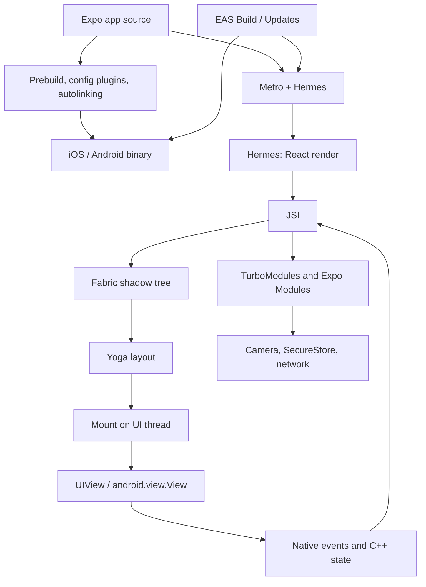

React Native 常被介紹成「React，但輸出是 native views 而不是 DOM」。這個描述並沒有錯，但壓縮得太厲害，解釋不了為什麼 `View` 裡的字串會 crash、為什麼 scroll offset 用 `useState` 會掉 frame、為什麼 Expo config plugin 不能 over the air 送達，或為什麼 `useLayoutEffect` 可以在 device 上一次 commit 量到 view，但若你每 frame 都 animate `height` 仍然會失敗。

這個技術棧透過 **Expo** 交付 React Native，就像這個網站透過 Next.js 交付 React 一樣。更有用的模型是：**Expo 是圍繞 React Native 的 orchestrator**，而 React Native 是 **React 的 host renderer**。Expo 分類 native modules、產生 iOS 與 Android 專案、用 Metro bundle JavaScript，並把 artifacts 對應到 devices。React Native 把 React tree 轉成 C++ shadow tree、跑 Yoga，並 mount `UIView` / `android.view.View` instances。React 仍擁有 elements、Fibers、lanes、render 與 commit。

<br />

```text
app source + app.json / config plugins
  → Expo prebuild / autolinking / Expo Modules
  → Metro bundle (Hermes bytecode)
  → React render (Fibers)
  → Fabric shadow nodes (C++, via JSI)
  → Yoga layout
  → mount native views
  → native events / C++ state / Expo Modules feed back
```

<br />

這篇文章針對 **Expo SDK 57**（`expo@57.0.9`、React Native **0.86.2**、React **19.2**、Hermes V1）。New Architecture 是預設，而且在這條 SDK line 裡，也是唯一受支援的 runtime。它假設你已熟悉 React 的 render/commit model。它區分四種陳述：

- 一條 **React 規則**，例如 render purity，或 state setter 會 schedule 工作而不是突變目前的 closure。
- 一份 **React Native 契約**，例如 `<View>` 與 `<Text>` 是不同的 host components，或 Fabric 把 shadow tree mount 到 platform views。
- 一份 **Expo 契約**，例如 config plugins、Continuous Native Generation、Expo Modules、`expo-router` file routes，或 EAS Build 與 EAS Update 的分工。
- 一項 **實作觀察**，例如 shadow-node field 或 Metro/Hermes 細節。觀察有助於除錯。應用程式碼不得依賴它們。

Legacy Bridge 與 `react-native init` 只在舊詞彙會造成歧義時出現。Expo Go 是帶固定 native module set 的 development host。它不是 production architecture。

<br />

---

## 1. Expo 在 React Native 周圍加上 Policy 與基礎設施

React 定義 components、reconciliation、Suspense 與 concurrent rendering。它不決定 TypeScript screen 如何變成 IPA、哪個 native module 被 link 進那個 binary、fonts 如何嵌入，或之後的 JavaScript bundle 如何取代隨 store build 一起出貨的那一份。React Native 決定 host views 如何建立與更新。Expo 決定其餘的 delivery path 並把它接起來。

一個 production Expo 應用跨越數層：



這些 boundaries 很重要，因為同一組 screens 可以在 React 沒變的情況下表現不同：

- **Config 與 prebuild** 決定 binary 裡存在哪些 native code：permissions、fonts、splash，以及 third-party modules。`app.json` / `app.config.ts` 加上 config plugins 就是契約。`npx expo prebuild` 會 materialize `ios/` 與 `android/`。
- **Autolinking** 在 **app** package 的 `node_modules` 裡發現 native modules 並註冊它們。只存在於 shared workspace package 的 native dependency 對 autolinking 是不可見的。
- **Metro** 把 JavaScript/TypeScript graph 轉成 Hermes 可執行的 bundle。開發時，Fast Refresh 會替換那個 graph。Hermes V1 在 production 把它 compile 成 bytecode。
- **React Native** 負責 render、layout 與 mount。Expo 不會取代 Fabric。
- **EAS** 是 deployment adapter。EAS Build 產出 native binary。EAS Update / `expo-updates` 會替換已包含 matching native surface 的 binary 裡的 JavaScript bundle。

把 Expo 叫做「managed workflow」低估了 compiler。把 React Native 叫做「帶 JS bridge 的 native app」低估了 renderer。比較耐用的心智模型是 **native project generator 加上 bundler 加上 React renderer**，再透過 host-specific adapter 部署。

Expo 之於 React Native，就像 Next.js 之於 browser：圍繞 React core 的 policy 與基礎設施。Next.js 把 URLs 對應到 browser 的 React trees。Expo 把 `app/` 檔案與 native modules 對應到 device 的 React trees。

<br />

---

## 2. React Native 是 Renderer，不是 Browser

Browser 解析 HTML，建立 DOM 與 CSSOM，做 styling、layout、paint 與 composite。那條路徑是 [Browser 裡的 Critical Rendering Path](/notes/critical-rendering-path-in-the-browser)。React Native 不做任何一項。沒有 HTML、沒有 CSSOM、也沒有 DOM。JSX 仍產生 React elements。Host tree 是 platform views。

`<View>` 與 `<Text>` 不是帶不同 default styles 的 div。它們是 **不同的 host components**，有不同的 native types 與不同的 layout rules。Yoga 可以 size 一個 `View`。Text metrics 來自 platform（`NSLayoutManager` / Android text layout）。字串只能作為 `Text` 的 child 才合法：

<br />

```tsx
import { StyleSheet, Text, View } from "react-native"

function Greeting({ name }: { name: string }) {
  return (
    <View style={styles.row}>
      <Text>Hello, {name}</Text>
    </View>
  )
}

const styles = StyleSheet.create({
  row: {
    gap: 8,
    padding: 16,
  },
})
```

<br />

這是非法的，而且在 production 會 crash：

<br />

```tsx
function Greeting({ name }: { name: string }) {
  return <View>Hello, {name}</View>
}
```

<br />

React Native 會嘗試把該字串 mount 成不接受 raw text 的 view 的 host child。當 falsy number 或 empty string 漏進 tree 時，也會出現同樣的 crash：

<br />

```tsx
function Badge({ count }: { count: number }) {
  return (
    <View>
      {count && <Text>{count}</Text>}
    </View>
  )
}
```

<br />

當 `count` 是 `0` 時，JSX 會 render `0`，而不是 `false`。Fabric 接著會嘗試在 `View` 底下建立 text host node。條件應放在 boolean 或 ternary：

<br />

```tsx
function Badge({ count }: { count: number }) {
  return (
    <View>
      {count > 0 ? <Text>{count}</Text> : null}
    </View>
  )
}
```

<br />

這是 React Native 契約，不是 lint 偏好。Web DOM 會把 `0` stringify 成 text node。Native host tree 不會。

Expo Go 不會改變這份契約。它是 prebuilt app，其 native module set 就是 Expo 在該 Go binary 裡 ship 的內容。Config plugin、custom Expo Module，或新的 native dependency 對 Go 是不可見的，直到它存在於 **你的** binary。Production development 使用 **dev client**（`expo-dev-client`）或 native surface 符合 `app.json` 的 EAS build。

<br />

---

## 3. 四棵 Tree

[深入理解 React](/notes/understanding-react-in-depth) 把 React elements、Fiber tree 與 host tree 分開。Fabric 加上第四棵存在於 C++ 的 tree：

<br />

```text
React elements   descriptions returned by components
Fiber tree       React's persistent bookkeeping and unit of work
Shadow tree      C++ layout tree (Yoga)
Host view tree   UIView / android.view.View on the UI thread
```

<br />

像 `HomeScreen` 或 `expo-router` layout 這類 composite component 永遠不會變成 shadow node。React 呼叫它，取得它回傳的 host elements，Fabric 只為那些 hosts 建立 shadow nodes：`View`、`Text`、`ScrollView`、來自 `expo-image` 的 `Image`，以及其他 native components。

Host Fiber 儲存指向其 shadow node 的 JSI pointer。Element object 是暫時的描述。Fiber 記住 identity、hooks 與 lanes。Shadow node 持有 style、children 與 layout。Host view 是用戶看得見的東西。

混淆這些層會產生常見錯誤。新的 element object 不代表新的 `UIView`。一次 component render 不代表 mount。JSX 裡的 wrapper `View` 在 flattening 之後可能從未存在為 native view。Device 上已改變的 `ScrollView` offset 不一定經過 React state。

<br />

---

## 4. Bridge 為何存在，以及它破壞了什麼

在 New Architecture 之前，JavaScript 與 native code 透過 asynchronous queue 溝通。Calls 被 serialize 成 JSON，post 過 bridge，並在另一邊 decode。Layout 無法在 render 期間 synchronous 讀取。Native modules 在 startup 時 eager 初始化。Concurrent React 無法 commit 一棵 coherent native tree，因為 renderer 無法參與 React 18 的 scheduling model。

那個設計 ship 了很多 apps。它也在每次跨 boundary 的 frame 上課稅：lists、gestures、cameras，以及任何需要比 JSON message 更大的 native object 的東西。

New Architecture 用 **JSI** 取代 queue，用 **Fabric** 取代 renderer，用 **TurboModules**（在 Expo 裡還有 **Expo Modules API**）取代 native modules。Expo SDK 55 停止支援 legacy architecture。SDK 57 不提供它作為 runtime option。執筆當下可在 `expo@canary` 取得的 React Native 0.87 延續這項移除。這篇文章描述的是你在 SDK 57 上實際執行的 architecture。

「Bridge」這個詞仍出現在 blog posts 與舊 modules 的 interop layers。它不是 framework 所建構的契約。

<br />

---

## 5. JSI 是 Shared Memory，不是 Message Bus

**JSI**（JavaScript Interface）是 C++ API，讓 JavaScript engine 持有 native object 的 reference，native code 也能持有 JavaScript function 的 reference。JS 對 native 的 call 可以是 synchronous。Hot path 上沒有 JSON round-trip。

這是 Fabric 在 render 期間建立 shadow nodes 所用的契約。也是 TurboModules 與 Expo Modules 暴露 `SecureStore`、camera frames 與 filesystem handles 所用的契約。像 VisionCamera 這類 library 可以在不把每秒約 30 MB 的 pixels 複製進 JSON string 的情況下處理 frame buffers。

Synchronous 不代表「免費」，也不代表「在另一條 thread」。Synchronous JSI call 仍佔用發起它的 thread。若那條 thread 是 JS thread，重的 native call 仍會 stall React。若工作屬於 UI thread，module 必須明確 hop 過去。

JSI 也不是 React API。應用程式碼應繼續呼叫已文件化的 modules（`expo-secure-store`、`expo-image`、`react-native` host components）。那些 modules 是 JSI host objects 這一事實，是解釋 latency 的實作觀察，不是你在 screen 裡應該直接 reach for 的 type。

<br />

---

## 6. Threading

Fabric 的設計透過讓 renderer structures 保持 immutable 而 thread-safe：updates clone 而不是 mutate。幾乎每條 production bug 都牽涉兩條 thread：

- **JS thread** 跑 Hermes、React 的 render phase，以及大部分 Yoga 工作。
- **UI thread**（main thread）是唯一可以 create、update 或 destroy host views 的 thread。

High-priority native events 可以在 **UI thread** 上跑 render pipeline，讓 gesture 不會卡在 in-flight JS render 後面。Lower-priority 工作可以被 interrupt。C++ state updates，例如 `ScrollView` offset，可以完全跳過 React 的 render phase。

<br />

```text
JS thread                         UI thread
  React render                      host view mutations
  most Yoga layout                  high-priority render (gestures)
  TurboModule / Expo Module JS      C++ state from native views
  Metro / Fast Refresh
```

<br />

這就是為什麼「app 很慢」不是一個診斷。長的 React render 佔用 JS thread。Layout-thrashing animation 佔用 Yoga。Main-thread native module 佔用 UI thread 並延遲 mount。Reanimated worklets 存在，是因為有些工作根本不能等 JS。

Hermes 不會給你第二條 JS thread。Concurrent React 可以在 JS thread 上 pause 並 restart render。除非 renderer 明確在 UI thread 跑 high-priority pass，否則它不會把 JavaScript 移到 UI thread。

<br />

---

## 7. Render、Commit 與 Mount

Fabric 的 pipeline 有三個 phase。官方文件稱它們為 **render**、**commit** 與 **mount**。它們對應 React 的 render/commit 分割，再加上額外的 native publication step。

**Render。** React 把 composite components 化簡成 host elements，對每個 host，Fabric 透過 JSI synchronous 在 C++ 建立 shadow node。Element tree 裡的 parent-child relationships 會 mirrored 到 shadow tree。這通常跑在 JS thread。React element tree 是 temporal 的。Fibers persist 並持有 JSI pointer。

**Commit。** 當 shadow tree 完成，Fabric 用 Yoga 計算 layout，並把那棵 tree promote 成「next」。大部分 layout 是 C++。`Text` 與 `TextInput` 仍會 call 進 platform 取 metrics。Commit 不得 mutate host views。常見路徑在 UI thread 之外執行；high-priority gesture 也可以改在 UI thread 跑完整條 pipeline。

**Mount。** UI thread diff 先前 mounted 的 shadow tree 與 next tree，flatten 不需要 host view 的 nodes，並套用 atomic mutations：create、update、insert、remove、delete。只有到那時 pixels 才會改變。

<br />

```text
React render (JS)
  → shadow nodes (C++, via JSI)
  → commit: Yoga + promote next tree
  → mount: diff, flatten, mutate UIView / android.view.View
```

<br />

Initial render 對 empty tree diff，所以 mount 是一串 creates。Update 對兩棵 immutable trees diff，可能只碰一個 `backgroundColor`。React 可以跳過 intermediate trees：較晚完成的 render 可以對 last published tree mount，而不是對每個被放棄的 attempt。

這就是 concurrent features 在 native 上能運作的機械原因。Render 是 speculative 的。Mount 是 publication。永遠不會完成的 transition 不會 mutate host views。

<br />

---

## 8. Yoga、Flattening，以及 Layout 可能花多少

Yoga 在 C++ 實作 Flexbox-like layout。Styles 是 JavaScript objects，不是 CSS stylesheets。`gap`、`padding` 與 `flex` 是 shadow-node inputs。它們不是 browser cascade。

有兩個後果。

第一，**view flattening**。只 pass through layout 的 nested wrapper `View`s 往往永遠不會變成 host views。Fabric 會把典型 600–1000 nodes 的 shadow tree 縮到約 200 個 host views 的量級。當 native inspector 缺少你寫的 `View` 時，flattening 是可能原因，不是 missing mount。

第二，**layout 不是每 frame 都免費**。Animate `width`、`height`、`top`、`margin` 或 `padding` 會要求 Yoga 重算。Animate `transform` 與 `opacity` 可以在 GPU 上跑，而不 relayout：

<br />

```tsx
import { useEffect, type ReactNode } from "react"
import Animated, {
  useAnimatedStyle,
  useSharedValue,
  withTiming,
} from "react-native-reanimated"
import { StyleSheet } from "react-native"

function SlideIn({
  visible,
  children,
}: {
  visible: boolean
  children: ReactNode
}) {
  const progress = useSharedValue(visible ? 1 : 0)

  useEffect(() => {
    progress.set(withTiming(visible ? 1 : 0))
  }, [progress, visible])

  const animatedStyle = useAnimatedStyle(() => {
    const value = progress.get()
    return {
      opacity: value,
      transform: [{ translateY: (1 - value) * 24 }],
    }
  })

  return (
    <Animated.View style={[styles.panel, animatedStyle]}>{children}</Animated.View>
  )
}

const styles = StyleSheet.create({
  panel: {
    borderCurve: "continuous",
    borderRadius: 12,
  },
})
```

<br />

Fabric 也讓 **synchronous measurement** 能在同一 commit 發生。`useLayoutEffect` 可以在 paint 前讀 layout。`onLayout` 在 view 之後改變時保持值 current。Prefer dispatch updater，讓相同 size 不會 schedule 另一次 render：

<br />

```tsx
import { useLayoutEffect, useRef, useState, type ReactNode } from "react"
import { StyleSheet, Text, View, type LayoutChangeEvent } from "react-native"

type Size = { width: number; height: number }

function MeasuredBox({ children }: { children: ReactNode }) {
  const ref = useRef<View>(null)
  const [size, setSize] = useState<Size | undefined>(undefined)

  useLayoutEffect(() => {
    const rect = ref.current?.getBoundingClientRect()
    if (rect) {
      setSize({ width: rect.width, height: rect.height })
    }
  }, [])

  function onLayout(event: LayoutChangeEvent) {
    const { width, height } = event.nativeEvent.layout
    setSize((current) => {
      if (current?.width === width && current.height === height) {
        return current
      }
      return { width, height }
    })
  }

  return (
    <View ref={ref} onLayout={onLayout} style={styles.box}>
      {children}
      {size ? (
        <Text>
          {size.width}×{size.height}
        </Text>
      ) : null}
    </View>
  )
}

const styles = StyleSheet.create({
  box: {
    gap: 8,
    padding: 16,
  },
})
```

<br />

`getBoundingClientRect` 是 post-0.82 路徑。較舊的 `measure` callback 是同一個 idea，但更多 asynchrony。兩者都不是 animate layout properties 的藉口。

<br />

---

## 9. Structural Sharing 與 C++ State

Shadow trees 是 immutable 的。React state update 會 clone 從 changed node 到 root 的路徑，並 **share** 未改變的 subtrees。Mount diff previous published tree 與 new tree。Siblings list 裡的 Node 4 可以被 reuse，同時 Node 3 的 `backgroundColor` 被 rewrite。

這份 sharing 就是 keys 與 identity 仍重要的原因：它們決定哪個 Fiber、哪個 shadow node、哪個 host view 存活。這也是為什麼一個 large screen 若每 row 都回傳新的 inline style object，仍可能比 screenshot 暗示的做更多工作。Style 是 cloning 的 input，即使視覺結果看起來相同。

Shadow tree 裡大部分資訊源自 React 並往下流。**C++ state** 是例外。有些 host components 保留 JavaScript 不擁有的 state。`ScrollView` offset 是常見例子：platform view 滾動，C++ 記錄 offset，而 `measure` 這類 API 可以讀它。React 沒有 render 那次 update。

把 offset 放進 `useState` 會發明第二個 source of truth，並在每次 scroll event schedule React render：

<br />

```tsx
function Feed() {
  const [scrollY, setScrollY] = useState(0)

  return (
    <ScrollView
      onScroll={(event) => {
        setScrollY(event.nativeEvent.contentOffset.y)
      }}
      scrollEventThrottle={16}
    />
  )
}
```

<br />

JS thread 現在在通往每一 frame 的路上 reconcile。Offset 已經存在於 C++。對 animation，Reanimated shared value 在 UI thread 更新。對 non-reactive tracking，ref 就夠：

<br />

```tsx
import Animated, {
  useAnimatedScrollHandler,
  useSharedValue,
} from "react-native-reanimated"

function Feed() {
  const scrollY = useSharedValue(0)

  const onScroll = useAnimatedScrollHandler({
    onScroll: (event) => {
      scrollY.set(event.contentOffset.y)
    },
  })

  return (
    <Animated.ScrollView onScroll={onScroll} scrollEventThrottle={16} />
  )
}
```

<br />

若 React 在中間 commit，C++ state commits 會 retry。Source of truth 留在 native。React 讓路，直到 screen 真的需要 React state snapshot。

<br />

---

## 10. TurboModules、Codegen 與 Expo Modules

Legacy native modules 會 upfront 註冊。Startup 為 camera、maps 與 analytics 付費，即使第一個 screen 從未使用它們。

**TurboModules** 透過 JSI lazy load。第一次 JS access 才 construct module。**Codegen** 讀 TypeScript 或 Flow specs 並產生 native bindings，讓 JS/native interface 在 build time 被檢查，而不是在 production 的第一次 call。

Expo 的 **Expo Modules API** 坐在同一層 JSI 上。`expo-secure-store`、`expo-camera`、`expo-font` 與 `expo-image` 是帶 JavaScript entry points 的 native modules。它們不是圍繞 `fetch` 的可選 wrappers。

兩份 Expo 契約決定 module 是否根本存在於 binary。

**Autolinking** 掃描 app 的 `node_modules`。在 monorepo 裡，`packages/ui` 使用的 native dependency 也必須在 app package 宣告。否則 prebuild 不會 link 它，JS import 會在 runtime 失敗，或 native symbol 會 missing。

**Config plugins** mutate 產生的 native project：Info.plist keys、Gradle permissions、embedded fonts、splash screens。Fonts 應放在 `expo-font` plugin，讓它們在 process start 就存在，而不是 async `useFonts` gate 之後：

<br />

```json
{
  "expo": {
    "plugins": [
      [
        "expo-font",
        {
          "fonts": ["./assets/fonts/Geist-Bold.otf"]
        }
      ]
    ]
  }
}
```

<br />

Images 應放在 `expo-image`。它是帶 native caching、blurhash placeholders，以及 lists 用 recycling keys 的 Expo Module。`react-native` 的 `Image` 是較薄的 host wrapper：

<br />

```tsx
import { Image } from "expo-image"
import { StyleSheet } from "react-native"

function Avatar({ url }: { url: string }) {
  return (
    <Image
      source={{ uri: url }}
      contentFit="cover"
      cachePolicy="memory-disk"
      style={styles.avatar}
    />
  )
}

const styles = StyleSheet.create({
  avatar: {
    borderCurve: "continuous",
    borderRadius: 20,
    height: 40,
    width: 40,
  },
})
```

<br />

加上 plugin 或 native module 會改變 **native** surface。那需要 `npx expo prebuild`（或 EAS Build）與新的 binary。只有 JavaScript 的 changes 不需要。

<br />

---

## 11. Metro、Hermes，以及 OTA 能替換什麼

`npx expo start` 跑 Metro。Metro 從 Expo entry 走 module graph，resolve platform extensions（`*.ios.tsx`、`*.android.tsx`），並 serve bundle。開發時，Fast Refresh 替換 components，並在可能時保留 state。Production 裡，**Hermes V1**（自 SDK 56 起為預設，包含 SDK 57）把 bundle compile 成 bytecode。

JS thread 仍是一條 thread。更便宜的 bytecode format 不會讓 unbounded feed `map` 變免費。

**EAS Update** / `expo-updates` 把新的 JavaScript bundle ship 到既有 binary。它不能加 native module、permission、透過 config plugin 註冊的 font file，或新的 Expo Module。那些活在 IPA/APK。若 screen 在 OTA 之後開始呼叫 `expo-camera`，而 binary 是在沒有該 module 的情況下 build，update 不會發明 native code。

那個分割是 Expo 對 Next.js compiler 與 runtime 的類比。Store build 是 native contract。Update 是給那份 contract 的新 React tree。

Hermes 也解釋某些 debugging 形狀。React Native DevTools 與 engine 對話。JS-only freeze 是 Hermes/React 問題。JS idle 時仍持續的 freeze 是 UI-thread 或 native-module 問題。

<br />

---

## 12. expo-router 是 Native Views 上的 Route Tree

`expo-router` 把 `app/` 底下的 files 對應到 screens，就像 Next.js 把 `app/` 對應到 URL segments。類比有用但不完整。Next.js 為 document 產生 HTML 與 Flight tree。Expo Router 產生 Fabric 會 mount 進 **native** navigator 的 React tree。

用 native stack。Expo Router 的 `Stack` 是 `@react-navigation/native-stack`。Transitions 與 back-swipe 跑在 UI thread。`@react-navigation/stack` 是 JS navigator：它透過 React animate views，並失去那種 native behavior。

<br />

```tsx
import { Stack } from "expo-router"

export default function Layout() {
  return <Stack />
}
```

<br />

當 product 在意 platform feel 時，Tabs 也應該是 native 的：

<br />

```tsx
import { NativeTabs } from "expo-router/unstable-native-tabs"

export default function TabLayout() {
  return (
    <NativeTabs>
      <NativeTabs.Trigger name="index">
        <NativeTabs.Trigger.Label>Home</NativeTabs.Trigger.Label>
        <NativeTabs.Trigger.Icon sf="house.fill" md="home" />
      </NativeTabs.Trigger>
      <NativeTabs.Trigger name="settings">
        <NativeTabs.Trigger.Label>Settings</NativeTabs.Trigger.Label>
        <NativeTabs.Trigger.Icon sf="gear" md="settings" />
      </NativeTabs.Trigger>
    </NativeTabs>
  )
}
```

<br />

`expo-router/unstable-native-tabs` 這個 import 是 SDK 57 上的 Expo 契約。即使之後 module path 穩定下來，仍應優先用 native tabs，而不是 JS tab navigator。

Layout file 是 composite component。它有 Fiber identity。它不會自己變成 shadow node。Native stack 擁有 headers、gestures 與 large titles 的 host views。Custom JS header 是你現在得 mount、style，並與 OS 保持 sync 的 React subtree。Prefer native header options。

這不是 routing tutorial。架構重點是 navigation 屬於 host tree 的一部分。若 transition 跑在 JavaScript，每一 frame 都會 re-enter React。若它跑在 `UINavigationController` / Android native tab host，OS animate 時 React 可以 idle。

<br />

---

## 13. Native 上的 Concurrent React

Fabric 是讓 React 18+ scheduling 在 device 上成真的東西。Legacy renderer 無法乾淨地參與 transitions、Suspense，或來自 native events 的 automatic batching。

`startTransition` 可以把 heavy screen update 標成 interruptible。設定 large list size 的 slider 可以讓 gesture 保持 urgent，list 保持 transitional，與 web 上同一 pattern。Suspense 可以為 native tree 的一個 region 顯示 fallback，而不 tear down 該 boundary 外已 commit 的 host views。

Synchronous layout 是另一半。在 legacy architecture 上，`onLayout` 加上 follow-up `setState` 往往會 paint 一 frame 放錯位置的 tooltip。在 Fabric 上，`useLayoutEffect` 加上 `getBoundingClientRect` 可以在一次 commit 量測並套用。這是 React 規則（layout effects 在 paint 前跑）因 React Native 契約（renderer 可以 synchronous 讀 layout）而變真。

Concurrent rendering 仍不是 parallelism。Hermes 跑工作。Fabric 可以 interrupt 它。UI thread 可以 take high-priority pass。Committed host tree 保持 coherent。

至於 React APIs 本身，見 [React 19 新功能](/notes/react-19-new-features) 與 [深入理解 React](/notes/understanding-react-in-depth)。這一節只說明那些 APIs 在 Expo SDK 57 上為何不是 no-ops。

<br />

---

## 14. 不能等 JS 的工作

60fps gesture 無法 round-trip 經過 React render、Yoga 與 mount 仍跑在 JS thread 上，還能 feel native。Reanimated worklets 與 Gesture Handler 跑在 UI thread。SDK 57 pin 了 `react-native-reanimated`、`react-native-worklets` 與 `react-native-gesture-handler` 的 current versions。

`Pressable` 是 host press primitive。`TouchableOpacity` 是 legacy。Animated press states（scale、opacity）應放在 `GestureDetector` 加 shared values，而不是 press-in 的 JS `setState`。

Lists 是另一個 JS-thread trap。Map 每一 row 的 `ScrollView` 會為 offscreen content 建立 Fiber、shadow node，以及可能的 host view：

<br />

```tsx
function Feed({ items }: { items: Item[] }) {
  return (
    <ScrollView>
      {items.map((item) => (
        <ItemCard key={item.id} item={item} />
      ))}
    </ScrollView>
  )
}
```

<br />

Virtualizer 只 mount 大致可見的 window。那是 Fabric budget，不是 stylistic preference：

<br />

```tsx
import { FlashList } from "@shopify/flash-list"
import { StyleSheet } from "react-native"

function Feed({ items }: { items: Item[] }) {
  return (
    <FlashList
      data={items}
      renderItem={({ item }) => <ItemCard item={item} />}
      keyExtractor={(item) => item.id}
      contentContainerStyle={styles.list}
    />
  )
}

const styles = StyleSheet.create({
  list: {
    padding: 16,
    gap: 12,
  },
})
```

<br />

LegendList 是同一個 idea。契約是「不要 mount 用戶看不到的東西」。`renderItem` 上的 inline style objects 與 inline callbacks 在 compiler 沒 inline 它們時仍會 defeat memoization；hoist 或讓 React Compiler 做。架構成本是額外的 render → 額外的 shadow clones → 用戶 scroll 時 JS 與 UI threads 上的額外 mount diffs。

<br />

---

## 15. 從頭到尾跟一次 Press

假設 Expo Router 裡的 membership card screen。用戶 press 一個 `Pressable`。Handler 用 `setState` 寫 flag，並從 `expo-secure-store` 讀 token。

路徑是：

1. OS 在 UI thread 把 touch 送到 host view。
2. Fabric / Gesture Handler 把 press route 進 JS，並呼叫 `Pressable` handler。
3. `setState` 在 screen 的 Fiber 上 enqueue Hook update，並 schedule root（[深入理解 React](/notes/understanding-react-in-depth)）。
4. React 在 JS thread render。Composite components 跑。Host elements 被建立。
5. Fabric 透過 JSI clone 或 create changed hosts 的 shadow nodes，並 share 其餘部分。
6. Commit 跑 Yoga。Text metrics 可能 call 進 UIKit / Android。
7. Mount diff previous shadow tree，flatten wrappers，並在 UI thread mutate native views。
8. `expo-secure-store` read 是進 Expo Module 的 separate JSI call。它不經 Fabric。它可能在 module 內 hop threads。它永遠不會變成 `View`。
9. 若 press 也 navigated，native stack 在 UI thread animate，同時 React render destination screen。兩者由 routing 耦合，不是一次 function call。

在任何時刻，React 都不會 rewrite 已跑完的 handler 裡的 `pressed` binding。在任何時刻，half-finished render 都不會變成 half-mutated `UIView` tree。SecureStore 不在 shadow tree。Card 的 `View` 在。

那一次 interaction 就是整個 stack：Expo Module、React scheduler、Fabric、Yoga，與 platform。

<br />

---

## 16. 調試時的問題

當 Expo screen 意外時，依序想這些：

1. **哪條 thread 忙？** JS freeze 對 UI freeze 對兩者都忙。
2. **這是 Expo Go、dev client，還是 release binary？** Go 不能長出新的 native modules。
3. **是 React render、Fabric commit，還是 mount？** Component 裡的 `console.log` 不能證明 `UIView` 改變了。
4. **這是 C++ state 還是 React state？** Scroll offset、text selection，與某些 gesture state 從未進入 `useState`。
5. **Flattening 是否移除了 native inspector 裡正在檢查的那個 view？**
6. **這個 change 需要 native rebuild，還是 JS 就夠？** Config plugins、permissions、fonts 與新的 Expo Modules 需要新 binary。EAS Update 不能發明它們。
7. **Autolinking 是否在看 app package？** 只在 workspace library 的 native dep 是 missing link，不是 Metro cache issue。
8. **這是 host-component 契約嗎？** `Text` 外的 strings、`0 && <Text />`、Gesture Handler list 裡的 `TouchableOpacity`。
9. **Navigation 是 native 嗎？** JS stack 會在應該 free 的 transition 期間顯示為 React 工作。
10. **Layout 是否每 frame 都在跑？** Animate `height` 是 Yoga。Animate `transform` 不是。

這些問題比一直加 `memo` 直到 list 不再掉 frame 更可靠。

<br />

---

## 17. 常見誤解

**「React Native 是 WebView。」** WebView 是 app 裡的 browser origin。Fabric mount platform views。混用兩者是 security boundary，見 [Frontend Security in Next.js and React Native](/notes/frontend-security-nextjs-react-native)。那不是 `View` 如何被畫出來。

**「Expo Go 就是 production 的做法。」** Go 是 prebuilt runtime。Production 是你的 EAS binary，加上可選的、符合該 binary 的 OTA JavaScript bundle。

**「Managed 代表沒有 native。」** Managed 代表 Expo 產生 native project。App 仍是 UIKit 與 Android views。Config plugins 是 native edits。Expo Modules 是 native code。

**「Bridge 仍是 JS 與 native 溝通的方式。」** 在 SDK 57 不是。JSI 是契約。Interop 可能為舊 modules 存在。它不是 architecture。

**「JSI 代表 JavaScript 平行跑。」** JSI 是 shared-memory calling。Hermes 仍是一條 JS thread。Concurrent React interleave 工作。它不會加 cores。

**「Fabric 是新的 React。」** Fabric 是 React Native 的 renderer。React 的 reconciler 是 [深入理解 React](/notes/understanding-react-in-depth) 描述的同一個 core。Fabric 是 host config 與 C++ shadow tree。

**「EAS Update 可以 ship 新的 native module。」** 它 ship JavaScript。Native surface changes 需要新 build。

**「更多 `View` 就代表更多 native views。」** Flattening 會 drop wrappers。Virtualization 拒絕 mount offscreen rows。JSX shape 不是 host-tree shape。

**「`useLayoutEffect` 在 native 沒用。」** 在 legacy renderer 上，sync layout 很弱。在 SDK 57 的 Fabric 上，它是你量測而不 visible jump 的方式。

<br />

---

## 最終心智模型

最短且準確的模型是：

<br />

```text
Expo generates the native binary and the JS bundle.
Hermes runs React.
Fibers remember.
JSI shares memory with native.
Fabric builds a shadow tree.
Yoga lays out.
Mounting publishes UIView / android.view.View.
C++ state can bypass React.
OTA replaces JS, not native.
```

<br />

React Native 不會取代 React 的 rendering model。Expo 不會取代 React Native 的 renderer。Expo 決定哪些 modules 存在、native project 如何產生，以及 binary 與 bundle 如何到達 device。React Native 決定 React tree 如何變成 platform views。React 決定 updates 如何被 schedule、render 與 commit。

保持 rendering pure，因為 Fabric 可能 restart 它。把 strings 放在 `Text` 裡，因為 host tree 不是 DOM。當 UI thread 已經擁有 scroll 與 gestures 時，把它們移出 React state tree。把 config plugins 放在 binary，不要放在 EAS Update。用 native navigators，讓 transitions 不要 re-enter JavaScript。

至於 React 自己的 queues、lanes 與 commit phase，繼續看 [深入理解 React](/notes/understanding-react-in-depth)。Web 對照見 [Browser 裡的 Critical Rendering Path](/notes/critical-rendering-path-in-the-browser)。Server/document 側的類比 orchestrator 見 [深入理解 Next.js](/notes/understanding-next-js-in-depth)。Device threat model（extractable bundle、SecureStore、WebView bridges）見 [Frontend Security in Next.js and React Native](/notes/frontend-security-nextjs-react-native)。

主要參考：Expo 的 [SDK 57 changelog](https://expo.dev/changelog/sdk-57)，以及 React Native 的 [architecture overview](https://reactnative.dev/architecture/overview)、[render pipeline](https://reactnative.dev/architecture/render-pipeline)、[threading model](https://reactnative.dev/architecture/threading-model) 與 [New Architecture](https://reactnative.dev/docs/the-new-architecture/landing-page) notes。公開的 Expo 與 React Native contracts 是耐用的 API。Shadow-node internals 與 Metro 細節是今天 toolchain 的除錯證據，不是要 hard-code 的 API。

這篇文章中的實作觀察對應 **Expo SDK 57** 與 React Native **0.86.2**（Hermes V1、New Architecture）。React Native 0.87 是下一條 Expo canary line，不是這個 SDK 的 runtime。
