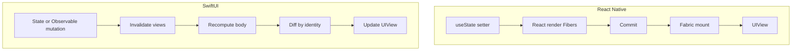

SwiftUI 常被介紹成「React，但 views 是用 Swift 寫的」。這跳過了為什麼 `View` struct 每次 update 都會被重建卻不會丟失 `@State`、為什麼沒有穩定 id 的 `ForEach` 會像缺了 `key` 一樣把 rows 洗亂、為什麼 `.onAppear` 不是 `useEffect([])`，或為什麼 Swift 裡的 `async`/`await` 可以 data-race，而同一套 pattern 在 JavaScript 卻不會。

這個技術棧透過 **Expo** 交付 React Native。這篇筆記是閱讀 SwiftUI 時用的 mapping。它假設你已經把 React Native 理解成 **React 的 host renderer**：Fibers、commit、Fabric、Yoga，以及一條對 gestures 來說太遲的 JS thread。那個模型是 [深入理解 React Native](/notes/understanding-react-native-in-depth)。你已經理解 native view tree。現在不靠 React 來寫它。

<br />

```text
RN:  setState → React render (Fibers) → commit → Fabric → UIView
SwiftUI: state mutation → invalidate body → value tree → diff by identity → UIView
```

<br />

Samples 針對 **iOS 17+** Observation（`@Observable`、`@State`、`@Binding`、`@Environment`）以及 **Swift 6** isolation（`MainActor`、`Task` cancellation）。React Native samples 對齊 sibling note 裡的 Expo SDK 57 路線。Combine 的 `ObservableObject` / `@ObservedObject` 只出現一次，作為你在 tutorials 裡仍會見到的舊路徑。

四種陳述：

- 一份 **React Native 契約**，例如 `<View>` 與 `<Text>` 是不同的 host components，或 Fiber 上的 `key` identity。
- 一份 **SwiftUI 契約**，例如 `View` 是一份 value description，或 `@State` 活在 framework 的 identity slot 裡而不是 struct 上。
- 一條 **Swift 語言規則**，例如 structs 在 assignment 時會 copy，或 `async` functions 會跑在它們繼承的 executor 上，直到你 hop。
- 一項 **實作觀察**，例如 `List` 包著 `UICollectionView`。應用程式碼不得依賴它們。

貫穿全文的是一個小的 **notes list → detail** screen：fetch、pull to refresh、push 一條 detail route。

---

## 1. 這篇筆記在做什麼

一個 React Native engineer 已經有正確的 abstractions：一棵 views 的 tree、會 invalidate 那棵 tree 的 state、layout、lazy lists、一條 native stack、不能等 JavaScript 的 gestures，以及帶 cancellation 的 async 工作。SwiftUI 把每一項 remap 到不同的 runtime。

- **先描述，再讓 framework 更新 host。** JSX 回傳 elements。`body` 回傳 `some View`。兩者都不是畫面上的 `UIView`。
- **Identity 決定什麼 state 能存活。** React 用 Fiber 上的 type + `key`。SwiftUI 用 structural position，加上明確的 `id:` / `ForEach` ids。
- **Lists 是 lazy 的，navigation 是 native 的，layout 是另一次 pass。** FlashList、`expo-router` 的 native stack，以及 Yoga，都有 SwiftUI counterparts。它們不是同一套 algorithms。
- 不會轉移的是 **runtime**。沒有 Hermes、沒有 Fabric shadow tree、沒有 Yoga、也沒有可以 over the air 替換的 Metro bundle。SwiftUI 被 compile 進 IPA。Update loop 是 framework 擁有的 value-tree diff，不是 React 的 render/commit。

這篇筆記不會走 Xcode、signing，或 App Store。它不會教 UIKit wrapping、The Composable Architecture、SwiftData，或把 Combine 當預設的 state path。

---

## 2. Runtime 不是 React

React Native 的 loop 是 [React 的 render 與 commit](/notes/understanding-react-in-depth) 加上一個 host renderer。Setter 會 schedule 工作。React 會 reconcile Fibers。Fabric 會 mount 或 update `UIView` instances。不能掉 frame 的 gestures 會離開那條 loop，透過 Reanimated 或 Gesture Handler 跑在 UI thread 上。

SwiftUI 的 loop 沒有 Fiber、沒有 JS thread、也沒有 Yoga。一個 `View` 是一個 **value**。當 view 讀到的 state 改變時，SwiftUI 會 invalidate 那個 view、要一份新的 `body`、把新的 value tree **按 identity** 跟上一份 diff，然後更新底層的 UIKit attributes。重建 struct 是預期而且便宜的。

<br />



<br />

- `body` 與 `render()` 都是描述。差別在 ownership。React 為每個 component instance 擁有一個 Fiber，並把 Hooks 存在上面。SwiftUI 擁有一份 identity map，並把 `@State` 存在那裡。你的 struct 是那份 map 的 **input**，不是 instance。
- SwiftUI 仍坐在 UIKit 上（`UIView`、`UICollectionView`、`UINavigationController`）。寫 `VStack` 不會給你另一條 pixels pipeline。你得到的是不同的 **description language** 與不同的 **identity/state** model。

**失敗：** 以為「沒有 UIKit」能幫你讀 stack trace。它幫不上。

---

## 3. React Native Engineers 會踩到的 Swift Traps

JavaScript values 除非是 primitives，否則是 references。突變 object 的一個 field，每個 alias 都看得見。Swift 對你放進 `View` 的資料預設相反：**`struct` 是 value**。Assignment 會 copy。對 copy 的 mutation 不會改到原本。

<br />

```swift
struct Note {
  var id: String
  var title: String
}

var a = Note(id: "1", title: "Draft")
var b = a
b.title = "Published"
// a.title == "Draft"
```

<br />

- `View` 是 structs 所 adopt 的 protocol。Framework 建立在便宜的 copies 上，而不是長壽的 component instances。
- `class` 是 reference type。`@Observable` models 是 classes，因為 store 必須被共享並原地突變。**讀** store 的 view 仍然是 struct。
- `let` vs `var` 不是 TypeScript 裡的 `const` vs `let`。`let` 綁定一個不能被重新賦值的名字。`let` struct 不能突變它的 properties。`let` class reference 不能指向另一個 instance，但那個 instance 的 `var` properties 仍然可以改。
- Optionals（`String?`、`Note?`）是一種 type，不是 runtime 的 `undefined`。你 unwrap 它們（`if let`、`guard let`、`??`），而不是檢查 `== null`。SwiftUI 大量用 optionals 做 presentation：`.sheet(item:)` 接受 `Binding<Item?>`，在它非 nil 時 present。

**失敗：** 把 `@State` 讀成對 immutable struct 的魔法 mutation。Property wrapper 在跟 SwiftUI 的 identity slot 說話。你在 `body` 裡看到的 struct 是一份新鮮的 value，它 **project** 那個 slot。

---

## 4. View 是描述，不是 Component Instance

Function component 是從 props（以及 Hook state）到 React element 的函式。SwiftUI view 是一個 **conform 到 `View` 的 struct**，並暴露 `body`。

<br />

```swift
struct NoteRow: View {
  let title: String

  var body: some View {
    Text(title)
  }
}
```

<br />

- 兩者都是 **pure descriptions**。建構 `NoteRow(title:)` 不會 mount 一個 `UIView`。它產生一份 framework 將 reconcile 的 value。
- **`body` 是 computed property**，不是你去呼叫的 function。SwiftUI 呼叫它。`body` 裡的 side effects 與 React render 期間的 side effects 是同一類 bug。
- **`some View` 是 opaque type。** Compiler 知道具體的 nested type。Callers 不知道。它不是 `ReactElement`。它不是 `any View`。`AnyView` 存在，但會付出 identity 與 performance。Prefer `some View`。
- **`ViewBuilder` 是 result builder**，這個 compiler feature 讓你能寫 `VStack { Text("A"); Text("B") }` 而不必回傳 array。Builder 裡的 `if` / `switch` **會改變 structural identity**。
- 每次 invalidation 都重建 struct，正是重點。沒有「活過這次 setState 的 component instance」這種等價物。便宜的 value，持久的 identity slot。

Xcode Previews 不是 Fast Refresh。Fast Refresh 替換一個 JS function 並試圖保住 Hook state。Preview 在 canvas 裡重新實例化 view tree。

---

## 5. Identity 不是 Fiber Identity

React 的公開 identity 規則是 type + position，被 `key` 覆蓋。State 活在 Fiber 上。SwiftUI 的公開 identity 規則是 **structural identity**（view 在 `body` tree 裡坐在哪裡），被明確 identity 覆蓋：`ForEach` 的 `id`、`.id(_:)`，以及 identifiable navigation values。

`@State` **不存在 struct 上**。Struct 會被 copy。SwiftUI 把 state 存在一個由該 view 的 identity 作為 key 的 slot 裡。若 identity 穩定，slot 能活過一份新的 `body`。若 identity 改變，slot 是新的，state 會 reset。若兩列共享一個 identity，它們共享一個 slot——跟重複 `key` 是同一個 bug。

<br />

```swift
ForEach(notes) { note in
  NoteRow(title: note.title)
}

// Note: Identifiable, or:
ForEach(notes, id: \.id) { note in
  NoteRow(title: note.title)
}
```

<br />

- 穩定的 ids 讓 state 與 animations 留在對的 row 上。Index-as-id 跟 `key={index}` 是同一個陷阱。
- **`ViewBuilder` 裡的 `if` / `else` 是 type-level branch。** SwiftUI 看到的是兩個不同的 structural positions，不是一個 props 變了的 view。SwiftUI 裡的條件 `if` 更接近互換 `{condition ? <A /> : <B />}` **且沒有 keys**，只是 framework 對此更嚴格。
- **`.id(newValue)` 強制一份新 identity。** 在你確實意思是 remount 時再用。
- **帶 range 的 `ForEach`**（`ForEach(0..<count)`）是 index identity。Prefer 帶 ids 的 data。

一列的 `@State`（swipe offset、expanded flag）必須跟著 `note.id`，而不是該列目前在 array 裡的 index。

**失敗：** 用 `.id(newValue)`「reset 一個 form」，結果每個 keystroke 都意外 remount。

---

## 6. State

React state 是 Fiber 上的 Hook slot。SwiftUI state 是 identity 上的 slot。

| Role | React Native | SwiftUI (iOS 17+) |
| --- | --- | --- |
| Local UI state | `useState` | `@State` |
| Controlled child | `value` + `onChange` | `@Binding` (`$state`) |
| Shared screen model | module store, Context, Zustand | `@Observable` class, often owned with `@State`, passed or put in `Environment` |
| Read-only dependency | Context | `@Environment` / `@Environment(\.dismiss)` |

<br />

```swift
struct NoteEditor: View {
  @State private var title = ""

  var body: some View {
    TextField("Title", text: $title)
  }
}

struct TitleField: View {
  @Binding var title: String

  var body: some View {
    TextField("Title", text: $title)
  }
}
```

<br />

- `$title` 是 `Binding<String>`——value 加上 setter。把 `$title` 傳給 child 是反過來的 lifting：parent 擁有，child 透過它寫入。
- Screen 的 notes array 不屬於每一列上的 `@State`。它屬於一個標了 `@Observable` 的 **class**。View 用 `@State` **擁有** 它（iOS 17 對 Observable instances 的規則）或接收它。
- SwiftUI 追蹤 `body` **讀了** 哪些 properties。突變 `isLoading` 不會 invalidate 一個只讀了 `notes` 的 view。這比典型的 React context value 更細。
- `@Environment(NotesStore.self)` 是不靠 props 把 store 往下傳的方式。它是 Context，不是 Redux。沒有 reducer 要求。
- Observation 之前的程式碼在 Combine 的 `objectWillChange` 上用 `ObservableObject`、`@Published`、`@StateObject`（owner）與 `@ObservedObject`（child）。`@StateObject` 不是 `@State`。`@ObservedObject` 不擁有 object；若 parent 重建它，你會 reset。iOS 17+ 的新程式碼不應從那裡起步。

---

## 7. Layout 不是 Yoga

Yoga 是 flexbox：`flexDirection`、`justifyContent`、`alignItems`、`flex: 1`、margins。SwiftUI layout 是一套 **proposal protocol**。Parent 提出一個 size。Child 選擇一個 size（最多是 proposal，除非它忽略）。Parent 再放置 child。`HStack`、`VStack` 與 `ZStack` 是三條 composition axes。`ZStack` 是 overlay，不是第三種 flex direction。

<br />

```swift
struct NoteCard: View {
  let title: String
  let excerpt: String

  var body: some View {
    HStack(alignment: .top, spacing: 12) {
      VStack(alignment: .leading, spacing: 4) {
        Text(title).font(.headline)
        Text(excerpt).foregroundStyle(.secondary)
      }
      Spacer()
    }
    .padding(16)
  }
}
```

<br />

- **`Spacer()` 一般不是 sibling 上的 `flex: 1`。** 它沿 stack 的 axis 擴張，吃掉剩下的 proposed space。Text column 上剩下的 width，往往是在 `VStack` 上用 `.frame(maxWidth: .infinity, alignment: .leading)`，而不是在它後面放 spacer。
- **`.frame(width:height:)` 是一份 proposal，然後是一個 size。** `maxWidth: .infinity` 的意思是「拿 parent 提出的無論多少」。
- **Safe area 預設開著。** SwiftUI 在它裡面 layout。`.ignoresSafeArea()` 選擇退出。RN 預設的 `View` **不會** inset；你加上 `SafeAreaView` 或 `useSafeAreaInsets()`。Defaults 是反的。
- **沒有 `StyleSheet`。** Modifiers wrap 這份 value。Order 重要：`.padding().background()` 不是 `.background().padding()`。那更接近 nested Views，而不是一份扁平的 style object。

兩套 stacks 都不要每 frame animate `height`。Prefer transforms 與 opacity。

---

## 8. Lists

`FlatList` / FlashList recycle cells。`ScrollView` + `map` 不會。SwiftUI 的 `List` 是 lazy 的。`List` 裡的 `ForEach` 是 lazy 的。普通 `ScrollView` 裡的 `ForEach` **不是**，除非你改成 `LazyVStack` / `LazyHStack`。

<br />

```swift
List(notes) { note in
  NoteRow(title: note.title)
}

ScrollView {
  LazyVStack {
    ForEach(notes) { note in
      NoteRow(title: note.title)
    }
  }
}
```

<br />

- **`List` 帶上 platform styling**（inset grouped、separators、swipe actions）。FlashList 是一塊空白的 recycling surface。若你想要自訂 feed，`ScrollView` + `LazyVStack` 比 `List` 更接近 FlashList。
- **一列上的 `onAppear` 在該列被 realized 時觸發**，不是 screen mount 時。那是 viewability，不是 list screen 上的 `useEffect`。
- Pull to refresh 是 list 上的 `.refreshable`，相對 `FlatList` 上的 `RefreshControl`。兩者都是 UI-thread 上的 platform controls。Main actor 上一次 synchronous load 仍會擋住 UI。

**失敗：** Identity bugs 表現為錯的 row 在 animate。修 `id`，不是修 animation。

---

## 9. Navigation

`expo-router` 把 `app/` 下的檔案對應到一條 **native** stack。URLs、deep links 與 layouts 是 Expo 契約。Transition 仍跑在 `UINavigationController` 上。SwiftUI 的 `NavigationStack` 也是一條 native stack。除非你自己建，它不是一棵 URL tree。你 push 的 value 就是 route。`navigationDestination(for:)` 是 registrar。

<br />

```swift
NavigationStack {
  List(notes) { note in
    NavigationLink(value: note) {
      Text(note.title)
    }
  }
  .navigationDestination(for: Note.self) { note in
    NoteDetailView(note: note)
  }
}
```

<br />

`Note` 必須是 `Hashable`（通常也是 `Identifiable`）才能活在 path 上。

| Job | expo-router | SwiftUI |
| --- | --- | --- |
| Stack | `app/**/_layout.tsx` + `<Stack />` | `NavigationStack` |
| Push | `router.push('/notes/1')` | `NavigationLink(value:)` or `path.append` |
| Typed screen | `app/notes/[id].tsx` | `.navigationDestination(for: Note.self)` |
| Modal | `presentation: 'modal'` | `.sheet(item:)` / `.fullScreenCover` |
| Dismiss | `router.back()` | `@Environment(\.dismiss)` |

<br />

- 兩套 stacks 用對了，都會把 transition 留在你的 update loop 之外。RN 裡的 JS stack navigator 每一 frame 都 re-enter React。自訂 SwiftUI transition 若每 frame tick `@State`，每一 frame 都會 re-enter `body`。Prefer platform stack。
- **沒有 file-system router。** 你不會從 folder 得到 typed routes。`NavigationPath` 是你可以 encode 的 untyped stack。Deep linking 是 `onOpenURL` 加上你自己的 parsing，或一個 library。

---

## 10. Gestures 與 Animation

React Native 的 JS thread 對 60fps pan 來說太遲。不能等 JS 的工作屬於 Reanimated worklets 或 Gesture Handler。那是 [深入理解 React Native](/notes/understanding-react-native-in-depth)。

SwiftUI **沒有 JS thread**。`DragGesture`、`MagnifyGesture` 與 `withAnimation` 已經跑在 UI process 裡。你不需要 worklet compiler 才能用手指移動一個 view。那並不讓 SwiftUI animation 等價於 Reanimated worklet。

<br />

```swift
struct SwipeRow: View {
  @State private var x: CGFloat = 0

  var body: some View {
    Text("Note")
      .offset(x: x)
      .gesture(
        DragGesture()
          .onChanged { value in
            x = value.translation.width
          }
          .onEnded { _ in
            withAnimation(.spring) { x = 0 }
          }
      )
  }
}
```

<br />

- Reanimated 的 `x.value` 可以更新而 **不必** React render。Shared values 是 native-thread state。SwiftUI 的 `x` 是 `@State`。每次 `onChanged` 都會 invalidate view 並重新計算 `body`。對一列 offset 這沒問題。對一棵在 `body` 裡做真正工作的 views graph，這並不免費。
- Worklet 的類比不是 `withAnimation`。它仍是「把這個留在 description pass 之外」——UIKit，或一個 `Canvas`，或一個寫入 SwiftUI 能在不重跑整棵 tree 的情況下 interpolate 的 transaction 的 gesture。
- **`withAnimation` interpolate 的是 SwiftUI 已經知道如何 animatable-diff 的 values**（frame、opacity、offset、部分 layout）。`body` 裡的任意工作不會因為你 wrap 了 setter 就變成 worklet。

在 SwiftUI 裡，你一開始就站在 RN 離開 React 才進入的那個世界。你仍可能掉 frame。你掉 frame 是因為在 `body` 裡做太多，不是因為在等 Hermes。

---

## 11. Swift Concurrency vs JavaScript Event Loop

JavaScript 是 single-threaded。Promises 與 `async`/`await` 是在 [event loop](/notes/javascript-event-loop-in-depth) 上 scheduling。你不能從兩條 threads data-race 同一個 JS object。你仍可能有 stale closures、錯過的 cleanups，以及一條在 UI 等待時很忙的 JS thread。

Swift 是 concurrent 的。`async`/`await` 不是 event loop。一個 `async` function 會 suspend。當它 resume 時，它可能在 **不同的 executor** 上。UIKit 與 SwiftUI state 屬於 **main actor**。Hop 出去 fetch，然後在沒有回到 `MainActor` 的情況下突變 store，就是 data race。Swift 6 的 compiler 常常會拒絕這件事。把拒絕當成 feature。

<br />

```swift
@Observable
@MainActor
final class NotesStore {
  var notes: [Note] = []

  func load() async {
    let next = try? await fetchNotes()
    notes = next ?? []
  }
}

.task {
  await store.load()
}

.task(id: selectedId) {
  await store.loadDetail(id: selectedId)
}
```

<br />

- **`.task` cancellation 是 cooperative 的**，像 `AbortController`。`URLSession` 會尊重它。緊密的 `for` loop 不會，除非你檢查 `Task.isCancelled`。
- **`.task(id:)` 是 dependency array。** 沒有 id 的 `.task { }` 更接近 `useEffect(() => { ... }, [])` 加上 cancel-on-unmount，但「unmount」指的是 SwiftUI identity 消失，不是 Fiber unmounting。若 identity 閃爍，你會 refetch。
- **`actor` 把 mutable state isolate** 到一個 serial mailbox。若 background task 突變一個 `body` 會讀的 class，你需要 isolation（store 上的 `@MainActor` 是常見的 UI 選擇），否則你有一場 JS 心智模型看不見的 race。
- `setTimeout(0)` 不是 `Task { }`。`Task { }` schedule 工作。它不會等一個不存在的 microtask checkpoint。`MainActor.run { }` 是「hop 到 UI actor」，不是 `queueMicrotask`。

---

## 12. Lifecycle 不是 Mount

`useEffect` 在 commit 之後跑。`useEffect(() => { ... }, [])` 在 mount 之後跑。SwiftUI 的 `.onAppear` / `.onDisappear` 跟隨 **rendered tree 裡的 identity**，不是 Fiber mount。`List` 一列的 `onAppear` 在 cell 被 realized 時觸發——滾出畫面，`onDisappear`；滾回來，再一次 `onAppear`。那更接近 `onViewableItemsChanged`，而不是 screen-level 的 `useEffect([])`。

`.task` 是更好的 loading primitive：view 出現時開始，view 的 identity 消失時 cancel，並且可以用 `.task(id:)` restart。Prefer 它，而不是 `onAppear { Task { ... } }`，後者很容易 leak。

- **`onAppear` 不是 `componentDidMount`。** 一張蓋住 view 的 sheet，歷史上會產生與「底下仍 mounted」不匹配的 appear/disappear 序列。不要把「整個 app session 只跑一次」的邏輯放進 `onAppear`。
- 對 notes list，在 list identity 上用 `.task` load，在 detail identity 上用 `.task(id: note.id)` load detail。
- 若你的意思是「Fiber 沒了」，`onDisappear` 不是可靠的「save draft」hook。從明確 action save，或從 `.task` cancellation（`defer` / `try await` teardown）save，前提是你已經決定把它綁在哪個 identity 上。

---

## 13. Notes List，兩套 Stacks

同一塊產品表面。Fetch 一份 list、pull to refresh、push 一條 detail、load body。RN 側是 Expo（`FlatList` + `useEffect` + `AbortController` + `router.push`）。SwiftUI 側是 Observation + `NavigationStack`。

<br />

```swift
import Observation
import SwiftUI

struct Note: Identifiable, Hashable {
  let id: String
  var title: String
  var body: String
}

@Observable
@MainActor
final class NotesStore {
  var notes: [Note] = []
  var isLoading = false

  func load() async {
    isLoading = true
    defer { isLoading = false }
    notes = (try? await fetchNotes()) ?? []
  }

  func loadDetail(id: String) async -> Note? {
    try? await fetchNote(id: id)
  }
}

struct NotesListView: View {
  @State private var store = NotesStore()

  var body: some View {
    NavigationStack {
      Group {
        if store.isLoading && store.notes.isEmpty {
          ProgressView()
        } else {
          List(store.notes) { note in
            NavigationLink(value: note) {
              Text(note.title)
            }
          }
          .refreshable { await store.load() }
        }
      }
      .navigationDestination(for: Note.self) { note in
        NoteDetailView(note: note, store: store)
      }
      .task { await store.load() }
    }
  }
}

struct NoteDetailView: View {
  let note: Note
  var store: NotesStore
  @State private var bodyText: String?

  var body: some View {
    Group {
      if let bodyText {
        Text(bodyText)
      } else {
        ProgressView()
      }
    }
    .navigationTitle(note.title)
    .task(id: note.id) {
      bodyText = await store.loadDetail(id: note.id)?.body
    }
  }
}
```

<br />

把這對當成一份 mapping 來讀，不是兩份 tutorials：

- **Identity：** `keyExtractor` / `note.id` vs path 上的 `Identifiable` / `Hashable`。
- **Ownership：** screen 上的 `useState` vs `@State` 擁有一個 `@Observable` store。
- **Load + cancel：** `useEffect` + `AbortController` vs `.task` / `.task(id:)`。
- **Refresh：** `RefreshControl` vs `.refreshable`。
- **Push：** `router.push("/notes/" + id)` vs `NavigationLink(value:)` + `navigationDestination`。

SwiftUI detail 仍然會 fetch，即使 list 已經有一個 `Note`。List row 不是一份完整 document。把整個 `Note` 當 navigation value 傳過去，是為了 `title` 的方便，不是 cache policy。

---

## 14. Analogy 在哪裡破裂

上面的 mappings 有用，直到它們被當成等式。

- **一個 `View` 是一個 value。一個 function component 是一個 Fiber 上的 function。** 重建 struct 不是 remounting。`@State` 能存活是因為 identity，不是因為 struct 長命。
- **沒有 Yoga，也沒有 `StyleSheet`。** Proposed sizes 與 modifier order 取代 flexbox 與 style objects。`Spacer` 不是 `flex: 1`。Safe area defaults 是反的。
- **沒有 JS thread，也沒有 OTA JavaScript。** Reanimated 存在是因為 Hermes 太遲。SwiftUI gestures 從 UI process 開始；你仍可能 stall `body`。一個新的 SwiftUI screen 是一份新 binary。EAS Update 不能替換 `NotesListView`。Store build **就是** tree。
- **Navigation 不是一棵 URL tree。** `expo-router` 讓 file routes 成為產品功能。`NavigationStack` 讓 value path 成為產品功能。你可以在上面建 URLs。Framework 不是從那裡開始。
- **`async`/`await` 不是 event loop。** Single-threaded JS 不能 race 同一個 object 的兩次突變。Swift 可以。Store 上的 `@MainActor` 不是迂腐。`.task` cancellation 是 identity-shaped，不是 Fiber-shaped。
- **`.onAppear` 不是 mount。** Lazy lists、sheets，以及 identity 改變，會比 screen component 上的 `useEffect([])` 更常呼叫它。

第一次讀 sample 時留著這套 mapping。當一個 view reset state、refetch 兩次，或 animate 錯的 row 時丟掉它。那時的問題是 SwiftUI 的問題：**identity 是什麼，`body` 讀了什麼，哪個 actor 擁有這次 mutation？** 不是「哪條 Fiber committed」。

---

## Recap Q&A

<Accordion type="single" collapsible>
  <AccordionItem value="swiftui-view">
    <AccordionTrigger>1. 為什麼 SwiftUI `View` 是描述，不是 component instance？</AccordionTrigger>
    <AccordionContent>

      - SwiftUI view 是一個 **conform 到 `View` 的 struct**，並暴露 `body`。建構 `NoteRow(title:)` 不會 mount 一個 `UIView`。它產生一份 framework 將 reconcile 的 value——與 JSX 同一份「先描述，再讓 framework 更新 host」的契約。
      - `body` 是 SwiftUI 呼叫的 **computed property**。`body` 裡的 side effects 與 React render 期間的 side effects 是同一類 bug。
      - 每次 invalidation 都重建 struct，正是重點。沒有「活過這次 setState 的 component instance」。便宜的 value，持久的 **identity slot**。
      - `some View` 是 opaque type，不是 `ReactElement`。`AnyView` 會付出 identity。Prefer `some View`。
      - JavaScript aliases 原地突變；Swift `struct` **copy**。`@State` 不是對 immutable struct 的魔法 mutation——wrapper 在跟 SwiftUI 的 slot 說話。

    </AccordionContent>
  </AccordionItem>

  <AccordionItem value="swiftui-identity">
    <AccordionTrigger>2. SwiftUI identity 與 Fiber identity 有何不同？</AccordionTrigger>
    <AccordionContent>

      - React 的公開規則是 type + position，被 `key` 覆蓋。State 活在 Fiber 上。SwiftUI 的公開規則是 **structural identity**（view 在 `body` 裡坐在哪裡），被 `ForEach` ids、`.id(_:)` 以及 identifiable navigation values 覆蓋。
      - `@State` **不存在 struct 上**。若 identity 穩定，slot 能活過一份新的 `body`。若 identity 改變，state 會 reset。若兩列共享一個 identity，它們共享一個 slot——跟重複 `key` 是同一個 bug。
      - `ViewBuilder` 裡的 `if` / `else` 是 **type-level branch**：兩個 structural positions，不是一個 props 變了的 view。
      - `.id(newValue)` 強制 remount。`ForEach(0..<count)` 是 index identity。Prefer 帶 ids 的 data。
      - **失敗：** 每個 keystroke 都用 `.id`「reset 一個 form」。

    </AccordionContent>
  </AccordionItem>

  <AccordionItem value="swiftui-state">
    <AccordionTrigger>3. `@State`、`@Binding` 與 `@Observable` 如何對應到 React？</AccordionTrigger>
    <AccordionContent>

      - Local UI state 是 `useState` → **`@State`**。Controlled child 是 `value` + `onChange` → **`@Binding`**（`$state`）。
      - Shared screen model 是 Context / Zustand → 一個 **`@Observable` class**，在 iOS 17 上常用 `@State` 擁有，再傳下去或放進 `Environment`。Read-only dependencies 是 Context → `@Environment`。
      - Screen 的 notes array 不屬於每一列上的 `@State`。它屬於 list 與 detail 都會讀的一份 model。
      - 那份 model 是 **class**，因為 store 必須被共享並原地突變。**讀** 它的 view 仍然是 struct。

    </AccordionContent>
  </AccordionItem>

  <AccordionItem value="swiftui-layout">
    <AccordionTrigger>4. 為什麼 SwiftUI layout 不是 Yoga？</AccordionTrigger>
    <AccordionContent>

      - Yoga 是 shadow tree 上的 flexbox。SwiftUI layout 是一套 **proposal protocol**：parent 提出一個 size，child 選擇一個 size，parent 再放置 child。
      - `HStack`、`VStack` 與 `ZStack` 是三條 composition axes。`ZStack` 是 overlay，不是第三種 flex direction。
      - `Spacer` 不是 `flex: 1`。Safe area defaults 是反的。Modifier order 取代一份扁平的 `StyleSheet`。
      - Lists、navigation 與 layout 仍有 counterparts——`List` / `UICollectionView`、一條 native stack、另一次 layout pass——但它們不是同一套 algorithms。
      - 用 platform 的工具 animate。不要假設 `flex: 1` 有一個同名雙胞胎。

    </AccordionContent>
  </AccordionItem>

  <AccordionItem value="swiftui-concurrency">
    <AccordionTrigger>5. 為什麼 Swift `async`/`await` 能 data-race，而 JavaScript 不能？</AccordionTrigger>
    <AccordionContent>

      - JavaScript 是 single-threaded。`async`/`await` 是在 event loop 上 scheduling。你不能從兩條 threads data-race 同一個 JS object。你仍可能有 stale closures 與一條忙碌的 JS thread。
      - Swift 是 **concurrent** 的。一個 `async` function 會 suspend；當它 resume 時，它可能在 **不同的 executor** 上。UIKit 與 SwiftUI state 屬於 **main actor**。
      - Hop 出去 fetch，然後在沒有回到 `MainActor` 的情況下突變 store，就是 data race。Swift 6 常常會拒絕這件事。把拒絕當成 feature。
      - `.task { await store.load() }` 更接近可取消的 Effect，而不是 `.onAppear`。`.onAppear` 不是 `useEffect([])`。
      - 把 store 標成 `@MainActor`。用 `.task(id:)` 在 identity 改變時 cancel。

    </AccordionContent>
  </AccordionItem>
</Accordion>
