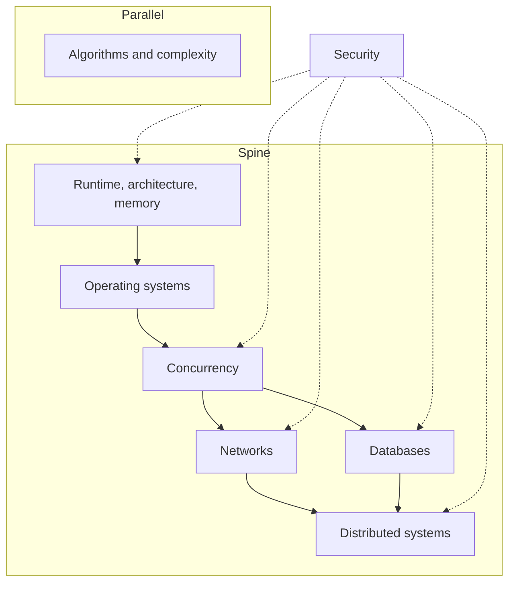

Production software は library の積み重ねではない。React tree、Hono handler、Postgres query の下には、より小さなモデルの組がある。program が memory をどう占めるか、operating system が work をどう schedule するか、複数のことが同時にどう起きるか、data が network をどう渡るか、database が truth をどう述べるか、そして machine が複数になったときそれらの truth がどう分岐するか。

 

この note は、それらのモデルが production TypeScript システム——browsers、Node、HTTP、Postgres——にどう現れるかの地図である。コースカタログではない。各 node は使える定義、production で現れる場所、そして弁護に値する failure mode である。Algorithms は spine の横に座る。Security は横切る。

 

 

矢印を辿る。process が何かをまだ言えないなら、distributed systems から始めない。

 

---

## Runtime、architecture、memory

Program は source file ではない。CPU、caches、RAM を占める instructions と data である。**Runtime** がその占め方を決める。JavaScript engine（Chrome と Node の V8）は functions を compile し、**heap** 上に allocate し、進行中の calls を **stack** に記録する。Architecture は locality がなぜ重要か——cache line を miss することは jank として感じる stall である——と、main thread が無限ループではなく稀少な機械であることを説明する。

 

Component が大きな array を close over する、module-level cache が parsed JSON を永遠に持つ、React list が styles を書いたあと layout を強制する。そのたびにこのモデルに当たる。Engine は、live reference が残っているものを代わりに捨ててはくれない。Unbounded recursion による stack overflow も同じモデルである。各 call は frame であり、frame は有限である。Event loop と rendering path は、その stack が他の仕事をできるほど空いたときに起きることである。

 

**Failure mode:** request や navigation のたびに増える closure や singleton cache。Memory は JavaScript が「garbage collected」だから leak しない、のではない。Reference が残っているから leak する。Process が limit に当たり、tab が死に、heap snapshot には bound を設けていない map がある。

 

Runtime モデルは [JavaScript コア概念](/notes/core-javascript-concepts)。Stack が空のあいだ host が何をするかは [JavaScript Event Loop を深く理解する](/notes/javascript-event-loop-in-depth)。Main-thread の仕事が pixels になる理由は [ブラウザにおける Critical Rendering Path](/notes/critical-rendering-path-in-the-browser)。

 

---

## Operating systems

OS は、多くの programs が一台の機械を共有するという fiction である。**Process** は address space と一組の resources。**Thread** はその空間の中で schedule される実行である。**Virtual memory** は各 process に RAM を所有していると信じさせる。**I/O** は kernel への request であり、JavaScript promise ではない——promise は runtime が返答を聞く手段である。

 

Node の JavaScript は 1 本の thread で走る。Timers、DNS、ほとんどの filesystem 仕事は host で起き、callback が queue に入る。`worker_threads` と child processes が、追加の JS threads や processes を得る方法である。Browser は複数の processes（site isolation）が IPC で協調する。どれも「JavaScript は multi-threaded」ではない。OS が isolation と scheduling を提供し、runtime がその薄い切片を選んでいる。

 

**Failure mode:** Node process を thread pool として扱うこと。Request handler の中で巨大 payload の CPU-heavy な `JSON.parse`、tight loop、同期の `fs.readFileSync` は、その process 上の他のすべての request を止める。OS はまだ schedule している。JS thread はしていない。

 

この契約の host 側は [JavaScript Event Loop を深く理解する](/notes/javascript-event-loop-in-depth)。

 

---

## Concurrency

Concurrency は重なる仕事である。**Parallelism** は複数 core の上で重なる仕事である。JavaScript は concurrency を安く与える（`async`/`await`、queues、event loop）。Parallelism は対価を払ったときだけ（workers、複数 processes）。2 つの `await` は interleave する。Lock は取らない。React の「concurrent」rendering は 1 thread 上の cooperative scheduling であり、OS threads が shared state を race することではない。

 

同一の `fetch` を coalesce するとき、Hono handler が Drizzle を await しながら in-memory counters が request をまたいで安全だと仮定してはいけないとき、2 つの updates が順不同で着いて UI が stale を出すとき、これが現れる。有用な道具は queues、single-flight maps、「この値は 1 つの task の所有」である。Shared mutable memory は高い道具である。

 

**Failure mode:** `await` をまたいで module-level object を read-modify-write し、「Node は single-threaded」だから安全だと言うこと。Single-threaded は一度に 1 つの stack という意味であり、一度に 1 つの request という意味ではない。2 番目の request はその隙間で走る。Counter、cache、in-flight map はもう間違っている。

 

Interleave そのものは [JavaScript Event Loop を深く理解する](/notes/javascript-event-loop-in-depth)。

 

---

## Networks

Network は可変 delay のある、ものを落とす queue である。**TCP** は bytes を順に届けようとする。**TLS** は相手を認証し pipe を暗号化する。**HTTP** はその上の request/response の約束である。Timeout は negative acknowledgment ではない。CORS は browser policy であり、server の access-control ではない。Cookies は credentials の輸送であり、server はそれでも verify しなければならない。

 

Timeout のない `fetch`、Hono の前の API Gateway、private であるべき JSON を cache する CDN、`Domain` が一段広い cookie。そこで現れる。Latency は平均ではない。Tail である。Rendering path が待つのは critical bytes である。残りは待てる。

 

**Failure mode:** Client が timeout し `POST` を retry し、timeout が「server は見ていない」と扱われる。Server は commit 済みかもしれない。Orders が 2 つ、side effects が 2 回、rows が 2 行。Network が一意に失敗したのではない。欠けた response の意味についての仮定が失敗した。

 

Bytes が first paint になる経路は [ブラウザにおける Critical Rendering Path](/notes/critical-rendering-path-in-the-browser)。この stack に deploy する API と edge の形は [Hono、Drizzle、Zod OpenAPI、SST による Backend API](/notes/backend-apis-hono-sst)。Cookie lifetime と `HttpOnly` は [Local Storage、Session Storage、Cookies](/notes/browser-storage-localstorage-sessionstorage-cookies)。

 

---

## Databases

Database は rows の桶ではない。同時に真であり得る statements を決める **constraints**、**indexes**、**transactions** の組である。Index は lookup を安くし write を少し高くする data structure である。Isolation は concurrent transactions の契約——1 つの transaction が他人の in-flight な仕事の何を見てよいか。Schema が API である。Application の `WHERE` は習慣であり、保証ではない。

 

この stack は Postgres、Drizzle、row-level security でこれを扱う。Hono にしかない tenant isolation は、filter を 1 つ忘れただけで leak する。Laptop では瞬間の query が、production では sequential scan になる。Transaction も constraint もない read-modify-write は、traffic を待つ lost update である。

 

**Failure mode:** 2 つの requests が同じ row を読み、両方 increment し、両方 write する。各 transaction は正しく見える。Counter は数字を飛ばす。Isolation が神秘的に失敗したのではない。パターンは check-then-act であり、database には atomic にするよう一度も頼んでいない。

 

Isolation の経路は [Hono、Better Auth、Drizzle、Postgres RLS による Multi-Tenant Backend](/notes/multi-tenant-backend-drizzle-hono-better-auth)。

 

---

## Distributed systems

Machine が 2 台以上になると、failure が普通になる。Networks は partition する。Processes は restart する。Lambda は同じ handler を 2 回 invoke できる。Clocks は一致しない。**Consistency** は readers に何を信じてよいかという選択である。**Idempotency** は retry を duplicate で終わらせない方法である。面白い bugs は「server が落ちた」ではない。「server は生きていて、直前の request が commit したかどうかわからない」である。

 

SST stages と Lambda、replay を生き延びなければならない agent workflows、ingest と retrieval が共有し tenants をまたいではいけない RAG index。そこで現れる。Durable run、namespace、idempotency key は同じアイデアである。仕事に名前を付け、2 回やっても安全にする。

 

**Failure mode:** Idempotency key のない retry。最初の invocation が row を書き、帰り道で timeout し、2 回目がもう一度書く。システムは「highly available」である。Duplicated でもある。Write identity のない availability は、手順が増えた at-least-once delivery にすぎない。

 

Stages と deploy loop は [SST による AWS インフラと DevOps の管理](/notes/using-sst-for-aws-infra-and-devops)。Tenant-scoped index は [RAG システムの作り方](/notes/how-to-build-a-rag-system)。Agent が何を、どこに remember してよいかは [Agent memory の 4 層](/notes/four-levels-of-agent-memory)。

 

---

## Data structures、algorithms、complexity

Algorithms は問題名のリストではない。Data を辿る小さな **patterns** の組である。Hash map は「これを見たか？」、sorted array 上の two pointers、heap は「top K」、graph walk は connectivity。**Complexity** は cost model——input が大きくなったときの time と memory——であり、ship する前に nested loop と linear scan を見分けられる。Input の形が、たいてい道具の名前を言う。

 

List search が実は lookup のとき、全 organization rows への「簡単な」filter が index であるべきとき、UI が keystroke ごとに O(n²) するとき、この pattern が使われる。Two Sum を解く map は、in-flight requests を de-duplicate する map でもある。Big-O は 20 items を micro-optimize しろとは言わない。2 万で倒れる仕事がどれかを示す。

 

**Failure mode:** Key できた data に nested loops をかけ、本当の bottleneck は測っていない network round trip である。CPU の話を最適化し、I/O の話を逃す。Complexity は意思決定の道具であり、競技ではない。

 

この stack で実装する patterns は [Common Algorithms](/notes/common-algorithms)。

 

---

## Security

Security は **trust boundary** の問いである。この機械は、あの機械からの message について何を信じてよいか。**Authentication** は誰か。**Authorization** は何をしてよいか。Client が送るものは source of truth ではない——JSON の `organizationId` も、verify していない JWT の role も、hidden form field も。Browser は untrusted host である。React Native bundle もそうである。

 

上のすべての node でこれが当てはまる。他 tenant の data を含む memory caches、header を信じる handlers、`HttpOnly` のない cookies、1 テーブル欠けた RLS、誤った namespace を search できる model——同じ class の bug である。Exploit は、その boundary が検査しなかったものである。

 

**Failure mode:** Client が所属 organization を宣言し、API がそれを信じる。Query は別 tenant の rows を返す。Transit の encryption は助けない。User を authenticate したうえで、authorization を自分で選ばせている。

 

この class の failures は [Web Security and the OWASP Top 10](/notes/web-security-owasp-top-10)。この stack の 2 つの hosts は [Frontend Security in Next.js and React Native](/notes/frontend-security-nextjs-react-native)。Database constraint としての tenant isolation は、上の multi-tenant note。

 

---

## グラフの歩き方

カレンダーではなく dependency の順で地図を読む。Runtime と memory が OS より先。Process は機械が program を抱える方法だから。OS が concurrency より先。Threads と I/O が「同時」の材料だから。Concurrency が networks と databases より先。どちらも独自の failure modes を持つ concurrent systems だから。Networks と databases が distributed systems より先。Distribution はそれらの failures に、memory を共有しない機械を足したものだから。問題が data の形なら、algorithms は並行して学べる。Security は後の章ではない。各 node で聞く問いである。この層は何を信じているか。誰がそれを教えたか。

 

Production bug が node を名指したとき、地図は役に立つ。Hung tab はしばしば runtime。止まった event loop は OS の契約。間違った counter は concurrency。二重課金は network か distributed retry。遅い list は algorithms か欠けた index。Tenants をまたぐ leak は security であり、database でもある。どのモデルが動いているかを知ることが仕事である。Libraries は変わる。モデルは変わらない。
