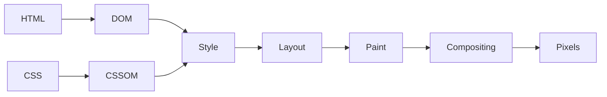
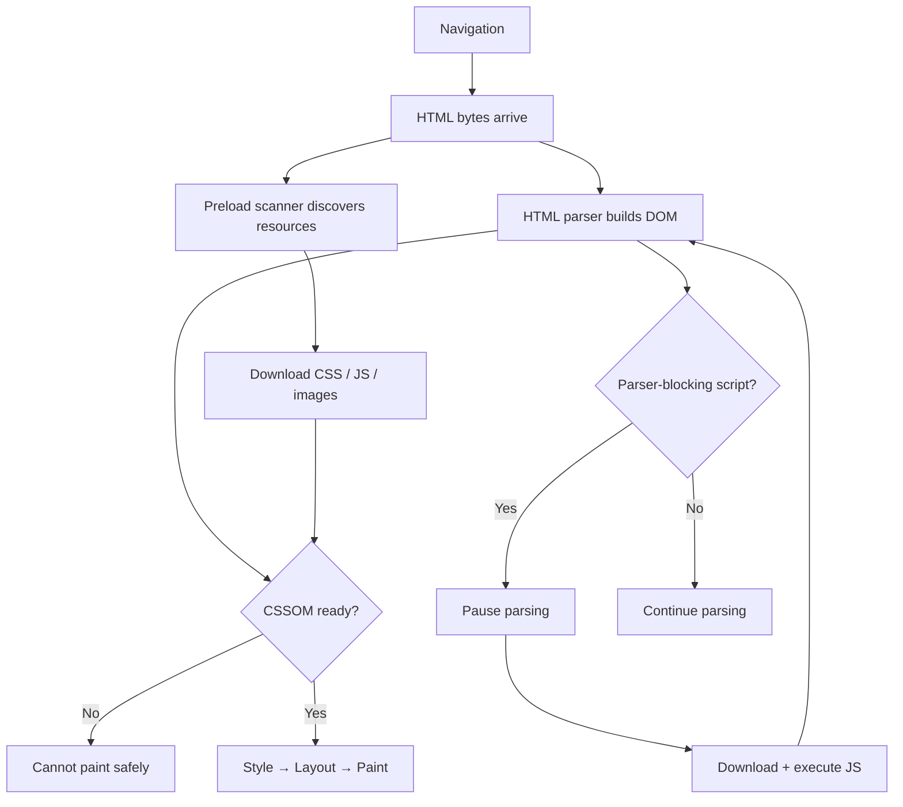
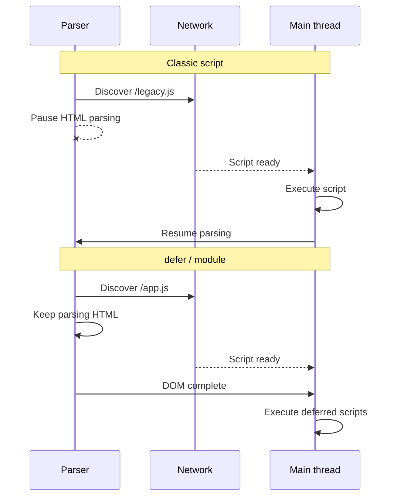
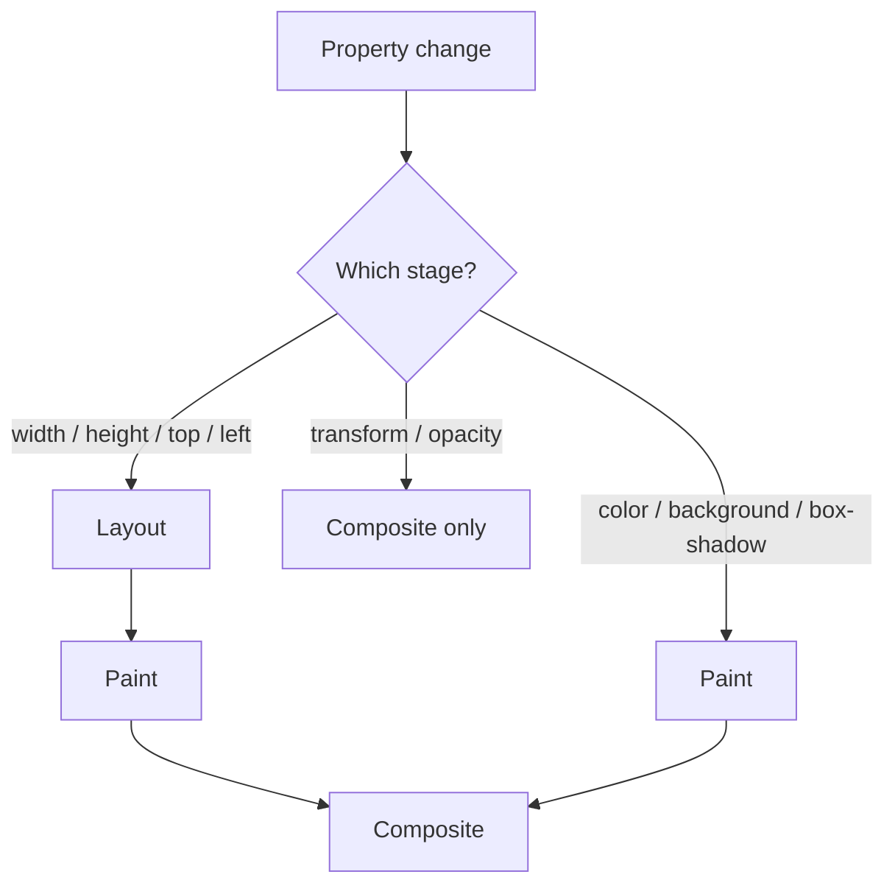
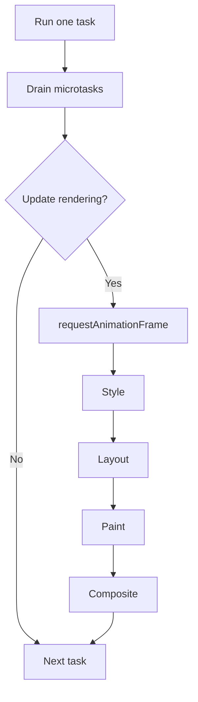
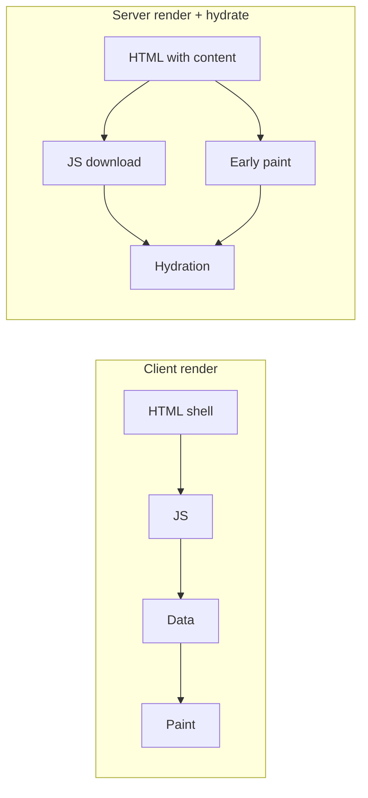
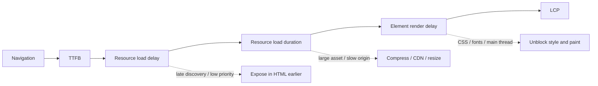

ブラウザはページ全体を待って一度だけ描画するわけではありません。HTML をストリーミングし、リソースを発見し、内部 tree を構築し、JavaScript を実行し、geometry を計算し、段階的に paint します。

**Critical rendering path** は、navigation から初期表示に必要な pixels までの依存チェーンです。network、HTML parser、CSS engine、JavaScript runtime、rendering pipeline を横断します。

有用な性能の問いは「ページはどれくらい大きいか？」だけではありません。**どのリソースか main-thread タスクが、次の重要な frame の生成を妨げているか？** です。

<br />

---

## 1. The Rendering Pipeline

簡略化したモデルは次のとおりです：

<br />



<br />

実際のブラウザはこれらの段階を pipeline 化し、繰り返します。HTML 到着中に DOM を構築でき、リソースは並行ダウンロードでき、document 完了前に paint することもできます。後から JavaScript が style、layout、paint を無効化し得ます。

したがって critical path は固定順序ではなく **dependency graph** です。遅れた stylesheet は rendering を遅らせます。Parser-blocking script は markup とリソース発見を遅らせます。すべてのリソースが cached でも、大きな JavaScript task は painting を遅らせます。

<br />



<br />

---

## 2. Network、HTML、Resource Discovery

Rendering は document request から始まります。DNS、connection setup、TLS、redirects、server response time はすべて、有用な HTML を parse できる前に起こります。遅い **Time to First Byte** は後続の段階すべてを後ろにずらします。

ストリーミング HTML により、サーバーがレスポンス生成を終える前にブラウザが処理を始められます。Critical CSS、fonts、images、可視 markup は response の早い段階に置くべきです。

HTML parser は bytes を tokens にデコードし、DOM を段階的に構築します。ブラウザは **speculative preload scanner** も使い、次のような declarative resources を先読みします：

- `<link rel="stylesheet">`
- `<script src>`
- `` と `srcset`
- `<link rel="preload">`

main parser がブロックされていても、この scanner は request を開始できます。JavaScript で作られたリソース、後の API request で返るもの、まだ読み込まれていない CSS 内の参照は、信頼して発見できません。

そのため declarative HTML 自体が性能機能です。`` はブラウザに即座に見えます。JavaScript と data fetching の後に計算される image URL は、遅い依存になります。

<br />

---

## 3. CSS と JavaScript Blocking

CSS は **CSSOM** に parse されます。適用可能な styles がないと、どの boxes がありどう見えるか決められません。

document head の外部 stylesheet は通常 render-blocking です：

<br />

```html
<link rel="stylesheet" href="/app.css" />
```

<br />

CSS は通常 DOM construction を止めませんが、未完成 styles に依存する内容の paint は防ぎます。JavaScript が computed styles を参照しうるため、後続 script も遅らせられます：

<br />

```html
<link rel="stylesheet" href="/app.css" />
<script>
  console.log(getComputedStyle(document.body).color)
</script>
```

<br />

Script は CSS を待ち、parser は script を待ちます。一つの stylesheet が rendering と parsing の両方に影響します。

CSS `@import` は別の waterfall を作ります。import されたファイルは parent stylesheet のダウンロードと parse の後でないと発見されません。直接の `<link>` 要素の方が request を早く公開します。

### Script loading

属性のない classic script は遭遇時に parser をブロックします：

<br />

```html
<script src="/legacy.js"></script>
```

<br />

代替手段は意味が異なります：

| Script | Execution | Ordering |
| --- | --- | --- |
| Classic | Blocks parser | Document order |
| `defer` | After parsing | Document order |
| `async` | As soon as ready | Load order |
| `type="module"` | Deferred by default | Module dependency order |

<br />



<br />

アプリケーションコードは通常 module か `defer` を使うべきです。独立した analytics は `async` 向きです。

Script を defer しても parser blocking は消えますが CPU コストは消えません。転送、parse、compile、execute は依然必要です。大きな startup tasks は DOM ready 後でも rendering と操作を遅らせます。

<br />

---

## 4. Style、Layout、Paint、Compositing

### Style calculation

ブラウザは DOM と CSSOM を結合し、cascade、inheritance、relative values、matching rules を解決します。結果が rendering に参加する boxes を決めます。

DOM nodes と boxes は一対一ではありません：

- `display: none` は subtree を layout から除きます。
- `visibility: hidden` は layout 空間を保持します。
- Pseudo-elements は DOM nodes なしに boxes を作れます。
- Text は複数の line boxes を生むことがあります。

大きな DOM と広い invalidation は、通常 selectors の微最適化より重要です。

### Layout

Layout は box positions、dimensions、line breaks、relationships を計算します。幅の変更は descendants に波及し、テキストを組み直し、container 下のすべてを動かし得ます。

ブラウザは geometry が必要になるまでこの処理を batch します。write と read を交互にすると、繰り返し synchronous layout が強制されます：

<br />

```ts
for (const card of cards) {
  card.style.width = "50%"
  console.log(card.offsetWidth)
}
```

<br />

write は layout を無効化し、`offsetWidth` は現在の geometry を要求します。代わりに read を batch してから write します：

<br />

```ts
const widths = cards.map((card) => card.offsetWidth)

for (const [index, card] of cards.entries()) {
  card.style.width = `${widths[index] / 2}px`
}
```

<br />

`getBoundingClientRect`、`offsetWidth`、`getComputedStyle` などの API 自体は遅くありません。未完了の style や layout を flush させるときに高コストになります。

### Paint and compositing

Paint は text、backgrounds、borders、images、shadows、effects の drawing commands を記録します。ブラウザはこれを tiles に rasterize し、composited layers に載せることもあります。

<br />



<br />

`transform` と `opacity` の animations は、多くの場合 compositor 上で新しい layout や paint なしに動けます：

<br />

```css
.panel {
  transition:
    transform 180ms ease,
    opacity 180ms ease;
}
```

<br />

`width`、`height`、`top`、`left` の animation は通常 layout と paint を引き起こします。Compositor 処理も無料ではありません。layers はメモリを使い、rasterization が必要で、毎 frame 組み立てられます。`will-change` を乱用すると性能が悪化することもあります。

<br />

---

## 5. Main Thread と Rendering Opportunities

JavaScript と大部分の rendering は main thread を共有します。簡略化した event-loop turn は次のとおりです：

<br />



<br />

ブラウザは毎 task の後に paint するわけではありませんが、main thread が空く必要があります。長い JavaScript tasks は input と frames を遅らせます。無制限の microtask chain も、microtasks を drain してから進むため rendering を餓死させ得ます。

UI が応答の機会を必要とするとき、CPU-heavy な処理は小さな tasks に分割します。`requestAnimationFrame` は高コスト計算の場ではなく、視覚的 write を frame に揃えるために使います。通信コストが見合うなら、適した CPU 処理は Web Worker へ移します。

<br />

---

## 6. 初期ビューの最適化

初期 render には通常、可視 HTML、適用 CSS、blocking scripts、main-thread rendering time、結果に必要な image や font が要ります。Below-the-fold media、analytics、chat widgets、大部分の interaction code は不要です。

依存チェーンは次の順で最適化します：

1. Redirects と TTFB を減らし、有用な HTML を早くストリームする。
2. Critical CSS、fonts、LCP image を HTML から discover 可能にする。
3. Parser-blocking scripts と CSS import chains を除去する。
4. 総ページサイズだけでなく critical CSS と JavaScript を減らす。
5. Third-party コードを初期 path の外に置く。
6. Style、layout、paint、hydration の処理を減らす。

Resource hints は選択的に使います：

<br />

```html
<link rel="preconnect" href="https://cdn.example.com" crossorigin />
<link
  rel="preload"
  href="/hero.avif"
  as="image"
  type="image/avif"
  fetchpriority="high"
/>
```

<br />

`preconnect` は connection 準備にリソースを使います。`preload` は bandwidth を奪い合い、最終 request の type と credentials mode と一致させる必要があります。乱用するとより重要なリソースを遅らせます。

Images に dimensions を与え、読み込み前に layout 空間を確保します：

<br />

```html

```

<br />

LCP image を lazy-load しないでください。画面外 media には `loading="lazy"` を使います。

Fonts には WOFF2 subsets を配信し、fallback text を先に描画させます：

<br />

```css
@font-face {
  font-family: "Inter";
  src: url("/fonts/inter-latin.woff2") format("woff2");
  font-display: swap;
  font-weight: 100 900;
}
```

<br />

長いページでは `content-visibility: auto` が画面外 rendering をスキップできます。CSS containment と list virtualization も処理を減らせますが、挙動が変わるため、計測後に導入すべきです。

<br />

---

## 7. Framework Rendering と Hydration

Client-rendered application は、JavaScript、framework startup、data fetching が終わるまで意味のある内容を遅らせがちです。

Server rendering は内容とリソース参照を HTML に移し、より早い discovery と paint を可能にします。JavaScript コストは消えません。ページは早く paint しても、大きな hydration task 中に無反応になり得ます。

<br />



<br />

Streaming SSR、selective hydration、islands、Server Components は同じ問題を狙います。startup 処理を減らし、非 critical JavaScript を初期 dependency chain の外に置くことです。

関連する architecture の問い：

- 最初の HTML response に何を含める必要があるか？
- どの components が client-side JavaScript を要るか？
- Code と data はいつ discover 可能になるか？
- Hydration はより小さな boundaries でできるか？
- Framework が server-to-client request waterfalls を作っていないか？

<br />

---

## 8. Path の計測

Production build を使い、Network waterfall と Performance trace の両方を確認します：

- **Network** — 遅い discovery、priority、queueing、transfer time
- **Main** — parsing、script execution、style、layout、paint、long tasks
- **Frames** — 逃した rendering deadlines
- **Experience** — layout shifts と Core Web Vitals

遅い **Largest Contentful Paint** では、時間を次に分けます：

1. **TTFB**
2. **Resource load delay**
3. **Resource load duration**
4. **Element render delay**

<br />



<br />

高い load delay は discovery か priority を示します。高い load duration は asset サイズか origin 速度です。高い render delay は CSS、fonts、decoding、JavaScript、main-thread contention を示します。

周辺 metrics は別の失敗を説明します：

- **FCP** — 最初の内容が現れるタイミング
- **LCP** — 最大の可視内容が現れるタイミング
- **CLS** — 予期しない移動
- **INP** — 次の paint までの interaction latency

LCP が速くても、hydration や third-party scripts が後から main thread を占有すれば INP は悪くなり得ます。Lab traces が原因を説明し、real-user monitoring がユーザーがどれだけ遭遇するかを示します。

<br />

---

## 最終的なメンタルモデル

Critical rendering path は三つの有限リソースを消費します：

- **Network time** — critical bytes の発見と転送
- **Main-thread time** — parse、execute、style、lay out
- **Rendering capacity** — paint、rasterize、composite frames

速いページは重要リソースを早く公開し、意図しない blockers を避け、startup JavaScript を最小化し、layout 空間を確保し、初期 viewport 外の処理を defer します。

目標はすべてのリソースを即読みすることではありません。navigation とユーザーが見に来た pixels の間で、最短の dependency chain を作ることです。
