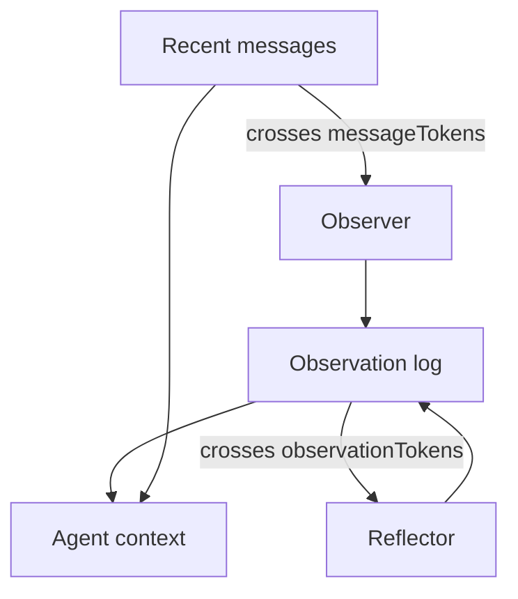

LLM の memory は金魚並みである。bikes が好きだと書いてから facts を聞けば、モデルは *Memento* の男のように見つめてくる。naive な fix は直近 *N* messages を毎回 request に詰め込むこと。10 turns までは動く。tool dumps、新しい threads、message 1 に置いた goal では死ぬ。

これが Mastra の 4 層 ladder。ship した順である。Alex Becker が [Four levels of agent memory](https://www.youtube.com/watch?v=18iIHQtIPmc) で同じ stack を walk through する。CoALA taxonomy（working / episodic / semantic / procedural）ではない。あの names は knowledge の *kinds* を describe する。この 4 levels は tokens が *どこに live するか*、keep するために *何を pay するか* を describe する。

Storage はすべてに required。options なしの `new Memory()` はすでに level 1。残りは同じ object 上の flags。

<br />

---

## 1. Conversation history

thread は 1 つの conversation。resource は owner：user、org、project。Studio は両方を invent する。自分で `generate` や `stream` を呼ぶときは渡す。

Mastra は storage から直近 *N* messages を load し context window に入れる。default の `lastMessages` は 10。動く理由は trivial：「I like bikes」が、あとで「tell me facts about them」と言ったときに model から見える。

<br />

```ts
import { Agent } from "@mastra/core/agent"
import { Memory } from "@mastra/memory"

export const agent = new Agent({
  id: "chat-agent",
  name: "Chat agent",
  instructions: "You are a helpful assistant.",
  model: "openai/gpt-5-mini",
  memory: new Memory({
    options: {
      lastMessages: 10,
    },
  }),
})
```

<br />

client からは **新しい message だけ** 送る。Mastra はすでに thread を持っている。full history を ship するのは redundant で、client timestamps は store に対して messages を reorder する。

この level は bug に見えるが bug ではない 2 つの fail がある：

- window は sliding cut。user の goal が最初の message で、その後 30 tool turns を燃やせば goal は消える。
- 新しい thread には history がない。同じ agent、同じ human、empty context。それは intelligence ではない。session cookie である。

tool results は cut を予想より早く到来させる。1 回の `llms.txt` fetch が 10k tokens になりうる。history は short chats の正しい default。memory system ではない。

<br />

---

## 2. Working memory

working memory は scratchpad。hundreds of messages 後でも、scope が `resource` なら新しい thread でも、毎 turn model から見える。empty fields を渡す。agent が `updateWorkingMemory` で埋める。filled block は system instruction に inject され、user には見えない。

history を supplement する。replace しない。変わらない facts に使う：name、「hate mistakes」、「prefer concise replies」、「build a $10M SaaS」。coding agents と long-horizon task はここに live する。

<br />

```ts
import { Agent } from "@mastra/core/agent"
import { Memory } from "@mastra/memory"

export const agent = new Agent({
  id: "personal-assistant",
  name: "Personal assistant",
  instructions: "You are a helpful personal assistant.",
  model: "openai/gpt-5-mini",
  memory: new Memory({
    options: {
      workingMemory: {
        enabled: true,
        scope: "resource",
        template: `# User Profile
- **Name**:
- **Preferences**:
- **Current Goal**:
`,
      },
    },
  }),
})
```

<br />

`scope: "resource"` が default：threads をまたいだ user あたり 1 scratchpad。`scope: "thread"` はこの conversation に isolate。scope を切り替えても data は migrate しない。

Markdown `template` の代わりに Zod `schema` を使える。両方は不可。templates は update ごとに whole block を replace。schemas は merge：変わった fields だけ送る；field を `null` にして delete。

working memory は意図的に small。fields を predefine する必要があり、agentic には感じない。growing event log の置き場でもない。conversation summaries を template に詰め込んでいるなら、level 4 へ skip。

observational memory が on のとき、`observationalMemory.observation.manageWorkingMemory` は Observer に scratchpad を書かせ、main agent が tool を remember しなくて済む。

<br />

---

## 3. Semantic recall

semantic recall は *message history* 上の RAG であり、product corpus 上ではない。この distinction が matter。[RAG システムの作り方](/notes/how-to-build-a-rag-system) の org-scoped document index は、agent が tool で search する library。semantic recall は automatic：新しい message はすべて embed され、future messages がその vector store を similar turns で query する。

「I like dogs, mine is called Nas Barkley。」後で別 thread：「what animals do I like?」lookup は meaning であり、単語 `dogs` ではない。Mastra は hits を extra system block として inject する：別 conversation から remembered。

<br />

```ts
import { Agent } from "@mastra/core/agent"
import { Memory } from "@mastra/memory"
import { LibSQLStore, LibSQLVector } from "@mastra/libsql"
import { ModelRouterEmbeddingModel } from "@mastra/core/llm"

export const agent = new Agent({
  id: "support-agent",
  name: "Support agent",
  instructions: "You are a helpful support agent.",
  model: "openai/gpt-5-mini",
  memory: new Memory({
    storage: new LibSQLStore({
      id: "agent-storage",
      url: "file:./local.db",
    }),
    vector: new LibSQLVector({
      id: "agent-vector",
      url: "file:./local.db",
    }),
    embedder: new ModelRouterEmbeddingModel("openai/text-embedding-3-small"),
    options: {
      semanticRecall: {
        topK: 3,
        messageRange: 2,
        scope: "resource",
      },
    },
  }),
})
```

<br />

`topK` は hits の数。`messageRange` は各 hit と一緒に pull する surrounding turns。多すぎると model が drown。少なすぎると fact を miss。`scope: "resource"` はその user の全 threads を search；LibSQL、Postgres、MongoDB、OracleDB、Upstash が support。

default は disabled。vector store と embedder が必要。write と query で同じ embedding model。document RAG と同じ rule。

costs は real：

- recall は imprecise。`topK` と `messageRange` を product ごとに tune する。
- embedder と vector store を run する。every turn に latency。
- injected system block は query で変わる。prompt prefix は cache に hit するほど stable ではない。production では cached input tokens が通常 largest saving。semantic recall はそれを spend する。

gains も real：meaning-based lookup、cross-thread recall、whole log を window に詰め込まず history を grow できること。

Pinecone document pipeline と混同しない。message RAG は「what did we already say」。document RAG は「what is in the handbook」。indexes が違う。tenancy が違う。tools が違う。

<br />

---

## 4. Observational memory

observational memory は人が remember し、forget する仕方を model したもの。2 つの ambient agents：**Observer** と **Reflector**。常にそこにある。常に running ではない。

message tokens が threshold を超えると（default 30,000；demos は watch できるようにしばしば 2k）、Observer は raw history を dense observation log に compress：priority markers、timestamps、まだ matter する sliver。10k-token の tool result が ~160 tokens になりうる。残りは die してよい。

observation log 自体が threshold を超えると（default 40,000）、Reflector が whole log を rewrite。low-priority lines を drop、related facts を merge、thread がどれだけ長くても window を bounded に保つ。reflections は third infinite layer として stack しない。各 reflection *が* 新しい log。new observations はその後に append。

<br />



<br />

observations は **stable**。append する。every turn で system prefix を reshuffle しない。semantic recall に対する cache argument の inverted。

Observer と Reflector は background で run。Studio では demo 用に click できる。real agent では async で non-blocking。coding harness の compaction はしばしば user を 1 分 pause し、wrong details を throw away する。この loop はどちらも supposed ではない。

<br />

```ts
import { Agent } from "@mastra/core/agent"
import { LibSQLStore } from "@mastra/libsql"
import { Memory } from "@mastra/memory"

export const agent = new Agent({
  id: "long-horizon-agent",
  name: "Long-horizon agent",
  instructions: "You are a helpful assistant.",
  model: "openai/gpt-5-mini",
  memory: new Memory({
    storage: new LibSQLStore({
      id: "memory-storage",
      url: "file:./memory.db",
    }),
    options: {
      observationalMemory: {
        model: "google/gemini-2.5-flash",
      },
    },
  }),
})
```

<br />

`observationalMemory: true` は Observer/Reflector model を `google/gemini-2.5-flash` に default。storage は required。今日 support される adapters：`@mastra/pg`、`@mastra/libsql`、`@mastra/mysql`、`@mastra/mongodb`、`@mastra/convex`、`@mastra/oracledb`。

Mastra の LongMemEval numbers は video から。最初の 3 rows は同じ model：working memory ~55%（この benchmark 向けに designed されていない）、semantic recall ~80%、observational memory ~84%。Gemini 2.5 Flash on OM は ~95% と reported、quoted した中で highest verifiable score。independent bake-off ではなく、Mastra の published scores として扱う。

noisy tool calls を survive する level：page snapshots、`llms.txt`、MCP dumps。compound する level でもある。何週間も event copy を書く workshop-helper agent は、「second person, short hook, no hype」を observations として keep し始める。template に入れるのを remember した field としてではない。

知っておく価値のある extras が 2 つ：

- `retrieval: true` は observation を produced した raw messages 上の `recall` tool を agent に与える。`{ vector: true }` はその store に semantic search を add。compression が original wording の消失を意味する必要はない。
- `observation.manageWorkingMemory` は OM に scratchpad を own させる。working memory は small で structured のまま；OM は main agent が tool call を spend しないようにする。

<br />

---

## 5. Which level

<br />

| Level | Primitive | Use when | Breaks when |
| --- | --- | --- | --- |
| Conversation history | `lastMessages` | Short threads、UI transcript | Goal が window から落ちる；新しい thread |
| Working memory | `workingMemory` | Stable facts と current goal | Event log や undeclared fields が必要 |
| Semantic recall | `semanticRecall` | Long、multi-thread history に sparse facts | Prompt cache が必要、または recall が too fuzzy |
| Observational memory | `observationalMemory` | Long horizon、noisy tools、cache-stable context | Storage adapter の run を refused |

<br />

Mastra の current recommendation は long-context agents 向け observational memory。earlier levels は依然存在し、依然 compose する。history は model が *right now* 見るもの。working memory は form。semantic recall は search。observational memory は window を blank にせず small に保つ仕組み。

options なしの `new Memory()` は conversation history。この repo の weather agent がそれ。thread がもはや chat でなくなったら graduate。

<br />

---

## 6. Invariants

1. Storage adapter 経由で persist。memory は context window ではない。
2. Client は新しい message を送る。server は thread を load。never both。
3. `thread` は conversation。`resource` は owner。cross-thread recall は resource query であり、missing `threadId` ではない。
4. Working memory は small、always-on block。diary に grow しない。
5. Messages 上の semantic recall は document RAG ではない。index が違う、tenant story が違う。両方で write と query に同じ embedding model。
6. Observational memory は observations を append して cacheable prefix を keep。semantic recall はその prefix を意図的に bust する。
7. Isolation は server concern。`resource` は model が pick するものではない。

4 levels。同じ `Memory` object。sophistication はどの tokens を keep し、どれを forget する覚悟があるか。
