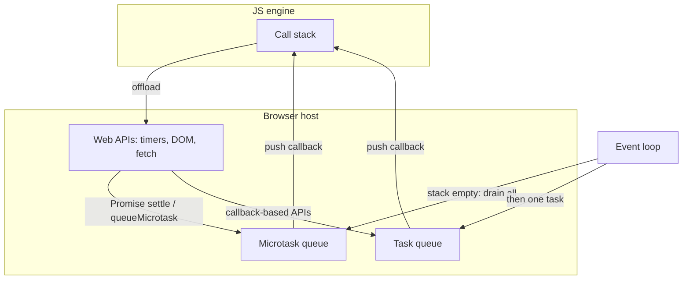
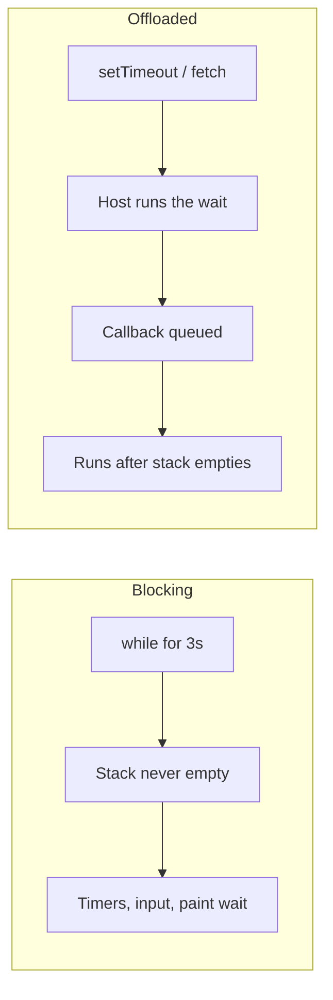
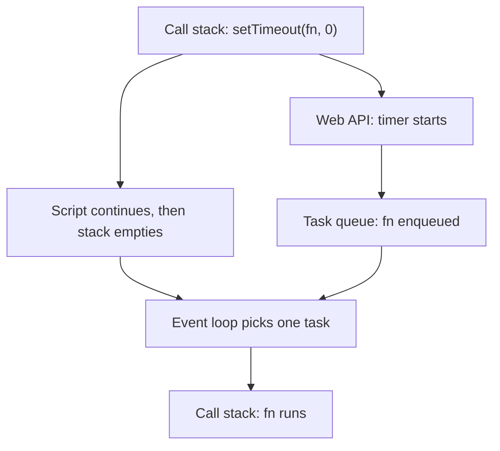
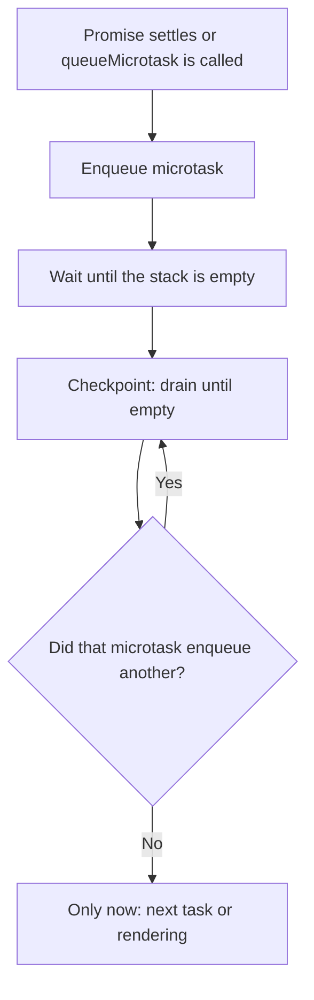
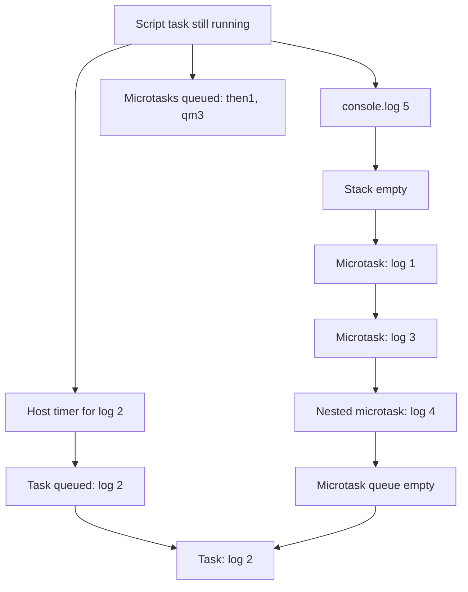
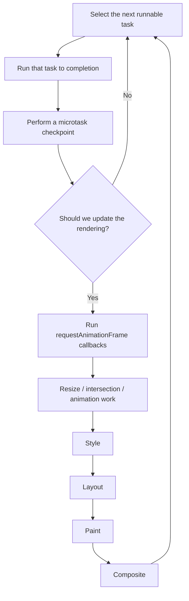
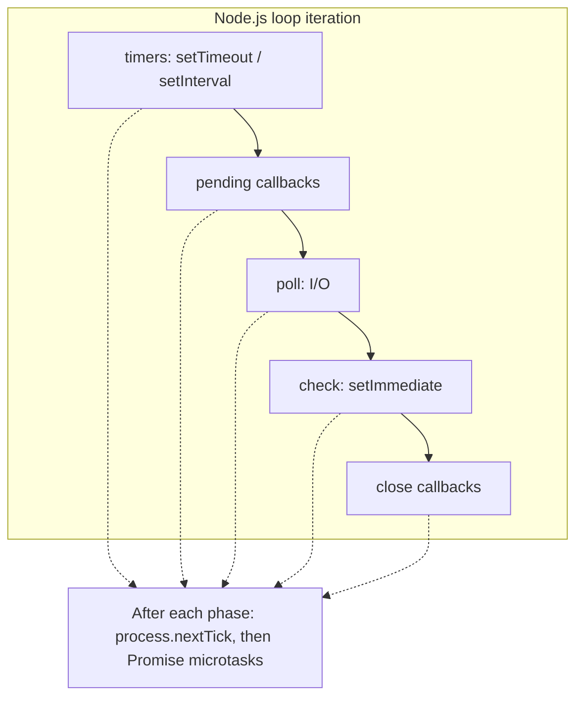

JavaScript は single-threaded です。それは timer が動いている間や network response が届いている間、browser が何もしていないという意味ではありません。意味するのは、**engine は一度に一つの JavaScript だけを実行する**、それが **call stack** の上であり、**host**——browser、Node.js、Deno——がバックグラウンドで他の仕事をし、後から engine に callbacks を走らせるよう頼む、ということです。

その受け渡しを調整するのが **event loop** です。これは JavaScript 言語の機能ではありません。ECMAScript は functions がどう呼び合うか、Promise jobs がどう queue されるかを規定します。HTML Standard は、browser がそれらの jobs、timers、input、networking、rendering を繰り返すターンにする方法を規定します。一つの **task** を実行し、**すべての microtasks** を drain し、必要なら **update the rendering** し、それから次の task を取ります。

このノートは [Lydia Hallie の可視化](https://www.youtube.com/watch?v=eiC58R16hb8) と同じ順でそのモデルを追います。stack、host APIs、task queue、microtask queue、そして古典的な `5 1 3 4 2` の順序パズルです。動画の recap のあと、WHATWG algorithm、rendering starvation、別の host としての Node.js、workers へと進みます。同じ runtime の概観版は [JavaScript コア概念](/notes/core-javascript-concepts) です。

<br />



<br />

同期コードは stack 上で走ります。Host APIs は stack の外で仕事を終え、callback を enqueue します。stack が空になるたび、event loop は **microtask queue** を優先して完全に空にし、それから **一つの** task を stack に載せます。

---

## 1. Call Stack

**Call stack** は、engine が今実行していることの last-in, first-out な記録です。function を呼ぶと **execution context** が push されます。return または throw で pop されます。実行できるのは一番上の frame だけです。

<br />

```ts
function add(a: number, b: number): number {
  return a + b
}

function printSum(): void {
  const result = add(2, 3)
  console.log(result)
}

printSum()
```

<br />

Stack は `printSum` → `add` と伸び、各 function が return するにつれて縮みます。それらの frames が残っているあいだ、他のものは何も走れません——timer callback も、click handler も、Promise `.then` も。JavaScript は今の function を中断して別のことをしに行きません。

それが single-threaded という制約です。密な loop は thread を「分け合い」ません。占有します：

<br />

```ts
const start = Date.now()
while (Date.now() - start < 3000) {
  // The page cannot paint, handle clicks, or fire timers.
}
```

<br />



<br />

有用な問いは「これは asynchronous か？」ではありません。**これは frame を stack に残すのか、return して host に仕事を終えさせるのか？** です。

---

## 2. Web APIs は Host であり、Engine ではない

V8、JavaScriptCore、SpiderMonkey は JavaScript を evaluate します。`setTimeout`、`document.querySelector`、`fetch` は実装しません。それらは **Web APIs** です。host が script に露出するインターフェースです。

Script が callback-based host API を呼ぶときの典型的な経路は：

1. その呼び出しは stack 上で走り、ほぼすぐに return する。
2. Host が実際の仕事——timer、network request、DOM listener——を始める。
3. その仕事が終わっても、host は callback を stack に **push しない**。queue に置き、event loop を待つ。

<br />

```ts
console.log("A")

setTimeout(() => {
  console.log("C")
}, 1000)

console.log("B")

// A, B, then C after the timer and after the stack is empty
```

<br />

`setTimeout` 自体は synchronous です。**schedule** するだけです。Delay 引数は host に渡されます。1 秒後、host は準備できた callback を持っています。その callback が 1000ms で走るか、1004ms か、もっと後かは、stack と後述の queues 次第です——timer だけでは決まりません。

同じ分割は他の callback-based APIs にも当てはまります。`addEventListener`、`XMLHttpRequest`、`MessageChannel`、古い Node の `fs.readFile(path, cb)`。完了は host で起きます。再開は queue を通します。

Promise-based APIs も I/O には host を使います。違いは **continuation** がどの queue に入るかです。`fetch(url).then(onResponse)` は host で network を待ち、Promise が settle したあと `onResponse` を **microtask** として queue します。その区別が、このノートの残りです。

---

## 3. Task Queue

HTML Standard はこれらを **tasks** と呼びます。くだけた文章では **macrotasks** と言うことが多いです。Timers、user input、`postMessage`、classic `<script>` の parse、多くの networking callbacks は tasks になります。

ほとんどのデバッグには、簡略化した規則で足ります：

- Event loop は選ばれた task を **一つ** 実行する。
- それから **microtask checkpoint** を行う。
- そのあとで初めて、別の task を検討する。

入れ子の `setTimeout` は、親の現在のターンの中では続行できません。**将来の** 仕事を schedule するだけです：

<br />

```ts
const order: string[] = []

setTimeout(() => {
  order.push("timeout-1")
  setTimeout(() => {
    order.push("timeout-2")
  }, 0)
}, 0)

setTimeout(() => {
  order.push("timeout-3")
}, 0)

// Typical order: timeout-1 → timeout-3 → timeout-2
```

<br />

一つのグローバル FIFO queue は漫画です。Host は複数の **task sources**——timer、DOM manipulation、user interaction、networking、history traversal——を持ち、queue も一つとは限りません。Event loop はある source から実行可能な task を **選びます**。理論上、一つの source が飢えることはあり得ます。実務では「一つの task、それから microtasks」というメンタルモデルで、コードの振る舞いは十分予測できます。

Script evaluation 自体が一つの task です。読み込んだファイル、parser が実行する classic script が、その話の最初の task です。Module や script の **トップレベル** で起きることはすべて、その task が完了するまでです。

---

## 4. `setTimeout(fn, 0)` は即座ではない

Delay `0` は「timer task を走らせてよい時点でできるだけ早く」という意味であり、「次の行の前に」ではありません。Host は入れ子 timers を clamp することもあります——HTML は nesting level 5 以降で最低 4ms を要求します——が、clamp は二次的です。主な遅延は event loop です。

<br />



<br />

Callback は **次のすべて** を待ちます：

- 現在の task が終わり、stack が空になること。
- これまでに queue されたすべての microtask と、それらがさらに enqueue するすべての microtask。
- すでに待っている、より早い tasks。

だからゼロ遅延の timer でも `Promise.resolve().then(...)` と `queueMicrotask(...)` に負けます。Timer は準備できています。入っている queue が違うだけです。

---

## 5. Microtask Queue

**Microtasks** は、最初の説明でいちばん抜けやすい部分です。Task が終わり、JavaScript execution context stack が空になると、host は **microtask checkpoint** を行います。最も古い microtask を実行し、queue が **空になるまで** 繰り返します。

Microtasks を enqueue する源：

- Promise reaction jobs：`.then`、`.catch`、`.finally`
- `await` のあとの `async` function continuation
- `queueMicrotask(fn)`
- `MutationObserver` callbacks

<br />



<br />

空になるまで drain する、が重要な規則です。`queueMicrotask` を呼ぶ、または別の Promise を resolve する microtask は、**同じ** checkpoint に仕事を足します。その仕事は次の timer、click、paint より先に走ります。

<br />

```ts
const order: string[] = []

setTimeout(() => {
  order.push("task")
}, 0)

queueMicrotask(() => {
  order.push("micro-1")
  queueMicrotask(() => {
    order.push("micro-2")
  })
})

Promise.resolve().then(() => {
  order.push("promise")
})

// After the timeout finally runs:
// micro-1 → promise → micro-2 → task
```

<br />

`queueMicrotask` と `Promise.resolve().then` は一つの queue を共有します。順序は schedule された順です。より速い thread ではありません。**同じ thread 上の、優先度の高い queue** です。

リスクは利点の裏側です。無制限の microtask 連鎖は、task queue にも rendering にも二度と戻りません：

<br />

```ts
function starve(): void {
  queueMicrotask(starve)
}

starve()
// Timers, clicks, and frames wait until this stops.
```

<br />

これは理論ではありません。つねに次の `then` を schedule する Promise `then` や、task に yield しない `await` loop は、`while` 一つなしにページを凍らせられます。

`await` は Promises の上の構文であり、第二の scheduler ではありません。`async` function は必ず Promise を返します。`await` に達するとその function は中断し、現在の stack を unwind させます。awaited value が settle すると、関数の残りが microtask として queue されます。`await Promise.resolve()` でさえ yield します。次の行で同期的に続きません。

---

## 6. Callback を Promisify すると Continuation が移る

Callback-based API を Promise で包んでも、host の仕事が microtask になるわけではありません。変わるのは、host task が走った **あと** に何が起きるかです。

<br />

```ts
function delay(ms: number): Promise<void> {
  return new Promise((resolve) => {
    setTimeout(resolve, ms)
  })
}

delay(0).then(() => {
  console.log("then")
})
```

<br />

`setTimeout` は依然として **task** を schedule します。その task が走ると `resolve` を呼びます。Promise が settle してから、`.then` handler が **microtask** として queue されます。その microtask は次の timer や click より先に走りますが、Promise を resolve した **timer task のあと** です。

比較：

<br />

```ts
Promise.resolve().then(() => console.log("microtask first"))
setTimeout(() => console.log("task second"), 0)

delay(0).then(() => console.log("microtask after its timer task"))
```

<br />

最初の `.then` は現在の task のあいだに queue されるので、最初の checkpoint に勝ちます。`delay(0).then` は、その timer task が走るまで走れません。Promisify は **continuation** を、すでに queue された microtasks より遅く、後続の tasks より早くします。

これが動画の "promisify" のポイントです。Host API は task queue を使い、Promise reactions は microtask queue を使います。自分が `resolve` のどちら側にいるかを知る必要があります。

---

## 7. Walkthrough：なぜ log は `5 1 3 4 2` なのか

Hallie のチャレンジは、モデルのすべての部分を最短で露わにするプログラムです：

<br />

```ts
Promise.resolve().then(() => console.log(1))

setTimeout(() => console.log(2), 10)

queueMicrotask(() => {
  console.log(3)
  queueMicrotask(() => console.log(4))
})

console.log(5)

// 5, 1, 3, 4, 2
```

<br />

**Script task のあいだ**、stack はまだ module を実行しています：

1. `Promise.resolve()` はすでに fulfilled な Promise を作ります。`.then` は handler をただちに **microtask** queue に入れます。まだ何も log しません。
2. `setTimeout` は callback と 10ms の delay を host に渡します。Host は timer を始めます。Callback はまだどの JS queue にもいません。
3. `queueMicrotask` が二つ目の microtask を queue します。
4. `console.log(5)` は synchronous です。**5** を出します。
5. そのあいだに timer が切れることがあります。切れると host は `() => console.log(2)` を **task** queue に入れます。次に走るべき queue ではまだありません。

Script task が終わります。Stack は空です。

**Microtask checkpoint：**

6. 最も古い microtask：Promise handler。**1** を出します。
7. 次：`queueMicrotask` callback。**3** を出し、別の microtask を queue します。
8. Checkpoint はまだ終わりません。入れ子の callback が走り、**4** を出します。
9. Microtask queue が空になります。

**次の task：**

10. Timer callback が stack に載り、**2** を出します。

<br />



<br />

10ms の timer が checkpoint の前に切れていなくても、log は `5 1 3 4 2` のままです——timer が少し遅れて task queue に入るだけです。Microtasks は timer を待ちません。Timer が microtasks を待ちます。

`queueMicrotask` を別の `Promise.resolve().then` に替えても、数字は同じ種類の queues にいます。パズルの要点は `queueMicrotask` という特別な API ではありません。**stack がいつ空になるか**、**各 callback がどの queue に入ったか** です。

---

## 8. HTML Event-Loop Algorithm

可視化は地図です。HTML Standard が領地です。簡略化しつつ spec に近い、browser の event-loop の一ターン：

<br />



<br />

漫画が飛ばしがちな三点：

**JS stack が空なら、checkpoint はいつでも走り得ます。** 名前のついた "turn" の終わりだけではありません。Promise reactions は、それらを resolve した function を中断しません。その stack が unwind した直後に走ります。

**Rendering は任意です。** Browser が合わせるのはディスプレイの refresh——多くの場合 60Hz か 120Hz——であり、「すべての task のあと」ではありません。rendering opportunity を一度飛ばすのは普通です。main thread が忙しくて毎回飛ばすのが jank です。

**`requestAnimationFrame` は microtask ではありません。** "update the rendering" のあいだ、checkpoint のあと、style と layout の前に走ります。DOM writes を rAF に入れると、それらを frame に揃えられます。そこで重い計算をすれば paint はやはりブロックされます。ブロックのタイミングが vsync に合うだけです。

[ブラウザにおける Critical Rendering Path](/notes/critical-rendering-path-in-the-browser) は、その rendering 分岐の中で起きることです。style、layout、paint、composite。Event loop は、その分岐が **いつ** 走ってよいかを決めます。長い task は遅らせます。空にならない microtask 連鎖は無期限に遅らせます。checkpoint が先に終わらなければならないからです。

この結合が、「async」な JavaScript でも frames を落とせる理由です。密な loop の中の `await` が yield するのは microtasks であり、tasks ではありません。Browser に paint や input の機会を与えるには、仕事が **task** に戻る必要があります——`setTimeout`、ある環境の `scheduler.yield()`、`MessageChannel`、または Worker。

---

## 9. Node.js は別の Host である

言語は同じです。Loop は違います。Node.js は HTML の「task、microtasks、たぶん render」ではなく、**libuv** phases で駆動されます。

Node の一 iteration のコンパクトな図：

<br />



<br />

| Mechanism | Browser | Node.js |
| --- | --- | --- |
| Timer callback | Task（timer source） | `timers` phase |
| Promise `.then` / `queueMicrotask` | Microtask queue | Microtask queue、`nextTick` のあと |
| `process.nextTick` | 存在しない | 現在の operation のあと、Promises の前に drain |
| `setImmediate` | 存在しない | `check` phase |
| `setTimeout(fn, 0)` vs `setImmediate` | N/A | どの phase から schedule したかで順が変わる |
| Rendering | "Update the rendering" | なし。これは server |

<br />

`process.nextTick` は鋭いエッジです。HTML の意味での microtask では **なく**、Promise jobs より **高い** 優先度を持ちます。`nextTick` loop は I/O を飢えさせます。microtask loop が rendering を飢えさせるのと同じです。「この stack のあと、I/O の前」が欲しく、Promise queue の前に割り込みたくないなら、`queueMicrotask` か Promise を優先してください。

Browser の順序パズルを Node に移植して同じ log を期待しないでください。Main module から schedule した `setImmediate` と `setTimeout(fn, 0)` は、順序が保証されないことで有名です。I/O callback からなら、同じ iteration で `check` が `poll` のあとに来るため、`setImmediate` が通常勝ちます。

Deno と Bun は timers と microtasks では browser に近く、そこに独自の I/O を足します。移植可能な規則は変わりません。**言語の Promises だけでなく、host の queues を知ること。**

---

## 10. Workers は自分の Loops を持つ

**Web Worker**、**Shared Worker**、**Service Worker** は、同じ loop 上の第二の stack ではありません。別の agent です。独自の heap、独自の call stack、独自の task と microtask queues、独自の event loop。

`postMessage` は host API です。メッセージは serialize され、届けられ、受け側 agent の loop 上で **task** として queue されます。Worker は、ページの loop が paint しているあいだに計算できます。ページの DOM には触れません。メモリ共有には `SharedArrayBuffer` と明示的な協調が要ります。二つの loops は合併しません。

それが browser JavaScript で parallelism を得る実際の方法です。別の event loop が tasks で話す。`while` を worker に offload すると、ページの stack が空きます。Worker 自身の stack が preempt 可能になるわけではありません。Worker は長い task や microtask 連鎖で、**自分の** timers と **自分の** message handlers を飢えさせられます。

---

## 11. 何がどの Queue に入るか

| API | Queue | Notes |
| --- | --- | --- |
| Sync function call | Call stack、即座 | 他のすべてをブロック |
| `setTimeout` / `setInterval` | Task | Delay は下限 |
| `addEventListener` callback | Task | User-interaction または他の DOM source |
| `postMessage` / `MessageChannel` | Task | Rendering へ yield するのに便利 |
| `fetch` completion then `.then` | Host I/O、それから microtask | Network 自体は microtask ではない |
| `Promise.then` / `.catch` / `.finally` | Microtask | すでに settled な Promise でも |
| `queueMicrotask` | Microtask | Promise jobs と同じ queue |
| `async` function after `await` | Microtask | `await` は必ず yield する |
| `MutationObserver` | Microtask | 同じ checkpoint で走る |
| `requestAnimationFrame` | Rendering | Microtasks のあと、paint の前 |
| `requestIdleCallback` | Idle task | Microtask ではない。負荷が高いと走らないこともある |
| `process.nextTick` | Node nextTick queue | 各 phase で、Promise microtasks の前 |
| `setImmediate` | Node `check` phase | Poll のあと |

<br />

Log の順が意外なとき、三つの問いで大抵切り分けられます：

1. **今 stack にあるのは何か？** そのコードが先に終わる。常に。
2. **何が microtask として queue されたか？** 次の task と rendering の前に、すべて走る。
3. **何が後の task を待たなければならないか？** Timers、input、messages、次の script。

`5 1 3 4 2` を暗記するより、どのスニペットでもこの三つの桶を描ける方が役に立ちます。Event loop は魔法でも parallelism でもありません。単一 thread が次の callback をいつ走らせてよいか、という方針です。
