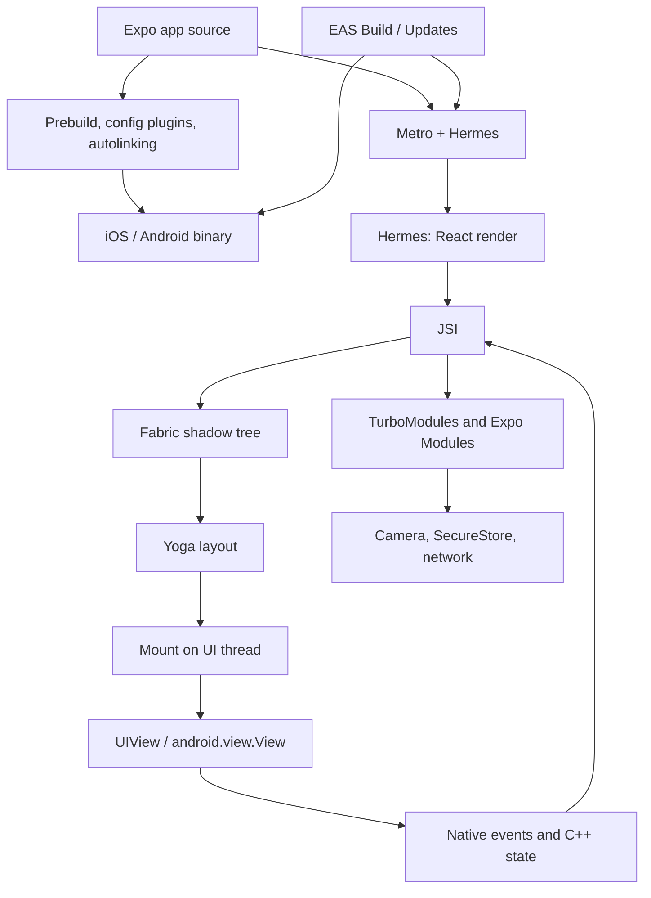

React Native はしばしば「React だが、出力が DOM ではなく native views になる」と紹介されます。その説明は間違いではありませんが、`View` 内の string が crash する理由、scroll offset を `useState` に置くと frame が落ちる理由、Expo config plugin が OTA で届かない理由、`useLayoutEffect` が device 上で同一 commit 内に view を measure できても毎 frame `height` を animate すると失敗する理由を説明するには、圧縮されすぎています。

この stack は **Expo 経由で** React Native を ship します。このサイトが Next.js 経由で React を ship するのと同じです。より有用なモデルは、**Expo が React Native 周辺の orchestrator** であり、React Native が **React の host renderer** である、ということです。Expo は native modules を分類し、iOS と Android のプロジェクトを生成し、Metro で JavaScript を bundle し、artifacts を devices に載せます。React Native は React tree を C++ shadow tree に変え、Yoga を走らせ、`UIView` / `android.view.View` instances を mount します。React は依然として elements、Fibers、lanes、render、commit を所有します。

<br />

```text
app source + app.json / config plugins
  → Expo prebuild / autolinking / Expo Modules
  → Metro bundle (Hermes bytecode)
  → React render (Fibers)
  → Fabric shadow nodes (C++, via JSI)
  → Yoga layout
  → mount native views
  → native events / C++ state / Expo Modules feed back
```

<br />

この記事は **Expo SDK 57**（`expo@57.0.9`、React Native **0.86.2**、React **19.2**、Hermes V1）を対象とします。New Architecture は default で、この SDK line では唯一 supported な runtime です。React の render/commit model に精通していることを前提とします。四種類の statement を区別します：

- **React rule**：render purity、state setter が current closure を mutate するのではなく work を schedule する、など。
- **React Native contract**：`<View>` と `<Text>` が異なる host components であること、Fabric が shadow tree を platform views に mount すること、など。
- **Expo contract**：config plugins、Continuous Native Generation、Expo Modules、`expo-router` file routes、EAS Build と EAS Update の split、など。
- **implementation observation**：shadow-node field や Metro/Hermes detail など。observations は debugging に役立ちます。application code は依存すべきではありません。

legacy Bridge と `react-native init` は、古い語彙が ambiguity を生む場合にのみ登場します。Expo Go は fixed native module set を持つ development host です。production architecture ではありません。

<br />

---

## 1. Expo は React Native 周辺に Policy と Infrastructure を足す

React は components、reconciliation、Suspense、concurrent rendering を定義します。TypeScript screen が IPA になる方法、どの native module がその binary に link されるか、fonts がどう embed されるか、後から JavaScript bundle が store build と一緒に ship した bundle をどう置き換えるかは決めません。React Native は host views の create と update を決めます。Expo は delivery path の残りを決め、接続します。

production Expo application は複数 layer にまたがります：



boundaries が重要なのは、React が変わらなくても同じ screens が異なる挙動を示しうるからです：

- **Config と prebuild** は binary に存在する native code を決めます：permissions、fonts、splash、third-party modules。`app.json` / `app.config.ts` と config plugins が contract です。`npx expo prebuild` が `ios/` と `android/` を materialize します。
- **Autolinking** は **app** package の `node_modules` 内の native modules を discover し register します。shared workspace package にだけ存在する native dependency は autolinking から invisible です。
- **Metro** は JavaScript/TypeScript graph を Hermes が execute できる bundle に変えます。development では Fast Refresh がその graph を置き換えます。production では Hermes V1 が bytecode に compile します。
- **React Native** が render、layout、mount します。Expo は Fabric を置き換えません。
- **EAS** は deployment adapter です。EAS Build が native binary を produce します。EAS Update / `expo-updates` は matching native surface を既に含む binary 内の JavaScript bundle を置き換えます。

Expo を「managed workflow」と呼ぶのは compiler を underspecify します。React Native を「JS bridge 付き native app」と呼ぶのは renderer を underspecify します。durable な mental model は **native project generator plus bundler plus React renderer** で、host-specific adapter 経由で deploy される、というものです。

Expo は React Native にとって、Next.js が browser にとってそうであるものです：React core 周辺の policy と infrastructure。Next.js は browser 向けに URLs を React trees に map します。Expo は `app/` files と native modules を device 向け React trees に map します。

<br />

---

## 2. React Native は Browser ではなく Renderer である

browser は HTML を parse し、DOM と CSSOM を build し、style、layout、paint、composite します。その path が [ブラウザにおける Critical Rendering Path](/notes/critical-rendering-path-in-the-browser) です。React Native はそれらを一切行いません。HTML も CSSOM も DOM もありません。JSX は依然 React elements を produce します。host tree は platform views です。

`<View>` と `<Text>` は default styles が違う div ではありません。**異なる host components** で、異なる native types と layout rules を持ちます。Yoga は `View` を size できます。Text metrics は platform（`NSLayoutManager` / Android text layout）由来です。string は `Text` の child としてのみ legal です：

<br />

```tsx
import { StyleSheet, Text, View } from "react-native"

function Greeting({ name }: { name: string }) {
  return (
    <View style={styles.row}>
      <Text>Hello, {name}</Text>
    </View>
  )
}

const styles = StyleSheet.create({
  row: {
    gap: 8,
    padding: 16,
  },
})
```

<br />

これは illegal で production では crash します：

<br />

```tsx
function Greeting({ name }: { name: string }) {
  return <View>Hello, {name}</View>
}
```

<br />

React Native はその string を raw text を accept しない view の host child として mount しようとします。falsy number や empty string が tree に leak しても同じ crash が起きます：

<br />

```tsx
function Badge({ count }: { count: number }) {
  return (
    <View>
      {count && <Text>{count}</Text>}
    </View>
  )
}
```

<br />

`count` が `0` のとき、JSX は `false` ではなく `0` を render します。Fabric は `View` の下に text host node を作ろうとします。condition は boolean か ternary に属します：

<br />

```tsx
function Badge({ count }: { count: number }) {
  return (
    <View>
      {count > 0 ? <Text>{count}</Text> : null}
    </View>
  )
}
```

<br />

これは lint preference ではなく React Native contract です。web DOM は `0` を text node に stringify します。native host tree はそうしません。

Expo Go はこの contract を変えません。Expo Go binary に ship された native module set を持つ prebuilt app です。config plugin、custom Expo Module、新しい native dependency は **your** binary に存在するまで Go から invisible です。production development は **dev client**（`expo-dev-client`）か、`app.json` に match する native surface を持つ EAS build を使います。

<br />

---

## 3. 四つの Tree

[React を深く理解する](/notes/understanding-react-in-depth) は React elements、Fiber tree、host tree を分けます。Fabric は C++ に生きる fourth tree を足します：

<br />

```text
React elements   descriptions returned by components
Fiber tree       React's persistent bookkeeping and unit of work
Shadow tree      C++ layout tree (Yoga)
Host view tree   UIView / android.view.View on the UI thread
```

<br />

`HomeScreen` や `expo-router` layout のような composite component は shadow node にはなりません。React がそれを呼び、返された host elements を取り、Fabric はそれら hosts だけに shadow nodes を作ります：`View`、`Text`、`ScrollView`、`expo-image` の `Image`、その他 native components。

host Fiber は shadow node への JSI pointer を保持します。element object は temporary description です。Fiber は identity、hooks、lanes を記憶します。shadow node は style、children、layout を保持します。host view が user に見えるものです。

これらの layer を混同すると usual mistakes が起きます。新しい element object が新しい `UIView` を意味するとは限りません。component render が mount を意味するとは限りません。JSX の wrapper `View` は flattening 後 native view として存在しないことがあります。device 上で変わった `ScrollView` offset が必ず React state を通ったとは限りません。

<br />

---

## 4. Bridge が存在した理由と、何を壊したか

New Architecture 以前、JavaScript と native code は asynchronous queue 経由で話しました。calls は JSON に serialize され、bridge を post し、反対側で decode されました。render 中に layout を synchronously read できませんでした。native modules は startup で eagerly initialize されました。concurrent React は coherent な native tree を commit できませんでした。renderer が React 18 の scheduling model に participate できなかったからです。

その design は多くの app を ship しました。boundary を cross する every frame に tax も課しました：lists、gestures、cameras、JSON message より大きな native object を必要とするものすべて。

New Architecture は queue を **JSI** に、renderer を **Fabric** に、native modules を **TurboModules**（Expo では **Expo Modules API**）に置き換えます。Expo SDK 55 は legacy architecture の support を drop しました。SDK 57 は runtime option として提供しません。執筆時点で `expo@canary` で利用可能な React Native 0.87 もその removal を続けます。この記事は SDK 57 で実際に走る architecture を述べます。

「bridge」という語は blog posts や old modules 向け interop layers にまだ現れます。framework が build されている contract ではありません。

<br />

---

## 5. JSI は Message Bus ではなく Shared Memory である

**JSI**（JavaScript Interface）は、JavaScript engine が native object への reference を保持し、native code が JavaScript function への reference を保持できる C++ API です。native への JS call は synchronous になり得ます。hot path に JSON round-trip はありません。

それが Fabric が render 中に shadow nodes を作る contract です。TurboModules と Expo Modules が `SecureStore`、camera frames、filesystem handles を expose する contract でもあります。VisionCamera のような library は、~30 MB の pixels を毎秒 60 回 JSON string に copy せず frame buffers を process できます。

Synchronous は「無料」でも「別 thread 上」でもありません。synchronous JSI call は、それを発行した thread を依然として占めます。その thread が JS thread なら、重い native call は React を stall します。work が UI thread に属するなら、module は明示的に hop する必要があります。

JSI は React API でもありません。application code は documented modules（`expo-secure-store`、`expo-image`、`react-native` host components）を呼び続けるべきです。それらが JSI host objects であることは latency を説明する implementation observation であり、screen で直接触る type ではありません。

<br />

---

## 6. Threading

Fabric は renderer structures を immutable に保つことで thread-safe になるよう設計されています：updates は mutate せず clone します。almost every production bug では二 thread が重要です：

- **JS thread** は Hermes、React の render phase、大部分の Yoga work を走らせます。
- **UI thread**（main thread）は host views を create、update、destroy できる唯一の thread です。

high-priority native events は render pipeline を **UI thread 上で** 走らせ、gesture が in-flight JS render の後ろに stuck しないようにできます。lower-priority work は interrupt 可能です。`ScrollView` offset のような C++ state updates は React の render phase を entirely skip できます。

<br />

```text
JS thread                         UI thread
  React render                      host view mutations
  most Yoga layout                  high-priority render (gestures)
  TurboModule / Expo Module JS      C++ state from native views
  Metro / Fast Refresh
```

<br />

だから「app が slow」は一 diagnosis ではありません。長い React render は JS thread を occupy します。layout-thrashing animation は Yoga を occupy します。main-thread native module は UI thread を occupy し mount を遅らせます。Reanimated worklets は、一部 work が JS を待ってはいけないから存在します。

Hermes は second JS thread を与えません。Concurrent React は JS thread 上で render を pause して restart できます。renderer が明示的に high-priority pass をそこで走らせない限り、JavaScript を UI thread に移しません。

<br />

---

## 7. Render、Commit、Mount

Fabric pipeline には三 phase があります。official documentation は **render**、**commit**、**mount** と呼びます。React の render/commit split に対応し、extra native publication step があります。

**Render.** React は composite components を host elements に reduce し、各 host について Fabric は C++ で synchronously shadow node を作ります。element tree の parent-child relationships は shadow tree に mirror されます。通常 JS thread で走ります。React element tree は temporal です。Fibers は persist し JSI pointer を保持します。

**Commit.** shadow tree が complete すると、Fabric は Yoga で layout を calculate し、その tree を "next" に promote します。大部分 layout は C++ です。`Text` と `TextInput` は metrics のため platform を call します。Commit は host views を mutate してはいけません。よくある path は UI thread の外で走ります。high-priority gesture は代わりに pipeline 全体を UI thread で走らせられます。

**Mount.** UI thread は previously mounted shadow tree を next と diff し、host view を要さない nodes を flatten し、atomic mutations を apply します：create、update、insert、remove、delete。そこで初めて pixels が変わります。

<br />

```text
React render (JS)
  → shadow nodes (C++, via JSI)
  → commit: Yoga + promote next tree
  → mount: diff, flatten, mutate UIView / android.view.View
```

<br />

initial render は empty tree に対して diff するので、mount は creates の list です。update は二 immutable trees を diff し、単一 `backgroundColor` だけ touch し得ます。React は intermediate trees を skip できます：後から complete した render は every abandoned attempt に対してではなく last published tree に対して mount できます。

これが concurrent features が native で work する mechanical reason です。Render は speculative です。Mount が publication です。finish しない transition は host views を mutate しません。

<br />

---

## 8. Yoga、Flattening、Layout が Cost になりうること

Yoga は C++ で Flexbox-like layout を implement します。styles は CSS stylesheets ではなく JavaScript objects です。`gap`、`padding`、`flex` は shadow-node inputs です。browser cascade ではありません。

二つの consequence が続きます。

第一に、**view flattening**。layout を pass through するだけの nested wrapper `View` は host views にならないことが多いです。Fabric は typical shadow tree 600–1000 nodes を on the order of 200 host views に reduce します。native inspector に書いた `View` がないとき、missing mount ではなく flattening が likely cause です。

第二に、**layout は every frame free ではない**。`width`、`height`、`top`、`margin`、`padding` を animate すると Yoga に recompute を求めます。`transform` と `opacity` を animate すると relayout なし GPU 上で走れます：

<br />

```tsx
import { useEffect, type ReactNode } from "react"
import Animated, {
  useAnimatedStyle,
  useSharedValue,
  withTiming,
} from "react-native-reanimated"
import { StyleSheet } from "react-native"

function SlideIn({
  visible,
  children,
}: {
  visible: boolean
  children: ReactNode
}) {
  const progress = useSharedValue(visible ? 1 : 0)

  useEffect(() => {
    progress.set(withTiming(visible ? 1 : 0))
  }, [progress, visible])

  const animatedStyle = useAnimatedStyle(() => {
    const value = progress.get()
    return {
      opacity: value,
      transform: [{ translateY: (1 - value) * 24 }],
    }
  })

  return (
    <Animated.View style={[styles.panel, animatedStyle]}>{children}</Animated.View>
  )
}

const styles = StyleSheet.create({
  panel: {
    borderCurve: "continuous",
    borderRadius: 12,
  },
})
```

<br />

Fabric は **synchronous measurement** も same commit で可能にします。`useLayoutEffect` は paint 前に layout を read できます。`onLayout` は view が後から変わったとき value を current に保ちます。identical size が another render を schedule しないよう dispatch updater を prefer します：

<br />

```tsx
import { useLayoutEffect, useRef, useState, type ReactNode } from "react"
import { StyleSheet, Text, View, type LayoutChangeEvent } from "react-native"

type Size = { width: number; height: number }

function MeasuredBox({ children }: { children: ReactNode }) {
  const ref = useRef<View>(null)
  const [size, setSize] = useState<Size | undefined>(undefined)

  useLayoutEffect(() => {
    const rect = ref.current?.getBoundingClientRect()
    if (rect) {
      setSize({ width: rect.width, height: rect.height })
    }
  }, [])

  function onLayout(event: LayoutChangeEvent) {
    const { width, height } = event.nativeEvent.layout
    setSize((current) => {
      if (current?.width === width && current.height === height) {
        return current
      }
      return { width, height }
    })
  }

  return (
    <View ref={ref} onLayout={onLayout} style={styles.box}>
      {children}
      {size ? (
        <Text>
          {size.width}×{size.height}
        </Text>
      ) : null}
    </View>
  )
}

const styles = StyleSheet.create({
  box: {
    gap: 8,
    padding: 16,
  },
})
```

<br />

`getBoundingClientRect` は post-0.82 path です。older `measure` callback はより asynchrony がある同じ idea です。どちらも layout properties を animate する口実にはなりません。

<br />

---

## 9. Structural Sharing と C++ State

Shadow trees は immutable です。React state update は changed node から root までの path を clone し、unchanged subtrees を **share** します。Mount は previous published tree を new と diff します。siblings list の Node 4 は reuse でき、Node 3 の `backgroundColor` は rewrite されます。

その sharing が keys と identity が依然重要な理由です：React がどの Fiber、どの shadow node、どの host view が survive するかを決める方法だからです。screenshot が示すより多く work する large screen も、every row で new inline style object を返せばあり得ます。visual result が identical に見えても style は cloning への input です。

shadow tree 内の大部分 information は React 由来で down に flow します。**C++ state** が exception です。一部 host components は JavaScript が own しない state を保持します。`ScrollView` offset が usual example です：platform view が scroll し、C++ が offset を record し、`measure` のような APIs が read できます。React はその update を render していません。

その offset を `useState` に入れると、second source of truth を invent し、every scroll event で React render を schedule します：

<br />

```tsx
function Feed() {
  const [scrollY, setScrollY] = useState(0)

  return (
    <ScrollView
      onScroll={(event) => {
        setScrollY(event.nativeEvent.contentOffset.y)
      }}
      scrollEventThrottle={16}
    />
  )
}
```

<br />

JS thread は every frame へ向かう途中で reconcile します。offset は C++ に既に存在します。animation には Reanimated shared value が UI thread で update します。non-reactive tracking には ref で十分です：

<br />

```tsx
import Animated, {
  useAnimatedScrollHandler,
  useSharedValue,
} from "react-native-reanimated"

function Feed() {
  const scrollY = useSharedValue(0)

  const onScroll = useAnimatedScrollHandler({
    onScroll: (event) => {
      scrollY.set(event.contentOffset.y)
    },
  })

  return (
    <Animated.ScrollView onScroll={onScroll} scrollEventThrottle={16} />
  )
}
```

<br />

C++ state commits は React が間に commit したら retry します。source of truth は native のままです。React は screen が React state snapshot を実際に必要とするまで out of the way です。

<br />

---

## 10. TurboModules、Codegen、Expo Modules

Legacy native modules は up front で register されました。Startup は first screen が never used でも camera、maps、analytics の代金を払いました。

**TurboModules** は JSI 経由で lazily load します。first JS access が module を construct します。**Codegen** は TypeScript か Flow specs を read し native bindings を generate するので、JS/native interface は production の first call ではなく build time に check されます。

Expo の **Expo Modules API** は同じ JSI layer 上にあります。`expo-secure-store`、`expo-camera`、`expo-font`、`expo-image` は JavaScript entry points を持つ native modules です。`fetch` 周りの optional wrappers ではありません。

二つの Expo contracts が module が binary に存在するかを決めます。

**Autolinking** は app の `node_modules` を scan します。monorepo では `packages/ui` が使う native dependency も app package に declare する必要があります。そうでなければ prebuild は link せず、JS import は runtime で fail するか native symbol が missing になります。

**Config plugins** は generated native project を mutate します：Info.plist keys、Gradle permissions、embedded fonts、splash screens。fonts は process start 時に存在するよう `expo-font` plugin に属し、async `useFonts` gate の後ではありません：

<br />

```json
{
  "expo": {
    "plugins": [
      [
        "expo-font",
        {
          "fonts": ["./assets/fonts/Geist-Bold.otf"]
        }
      ]
    ]
  }
}
```

<br />

Images は `expo-image` に属します。native caching、blurhash placeholders、lists 向け recycling keys を持つ Expo Module です。`react-native` の `Image` は thinner host wrapper です：

<br />

```tsx
import { Image } from "expo-image"
import { StyleSheet } from "react-native"

function Avatar({ url }: { url: string }) {
  return (
    <Image
      source={{ uri: url }}
      contentFit="cover"
      cachePolicy="memory-disk"
      style={styles.avatar}
    />
  )
}

const styles = StyleSheet.create({
  avatar: {
    borderCurve: "continuous",
    borderRadius: 20,
    height: 40,
    width: 40,
  },
})
```

<br />

plugin や native module の追加は **native** surface を変えます。`npx expo prebuild`（または EAS Build）と new binary が必要です。JavaScript-only changes ではありません。

<br />

---

## 11. Metro、Hermes、OTA が Replace できるもの

`npx expo start` は Metro を走らせます。Metro は Expo entry から module graph を walk し、platform extensions（`*.ios.tsx`、`*.android.tsx`）を resolve し、bundle を serve します。development では Fast Refresh が can する範囲で state を preserve しつつ components を置き換えます。production では **Hermes V1**（SDK 56 以降 default、SDK 57 含む）が bundle を bytecode に compile します。

JS thread は依然 one thread です。cheaper bytecode format が unbounded feed `map` を free にはしません。

**EAS Update** / `expo-updates` は existing binary に new JavaScript bundle を ship します。native module、permission、config plugin 経由で register された font file、new Expo Module は add できません。それらは IPA/APK に live します。screen が OTA 後に `expo-camera` を call し始め、binary がその module なしで build されていたら、update は native code を invent しません。

その split は Next.js の compiler versus runtime の Expo analog です。store build が native contract です。update はその contract 向け new React tree です。

Hermes は debugging shape も説明します。React Native DevTools は engine と talk します。JS-only freeze は Hermes/React problem です。JS idle 中も続く freeze は UI-thread か native-module problem です。

<br />

---

## 12. expo-router は Native Views 上の Route Tree である

`expo-router` は `app/` 下の files を screens に map します。Next.js が `app/` を URL segments に map するのと同様です。analogy は useful で incomplete です。Next.js は document 向け HTML と Flight tree を produce します。Expo Router は Fabric が **native** navigator に mount する React tree を produce します。

native stack を使います。Expo Router の `Stack` は `@react-navigation/native-stack` です。transitions と back-swipe は UI thread で走ります。`@react-navigation/stack` は JS navigator です：views を React 経由で animate し native behavior を失います。

<br />

```tsx
import { Stack } from "expo-router"

export default function Layout() {
  return <Stack />
}
```

<br />

product が platform feel を care するなら tabs も native にすべきです：

<br />

```tsx
import { NativeTabs } from "expo-router/unstable-native-tabs"

export default function TabLayout() {
  return (
    <NativeTabs>
      <NativeTabs.Trigger name="index">
        <NativeTabs.Trigger.Label>Home</NativeTabs.Trigger.Label>
        <NativeTabs.Trigger.Icon sf="house.fill" md="home" />
      </NativeTabs.Trigger>
      <NativeTabs.Trigger name="settings">
        <NativeTabs.Trigger.Label>Settings</NativeTabs.Trigger.Label>
        <NativeTabs.Trigger.Icon sf="gear" md="settings" />
      </NativeTabs.Trigger>
    </NativeTabs>
  )
}
```

<br />

`expo-router/unstable-native-tabs` の import は SDK 57 における Expo contract です。module path が後で安定しても、JS tab navigator より native tabs を優先します。

layout file は composite component です。Fiber identity を持ちます。それ自体 shadow node にはなりません。native stack が headers、gestures、large titles の host views を own します。custom JS header は mount、style、OS との sync を自分で担う React subtree です。native header options を prefer します。

routing tutorial ではありません。architectural point は navigation が host tree の一部であることです。transition が JavaScript で走れば every frame が React に re-enter します。`UINavigationController` / Android native tab host で走れば、OS が animate する間 React は idle に stay できます。

<br />

---

## 13. Native 上の Concurrent React

Fabric が React 18+ scheduling を device で real にするものです。legacy renderer は transitions、Suspense、native events からの automatic batching に cleanly participate できませんでした。

`startTransition` は heavy screen update を interruptible に mark できます。large list size を set する slider は web と同じ pattern で gesture を urgent、list を transitional に保てます。Suspense は native tree の region 向け fallback を示し、その boundary 外の committed host views を tear down せずに済みます。

Synchronous layout がもう半分です。legacy architecture では `onLayout` のあとで `setState` すると、tooltip が一 frame だけ間違った位置に paint されがちでした。Fabric では `useLayoutEffect` と `getBoundingClientRect` が同一 commit で measure と apply できます。React rule（layout effects は paint 前）が React Native contract（renderer が layout を synchronously read できる）によって成り立つ、ということです。

Concurrent rendering は依然 parallelism ではありません。Hermes が work を走らせます。Fabric が interrupt できます。UI thread が high-priority pass を取れます。committed host tree は coherent のままです。

React APIs 自体については [React 19 の新機能](/notes/react-19-new-features) と [React を深く理解する](/notes/understanding-react-in-depth) を参照。本節はそれらの API が Expo SDK 57 で no-op ではない理由だけです。

<br />

---

## 14. JS を待てない Work

60fps gesture は JS thread 上で React render、Yoga、mount を round-trip して native に feel することはできません。Reanimated worklets と Gesture Handler は UI thread で走ります。SDK 57 は `react-native-reanimated`、`react-native-worklets`、`react-native-gesture-handler` の current versions を pin します。

`Pressable` は host press primitive です。`TouchableOpacity` は legacy です。Animated press states（scale、opacity）は press-in の JS `setState` ではなく `GestureDetector` plus shared values に属します。

Lists も JS thread の罠です。すべての row を map する `ScrollView` は、画面外の content に対しても Fiber、shadow node、場合によっては host view を作ります：

<br />

```tsx
function Feed({ items }: { items: Item[] }) {
  return (
    <ScrollView>
      {items.map((item) => (
        <ItemCard key={item.id} item={item} />
      ))}
    </ScrollView>
  )
}
```

<br />

virtualizer は roughly visible window だけ mount します。stylistic preference ではなく Fabric budget です：

<br />

```tsx
import { FlashList } from "@shopify/flash-list"
import { StyleSheet } from "react-native"

function Feed({ items }: { items: Item[] }) {
  return (
    <FlashList
      data={items}
      renderItem={({ item }) => <ItemCard item={item} />}
      keyExtractor={(item) => item.id}
      contentContainerStyle={styles.list}
    />
  )
}

const styles = StyleSheet.create({
  list: {
    padding: 16,
    gap: 12,
  },
})
```

<br />

LegendList も same idea です。contract は「user が see できないものを mount しない」です。`renderItem` 上の inline style objects と inline callbacks は compiler が inlining しない限り memoization を defeat します。hoist するか React Compiler に任せます。architectural cost は extra render → extra shadow clones → user が scroll 中 JS と UI threads 上の extra mount diffs です。

<br />

---

## 15. 一つの Press を End to End で追う

Expo Router の membership card screen を suppose します。user が `Pressable` を press します。handler が `setState` で flag を write し、`expo-secure-store` から token を read します。

path は：

1. OS が UI thread 上の host view に touch を deliver します。
2. Fabric / Gesture Handler が press を JS に route し `Pressable` handler を call します。
3. `setState` が screen の Fiber 上に Hook update を enqueue し root を schedule します（[React を深く理解する](/notes/understanding-react-in-depth)）。
4. React が JS thread で render します。Composite components が run します。Host elements が作られます。
5. Fabric が changed hosts 向け shadow nodes を clone か create し（JSI 経由）、rest を share します。
6. Commit が Yoga を run します。Text metrics は UIKit / Android を call し得ます。
7. Mount が previous shadow tree を diff し、wrappers を flatten し、UI thread で native views を mutate します。
8. `expo-secure-store` read は Fabric を通らない separate JSI call into Expo Module です。module 内で threads を hop し得ます。`View` には never なりません。
9. press が navigate もしたなら、native stack は UI thread で animate し、React は destination screen を render します。この二つは one function call ではなく routing で coupled です。

どの時点でも React は既に run した handler 内の `pressed` binding を rewrite しません。half-finished render が half-mutated `UIView` tree になる時点もありません。SecureStore は shadow tree にありません。card の `View` はあります。

この一 interaction が whole stack です：Expo Module、React scheduler、Fabric、Yoga、platform。

<br />

---

## 16. デバッグ時の問題

Expo screen が surprise したら、次を順に辿ります：

1. **どの thread が busy か？** JS freeze versus UI freeze versus both。
2. **Expo Go、dev client、release binary のどれか？** Go は new native modules を grow できません。
3. **React render、Fabric commit、mount のどれか？** component 内 `console.log` は `UIView` が変わった証明になりません。
4. **C++ state か React state か？** Scroll offset、text selection、一部 gesture state は `useState` に never entered しません。
5. **flattening が native inspector から探している view を remove したか？**
6. **native rebuild が必要か、JS だけで足りるか？** Config plugins、permissions、fonts、new Expo Modules は new binary が必要です。EAS Update は invent できません。
7. **autolinking は app package を見ているか？** workspace library にだけある native dep は missing link であり、Metro cache issue ではありません。
8. **host-component contract か？** `Text` 外 strings、`0 && <Text />`、Gesture Handler list 内 `TouchableOpacity`。
9. **navigation は native か？** JS stack は free であるべき transition 中に React work として現れます。
10. **layout が every frame 走っているか？** Animated `height` は Yoga です。Animated `transform` はそうではありません。

これらの questions は list が frame を drop するまで `memo` を足すより beat します。

<br />

---

## 17. よくある誤解

**「React Native は WebView だ」** WebView は app 内 browser origin です。Fabric は platform views を mount します。二者を mix するのは security boundary で、[Frontend Security in Next.js and React Native](/notes/frontend-security-nextjs-react-native) で扱います。`View` の draw 方法ではありません。

**「Expo Go が production の仕組みだ」** Go は prebuilt runtime です。Production は your EAS binary plus、optionally その binary に fit する OTA JavaScript bundle です。

**「Managed は native なしだ」** Managed は Expo が native project を generate する、という意味です。app は依然 UIKit と Android views です。Config plugins は native edits です。Expo Modules は native code です。

**「Bridge が依然 JS と native の話し方だ」** SDK 57 では違います。JSI が contract です。Interop は old modules 向けに exist し得ます。architecture ではありません。

**「JSI は JavaScript が parallel に走る意味だ」** JSI は shared-memory calling です。Hermes は依然 one JS thread です。Concurrent React は work を interleave します。cores を add しません。

**「Fabric は新しい React だ」** Fabric は React Native の renderer です。React の reconciler は [React を深く理解する](/notes/understanding-react-in-depth) で述べる同じ core です。Fabric は host config と C++ shadow tree です。

**「EAS Update が new native module を ship できる」** JavaScript を ship します。Native surface changes は new build が必要です。

**「`View` が多いほど native views が多い」** Flattening が wrappers を drop します。Virtualization が offscreen rows の mount を refuse します。JSX shape は host-tree shape ではありません。

**「`useLayoutEffect` は native では useless だ」** Legacy renderer では sync layout は weak でした。SDK 57 の Fabric では visible jump なし measure の方法です。

<br />

---

## 最終的なメンタルモデル

最短で accurate なモデル：

<br />

```text
Expo generates the native binary and the JS bundle.
Hermes runs React.
Fibers remember.
JSI shares memory with native.
Fabric builds a shadow tree.
Yoga lays out.
Mounting publishes UIView / android.view.View.
C++ state can bypass React.
OTA replaces JS, not native.
```

<br />

React Native は React の rendering model を replace しません。Expo は React Native の renderer を replace しません。Expo はどの modules が exist するか、native project がどう generate されるか、binary と bundle が device に reach する方法を決めます。React Native は React tree が platform views になる方法を決めます。React は updates がどう schedule、render、commit されるかを決めます。

rendering を pure に保つ。Fabric が restart しうるから。strings を `Text` に保つ。host tree は DOM ではないから。scroll と gestures を UI thread が既に own しているとき React state tree から外す。config plugins を binary に、EAS Update には入れない。transitions が JavaScript に re-enter しないよう native navigators を使う。

React 自身の queues、lanes、commit phase については [React を深く理解する](/notes/understanding-react-in-depth) を続けて読んでください。Web との対比は [ブラウザにおける Critical Rendering Path](/notes/critical-rendering-path-in-the-browser)。server / document 側の対応する orchestrator として Next.js は [Next.js を深く理解する](/notes/understanding-next-js-in-depth)。device の threat model（extractable bundle、SecureStore、WebView bridges）は [Frontend Security in Next.js and React Native](/notes/frontend-security-nextjs-react-native) を参照。

主要 reference：Expo の [SDK 57 changelog](https://expo.dev/changelog/sdk-57)、React Native の [architecture overview](https://reactnative.dev/architecture/overview)、[render pipeline](https://reactnative.dev/architecture/render-pipeline)、[threading model](https://reactnative.dev/architecture/threading-model)、[New Architecture](https://reactnative.dev/docs/the-new-architecture/landing-page) notes。Public Expo と React Native contracts が durable API です。Shadow-node internals と Metro details は today の toolchain 向け debugging evidence であり、hard-code すべき API ではありません。

この記事の implementation observations は React Native **0.86.2**（Hermes V1、New Architecture）を伴う **Expo SDK 57** に対応します。React Native 0.87 は next Expo canary line であり、この SDK の runtime ではありません。
