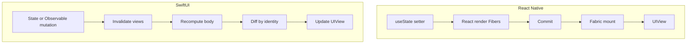

SwiftUI はしばしば「React だが、views が Swift で書かれている」と紹介されます。その説明は間違いではありませんが、`View` struct が update のたびに recreate されても `@State` を失わない理由、stable id のない `ForEach` が missing `key` と同じように rows を shuffle する理由、`.onAppear` が `useEffect([])` ではない理由、JavaScript では同じ pattern では起きない data-race を Swift の `async`/`await` が起こしうる理由を説明するには、圧縮されすぎています。

この stack は **Expo 経由で** React Native を ship します。この記事は、SwiftUI を読むときに使う mapping です。shipping diary ではありません。native の App Store app を前提としません。React Native を **React の host renderer** としてすでに理解していることを前提とします：Fibers、commit、Fabric、Yoga、そして gestures には遅すぎる JS thread。そのモデルは [React Native を深く理解する](/notes/understanding-react-native-in-depth) です。この記事は、その記事の終わりから始まります。native view tree はすでに理解しています。今度は React なしで書きます。

<br />

```text
RN:  setState → React render (Fibers) → commit → Fabric → UIView
SwiftUI: state mutation → invalidate body → value tree → diff by identity → UIView
```

<br />

サンプルは **iOS 17+** の Observation（`@Observable`、`@State`、`@Binding`、`@Environment`）と **Swift 6** の isolation（`MainActor`、`Task` cancellation）を対象とします。React Native のサンプルは sibling note の Expo SDK 57 line に合わせます：function components、hooks、`expo-router`。Combine の `ObservableObject` / `@ObservedObject` は一度だけ登場します。tutorials でまだ見る古い path です。

四種類の statement を区別します：

- **React Native contract**：`<View>` と `<Text>` が異なる host components であること、Fiber 上の `key` identity、など。
- **SwiftUI contract**：`View` が value description であること、`@State` が struct 上ではなく framework の identity slot に生きること、など。
- **Swift language rule**：assignment で structs が copy されること、`async` functions が hop するまで inherit した executor 上で走ること、など。
- **implementation observation**：`List` が `UICollectionView` を wrap すること、など。observations は stack traces を読む助けになります。application code は依存すべきではありません。

通底するのは小さな **notes list → detail** screen です：fetch、pull to refresh、detail route への push。中間セクションの snippets は mapping を証明する最小の pair です。セクション 13 で両方の stacks を一箇所に置きます。

<br />

---

## 1. この記事が扱うこと

React Native エンジニアはすでに正しい abstractions を持っています：views の tree、その tree を invalidate する state、layout、lazy lists、native stack、JavaScript を待てない gestures、cancellation 付きの async work。SwiftUI はそれぞれを別の runtime に remap します。

持ち越せるもの：

- **記述し、framework に host を更新させる。** JSX は elements を返します。`body` は `some View` を返します。どちらも画面上の `UIView` ではありません。
- **Identity が、どの state が生き残るかを決めます。** React は Fiber 上の type + `key` を使います。SwiftUI は structural position に加え、明示的な `id:` / `ForEach` ids を使います。
- **Lists は lazy、navigation は native、layout は別 pass です。** FlashList、`expo-router` の native stack、Yoga には SwiftUI の counterparts があります。同じ algorithms ではありません。

持ち越せないのは **runtime** です。Hermes もなく、Fabric shadow tree もなく、Yoga もなく、OTA で置き換えられる Metro bundle もありません。SwiftUI は IPA に compile されます。update loop は framework が所有する value-tree diff であり、React の render/commit ではありません。

この記事は Xcode、signing、App Store を歩きません。UIKit wrapping、The Composable Architecture、SwiftData、あるいは default の state path としての Combine も教えません。それらは後の記事か、別の仕事です。

<br />

---

## 2. Runtime は React ではない

React Native の loop は [React の render と commit](/notes/understanding-react-in-depth) に host renderer を足したものです。setter は work を schedule します。React は Fibers を reconcile します。Fabric は `UIView` instances を mount または update します。Yoga はすでに shadow tree を size しています。frame を落としてはいけない gestures は、その loop を離れ、Reanimated または Gesture Handler 経由で UI thread 上で走ります。

SwiftUI の loop には Fiber もなく、JS thread もなく、Yoga もありません。`View` は **value** です。view が読んだ state が変わると、SwiftUI はその view を invalidate し、新しい `body` を求め、新しい value tree を前のものと **identity で** diff し、下にある UIKit attributes を更新します。あなたが書いた `View` struct は画面上の object ではありません。recreate されるのは想定どおりで、安価です。

<br />



<br />

同じ見た目の嘘は、`body` が `render()` だということです。どちらも descriptions です。違いは ownership です。React は component instance ごとに Fiber を所有し、その上に Hooks を格納します。SwiftUI は identity map を所有し、そこに `@State` を格納します。あなたの struct はその map への input であり、instance ではありません。

implementation observation：SwiftUI は依然として UIKit の上に座っています（`UIView`、`UICollectionView`、`UINavigationController`）。`VStack` を書いたから別の pixels pipeline が手に入るわけではありません。手に入るのは別の **description language** と別の **identity/state** model です。「UIKit はない」と考えても、stack trace を読む助けにはなりません。

<br />

---

## 3. React Native エンジニアが踏む Swift の罠

JavaScript の values は primitives でなければ references です。object の field を mutate すると、すべての alias から見えます。`View` に置く data についての Swift の default は逆です：**`struct` は value** です。assignment は copy します。copy の mutation は original を変えません。

これは Swift language rule です。重要なのは、`View` が structs が adopt する protocol だからです。framework は安価な copies の上に建っており、長く生きる component instances の上ではありません。

<br />

```ts
type Note = { id: string; title: string }

const a: Note = { id: "1", title: "Draft" }
const b = a
b.title = "Published"
// a.title === "Published"
```

<br />

```swift
struct Note {
  var id: String
  var title: String
}

var a = Note(id: "1", title: "Draft")
var b = a
b.title = "Published"
// a.title == "Draft"
```

<br />

`class` は reference type です。二つの variables が同じ instance を指せます。`@Observable` models が classes なのは、store が共有され in place で mutate されなければならないからです。store を **読む** view は依然として struct です。

`let` vs `var` は TypeScript の `const` vs `let` ではありません。`let` は reassign できない name を bind します。`let` struct は properties を mutate できません。`let` class reference は別の instance を指せませんが、instance の `var` properties は依然として mutate できます。

Optionals（`String?`、`Note?`）は type であり、runtime の `undefined` ではありません。`== null` をチェックする代わりに unwrap します（`if let`、`guard let`、`??`）。SwiftUI は presentation に optionals を多用します：`.sheet(item:)` は `Binding<Item?>` を取り、non-nil のときに present します。

これはどれも UI ではありません。飛ばすと `@State` が immutable struct の魔法の mutation に見えます。そうではありません。property wrapper は SwiftUI の identity slot と話します。`body` で見る struct は、その slot を **project** する新しい value です。

<br />

---

## 4. View は Description であり、Component Instance ではない

function component は props（と Hook state）から React element への function です。SwiftUI view は **`View` に conform する struct** で、`body` を expose します。

<br />

```tsx
function NoteRow({ title }: { title: string }) {
  return (
    <View>
      <Text>{title}</Text>
    </View>
  )
}
```

<br />

```swift
struct NoteRow: View {
  let title: String

  var body: some View {
    Text(title)
  }
}
```

<br />

同じところ：どちらも **pure descriptions** です。`NoteRow` を呼ぶ / `NoteRow(title:)` を construct しても `UIView` は mount されません。framework が reconcile する value を produce します。

嘘になるところ：

- **`body` は computed property であり、あなたが呼ぶ function ではありません。** SwiftUI が呼びます。`body` 内の side effects は、React render 中の side effects と同じ class の bug です。
- **`some View` は opaque type です。** compiler は concrete な nested type（`Text`、あるいは `VStack<Text>`、あるいはあなたが compose したもの）を知っています。callers は知りません。`ReactElement` ではありません。`any View`（type erasure）でもありません。`AnyView` は存在し、identity と performance に cost します。`some View` を prefer してください。
- **`ViewBuilder` は result builder** です。array を返さずに `VStack { Text("A"); Text("B") }` と書ける compiler feature です。JSX は `jsx()` の syntax です。children の list は別の mechanism です。builder 内の `if` / `switch` は **structural identity を変えます**。それがセクション 5 です。

invalidation のたびに struct を recreate するのが要点です。「この setState を生き残った component instance」の equivalent はありません。安価な value、persistent な identity slot。

Xcode Previews は Fast Refresh ではありません。Fast Refresh は JS function を置き換え、Hook state を保とうとします。preview は canvas 内で view tree を re-instantiate します。有用です。delivery path は違います。

<br />

---

## 5. Identity は Fiber Identity ではない

React の公開 identity rule は type + position で、`key` が override します。[React を深く理解する](/notes/understanding-react-in-depth) が Fiber 版です。state は Fiber 上に生きます。key を変えると、React は新しい instance として扱います：state は reset されます。

SwiftUI の公開 identity rule は **structural identity**（view が `body` tree のどこに座るか）で、明示的な identity が override します：`ForEach` の `id`、`.id(_:)`、identifiable な navigation values。

`@State` は **struct 上に格納されません**。struct は copy されます。SwiftUI はその view の identity で key された slot に state を格納します。identity が stable なら、slot は新しい `body` を生き残ります。identity が変われば、slot は新しく、state は reset されます。二つの rows が identity を共有すると、slot も共有し、state が間違った row に「sticky」に見えます——duplicate `key` と同じ bug です。

<br />

```tsx
notes.map((note) => (
  <NoteRow key={note.id} title={note.title} />
))
```

<br />

```swift
ForEach(notes) { note in
  NoteRow(title: note.title)
}

// Note: Identifiable, or:
ForEach(notes, id: \.id) { note in
  NoteRow(title: note.title)
}
```

<br />

同じところ：**stable ids が state と animations を正しい row に保ちます。** index を id にするのは `key={index}` と同じ罠です。

嘘になるところ：

- **`ViewBuilder` 内の `if` / `else` は type-level の branch です。** SwiftUI は props が変わった一つの view ではなく、二つの異なる structural positions を見ます。各 branch は独自の identity を持ちます。React の conditional `return` は、同じ function を render していれば同じ component type のままです。SwiftUI の conditional `if` は `{condition ? <A /> : <B />}` を **keys なしで** 入れ替えるのに近く、ただし framework のほうが厳しいです。
- **`.id(newValue)` は新しい identity を強制します。** remount したいときに使います。keystroke のたびに誤って「form を reset」するために使ってはいけません。
- **range 付きの `ForEach`**（`ForEach(0..<count)`）は index identity です。ids 付きの data を prefer してください。

notes list はこれに依存します。row の `@State`（swipe offset、expanded flag）は `note.id` に従う必要があり、array 内の現在の index ではありません。

<br />

---

## 6. State

React の state は Fiber 上の Hook slot です。SwiftUI の state は identity 上の slot です。成り立つ mappings：

| 役割 | React Native | SwiftUI (iOS 17+) |
| --- | --- | --- |
| ローカル UI state | `useState` | `@State` |
| 制御される child | `value` + `onChange` | `@Binding` (`$state`) |
| 共有 screen model | module store, Context, Zustand | `@Observable` class, often owned with `@State`, passed or put in `Environment` |
| 読み取り専用の dependency | Context | `@Environment` / `@Environment(\.dismiss)` |

<br />

```tsx
function NoteEditor() {
  const [title, setTitle] = useState("")

  return (
    <TextInput value={title} onChangeText={setTitle} />
  )
}
```

<br />

```swift
struct NoteEditor: View {
  @State private var title = ""

  var body: some View {
    TextField("Title", text: $title)
  }
}
```

<br />

同じところ：ローカルな value、それを書く手段、変わったときの rebuild。`$title` は `Binding<String>` です——「value プラス setter」の SwiftUI 名です。`$title` を child に渡すのは lifting の逆です：parent が所有し、child が書き通します。

<br />

```tsx
function TitleField({
  value,
  onChange,
}: {
  value: string
  onChange: (next: string) => void
}) {
  return <TextInput value={value} onChangeText={onChange} />
}
```

<br />

```swift
struct TitleField: View {
  @Binding var title: String

  var body: some View {
    TextField("Title", text: $title)
  }
}
```

<br />

screen の notes array は、すべての row の `@State` に属しません。list と detail の両方が読む model に属します。その model は `@Observable` を付けた **class** です。view は `@State` でそれを **所有** するか（Observable instances に対する iOS 17 の rule）、受け取ります。

<br />

```swift
import Observation
import SwiftUI

@Observable
final class NotesStore {
  var notes: [Note] = []
  var isLoading = false
}

struct NotesListView: View {
  @State private var store = NotesStore()

  var body: some View {
    List(store.notes) { note in
      Text(note.title)
    }
  }
}
```

<br />

SwiftUI は `body` が **読んだ** properties を track します。`isLoading` を mutate しても、`notes` だけを読んだ view は invalidate しません。typical な React context value より細かいです。あちらでは store の tick がすべての consumer を re-render します。contexts を split するか select しない限り。

`@Environment(NotesStore.self)` は、props なしで store を下に渡す方法です。Context であり、Redux ではありません。reducer の requirement はありません。time-travel もありません。framework が持たない JS Flux の語彙を import しないでください。

**古い path、一段落。** Observation 以前の code は `ObservableObject`、`@Published`、`@StateObject`（owner）、`@ObservedObject`（child）を使います。それらの types は Combine の `objectWillChange` の上に座っています。samples ではまだ見ます。iOS 17+ の新しい code はそこから始めるべきではありません。`@StateObject` は `@State` ではありません。`@ObservedObject` は object を所有しません。parent が recreate すると reset されます。その ownership の区別が、ここで Observation + `@State` を teaching default にする理由です。

<br />

---

## 7. Layout は Yoga ではない

Yoga は flexbox です：`flexDirection`、`justifyContent`、`alignItems`、`flex: 1`、margins。React Native に CSSOM はありませんが、**algorithm** は依然として shadow tree 上の Yoga です。

SwiftUI の layout は **proposal protocol** です。parent が size を propose します。child が size を選びます（ignore しない限り、proposal を超えない）。parent が child を置きます。`HStack`、`VStack`、`ZStack` が三つの composition axes です。z-index 付きの `flexDirection: 'row' | 'column'` ではありません。`ZStack` は overlay であり、第三の flex direction ではありません。

<br />

```tsx
function NoteCard({
  title,
  excerpt,
}: {
  title: string
  excerpt: string
}) {
  return (
    <View style={styles.card}>
      <View style={styles.text}>
        <Text style={styles.title}>{title}</Text>
        <Text style={styles.excerpt}>{excerpt}</Text>
      </View>
    </View>
  )
}

const styles = StyleSheet.create({
  card: {
    flexDirection: "row",
    alignItems: "flex-start",
    gap: 12,
    padding: 16,
  },
  text: {
    flex: 1,
    gap: 4,
  },
  title: { fontWeight: "600" },
  excerpt: { opacity: 0.7 },
})
```

<br />

```swift
struct NoteCard: View {
  let title: String
  let excerpt: String

  var body: some View {
    HStack(alignment: .top, spacing: 12) {
      VStack(alignment: .leading, spacing: 4) {
        Text(title).font(.headline)
        Text(excerpt).foregroundStyle(.secondary)
      }
      Spacer()
    }
    .padding(16)
  }
}
```

<br />

同じところ：row、leading alignment、内側の column、padding。

嘘になるところ：

- **`Spacer()` は一般に、sibling の `flex: 1` ではありません。** stack の axis に沿って伸び、残りの proposed space を食べる view です。`HStack` では押し、`VStack` では垂直に押します。RN で text container に `flex: 1` を置くのは「この column が残りの width を取る」です。SwiftUI では多くの場合、その後の spacer ではなく、`VStack` 上の `.frame(maxWidth: .infinity, alignment: .leading)` です。snippet が `Spacer()` を使うのは、trailing edge に残った space の見た目を合わせるためです。
- **`.frame(width:height:)` は proposal、それから size です。** Yoga の `width` / `height` と常に同じではありません。`maxWidth: .infinity` は「parent が propose したものを取る」という意味です。
- **Safe area は default で on です。** SwiftUI はその内側に layout します。`.ignoresSafeArea()` で opt out します。RN の default `View` は inset **しません**。`SafeAreaView` か `useSafeAreaInsets()` を足します。defaults は逆です。
- **`StyleSheet` はありません。** modifiers（`.padding`、`.background`、`.clipShape`）が value を wrap します。順序が重要です：`.padding().background()` は `.background().padding()` ではありません。flat な style object より、nested Views に近いです。

どちらの stack でも、毎 frame `height` を animate しないでください。RN では Yoga と Fabric と戦います。SwiftUI では layout pass と戦います。native と同じく、transforms と opacity を prefer してください。

<br />

---

## 8. Lists

`FlatList` / FlashList は cells を recycle します。`ScrollView` + `map` はしません。RN contract は：長い data は virtualized list を通り、`keyExtractor` が identity です。

SwiftUI の `List` は lazy です。`List` 内の `ForEach` は lazy です。plain な `ScrollView` 内の `ForEach` は **lazy ではありません**。`LazyVStack` / `LazyHStack` に切り替えない限り。最後の文は、名前が違う FlashList versus `map` の会話です。

<br />

```tsx
<FlatList
  data={notes}
  keyExtractor={(item) => item.id}
  renderItem={({ item }) => <NoteRow title={item.title} />}
/>
```

<br />

```swift
List(notes) { note in
  NoteRow(title: note.title)
}

// Or:
ScrollView {
  LazyVStack {
    ForEach(notes) { note in
      NoteRow(title: note.title)
    }
  }
}
```

<br />

同じところ：data を入れ、row ごとの identity、row renderer、recycling。

嘘になるところ：

- **`List` は platform styling を連れてきます**（inset grouped、separators、swipe actions）。FlashList は空白の recycling surface です。custom feed が欲しいなら、`ScrollView` + `LazyVStack` のほうが `List` より FlashList に近いです。
- **row の `onAppear` は、row が realize されたときに発火します**。screen が mount したときではありません。それは viewability であり、list screen 上の `useEffect` ではありません。セクション 12。
- **Identity bugs は、間違った row が animate することとして現れます。** 直すのは animation ではなく `id` です。

Pull to refresh は list 上の `.refreshable` 対 `FlatList` 上の `RefreshControl` です。どちらも UI-thread の platform controls です。どちらも frames を block する形で JS/main thread 上で fetch すべきではありません——Swift には JS thread はありませんが、main actor 上の synchronous load は依然として UI を block します。

<br />

---

## 9. Navigation

`expo-router` は `app/` 下の files を **native** stack（`@react-navigation/native-stack`）に map します。URLs、deep links、layouts が Expo contract です。transition は依然として `UINavigationController` 上で走ります。

SwiftUI の `NavigationStack` も native stack です。自分で作らない限り URL tree ではありません。push する value が route です。`navigationDestination(for:)` が registrar です。

<br />

```tsx
// app/notes/_layout.tsx
import { Stack } from "expo-router"

export default function NotesLayout() {
  return <Stack />
}

// app/notes/index.tsx
import { useRouter } from "expo-router"
import { Pressable, Text } from "react-native"

function NoteLink({ id, title }: { id: string; title: string }) {
  const router = useRouter()
  return (
    <Pressable onPress={() => router.push(`/notes/${id}`)}>
      <Text>{title}</Text>
    </Pressable>
  )
}
```

<br />

```swift
NavigationStack {
  List(notes) { note in
    NavigationLink(value: note) {
      Text(note.title)
    }
  }
  .navigationDestination(for: Note.self) { note in
    NoteDetailView(note: note)
  }
}
```

<br />

`Note` は path 上に生きるために `Hashable`（そして通常は `Identifiable`）でなければなりません。

| 用途 | expo-router | SwiftUI |
| --- | --- | --- |
| Stack | `app/**/_layout.tsx` + `<Stack />` | `NavigationStack` |
| Push | `router.push('/notes/1')` | `NavigationLink(value:)` or `path.append` |
| 型付き screen | `app/notes/[id].tsx` | `.navigationDestination(for: Note.self)` |
| Modal | `presentation: 'modal'` | `.sheet(item:)` / `.fullScreenCover` |
| Dismiss | `router.back()` | `@Environment(\.dismiss)` |

<br />

同じところ：native stack、上に push された detail、stack push ではない sheet。

嘘になるところ：**file-system router はありません。** folder から typed routes は得られません。`NavigationPath` は encode できる untyped stack です。Deep linking は `onOpenURL` に自分の parsing、あるいは library です。`href` が architecture だと思わないでください。

これは routing tutorial ではありません。要点は、正しく使えば両方の stacks が transition を update loop の外に保つことです。RN の JS stack navigator は毎 frame React に再突入します。毎 frame `@State` を tick する custom SwiftUI transition は毎 frame `body` に再突入します。platform stack を prefer してください。

<br />

---

## 10. Gestures と Animation

React Native の JS thread は 60fps の pan には遅すぎます。New Architecture はそれを変えません。JS を待てない work は Reanimated worklets または Gesture Handler に属します。それらは UI thread 上で走り、C++ / native animated nodes に書き込みます。それが [React Native を深く理解する](/notes/understanding-react-native-in-depth) のセクション 14 です。

SwiftUI には **JS thread がありません**。`DragGesture`、`MagnifyGesture`、`withAnimation` はすでに UI process 内で走ります。指で view を動かすために worklet compiler は不要です。

それで SwiftUI の animation が Reanimated worklet と equivalent になるわけではありません。

<br />

```tsx
import { Gesture, GestureDetector } from "react-native-gesture-handler"
import Animated, {
  useAnimatedStyle,
  useSharedValue,
  withSpring,
} from "react-native-reanimated"

function SwipeRow() {
  const x = useSharedValue(0)
  const pan = Gesture.Pan()
    .onChange((event) => {
      x.value = event.translationX
    })
    .onEnd(() => {
      x.value = withSpring(0)
    })
  const style = useAnimatedStyle(() => ({
    transform: [{ translateX: x.value }],
  }))

  return (
    <GestureDetector gesture={pan}>
      <Animated.View style={style}>
        <Text>Note</Text>
      </Animated.View>
    </GestureDetector>
  )
}
```

<br />

```swift
struct SwipeRow: View {
  @State private var x: CGFloat = 0

  var body: some View {
    Text("Note")
      .offset(x: x)
      .gesture(
        DragGesture()
          .onChanged { value in
            x = value.translation.width
          }
          .onEnded { _ in
            withAnimation(.spring) { x = 0 }
          }
      )
  }
}
```

<br />

同じところ：pan が駆動する translation、spring で戻る。

嘘になるところ：

- **Reanimated の `x.value` は React render なしで update できます。** shared values は native-thread state です。SwiftUI の `x` は `@State` です。各 `onChanged` が view を invalidate し、`body` を再計算します。一行の offset なら問題ありません。`body` で本物の work をする views の graph では無料ではありません。worklet の analog は `withAnimation` ではありません。依然として「これを description pass の外に置け」です——UIKit、あるいは `Canvas`、あるいは tree 全体を再実行せずに SwiftUI が interpolate できる transaction を書く gesture。
- **`withAnimation` は、SwiftUI がすでに animatable-diff できる values を interpolate します**（frame、opacity、offset、一部の layout）。`useAnimatedStyle` ではありません。setter を wrap したからといって、`body` 内の任意の work が worklet になるわけではありません。

生き残る mapping：**gesture が JS bundle を待ってはいけないなら、すでに React Native の render loop を離れています。** SwiftUI ではその世界から始まります。それでも frames は失えます。失うのは Hermes を待つからではなく、`body` でやりすぎるからです。

<br />

---

## 11. Swift Concurrency と JavaScript Event Loop

JavaScript は single-threaded です。Promises と `async`/`await` は [event loop](/notes/javascript-event-loop-in-depth) 上の scheduling です：一つの call stack、microtask queue、task queue。二つの threads から JS object を data-race することはできません。それでも stale closures、逃した cleanups、UI が待っている間 busy な JS thread はありえます。

Swift は concurrent です。`async`/`await` は event loop ではありません。`async` function は suspend します。resume するとき、**別の executor** 上かもしれません。UIKit と SwiftUI の state は **main actor** に属します。fetch のために hop して離れ、`MainActor` に戻らず store を mutate するのは data race です。Swift 6 の compiler はしばしばそれを拒否します。その拒否を feature として扱ってください。

<br />

```tsx
useEffect(() => {
  const controller = new AbortController()

  async function load() {
    const next = await fetchNotes({ signal: controller.signal })
    setNotes(next)
  }

  void load()
  return () => controller.abort()
}, [])
```

<br />

```swift
.task {
  await store.load()
}

// Restart when the selected note changes — the dependency array:
.task(id: selectedId) {
  await store.loadDetail(id: selectedId)
}
```

<br />

```swift
@Observable
@MainActor
final class NotesStore {
  var notes: [Note] = []

  func load() async {
    let next = try? await fetchNotes()
    notes = next ?? []
  }
}
```

<br />

同じところ：view が active なときに async work を始め、そうでなければ cancel し、結果を screen state に置く。

嘘になるところ：

- **`.task` の cancellation は cooperative** で、`AbortController` に似ています。`URLSession` はそれを尊重します。tight な `for` loop は、`Task.isCancelled` をチェックしない限り尊重しません。abort せずに `useEffect` を抜けるのは同じ class の leak です。
- **`.task(id:)` は dependency array です。** id なしの `.task { }` は `useEffect(() => { ... }, [])` **に加えて** cancel-on-unmount に近いですが、「unmount」は Fiber が unmount することではなく、SwiftUI identity が消えることです。identity が flicker すると refetch します。それは正しい cancellation であり、謎の二重 fetch ではありません。
- **`actor` は mutable state を** serial mailbox に isolate します。`Mutex` ではなく、「JavaScript は single-threaded だから大丈夫」でもありません。background task が `body` の読む class を mutate するなら、isolation が必要です（store 上の `@MainActor` が通常の UI の選択です）。さもなければ、JS の mental model には見えない race があります。

`setTimeout(0)` は `Task { }` ではありません。`Task { }` は work を schedule します。存在しない microtask checkpoint を待ちません。`MainActor.run { }` は「UI actor へ hop する」であり、`queueMicrotask` ではありません。

<br />

---

## 12. Lifecycle は Mount ではない

`useEffect` は commit の後に走ります。`useEffect(() => { ... }, [])` は mount の後に走ります。cleanup は unmount の前、あるいは deps が変わったときの次の effect の前に走ります。それは React rule です。Fabric は device 上で commit を real にします。effect がいつ走るかは変えません。

SwiftUI の `.onAppear` / `.onDisappear` は Fiber mount ではなく、**rendered tree 内の identity** に従います。`List` row の `onAppear` は cell が realize されたときに発火します——scroll して外すと `onDisappear`、戻すと再び `onAppear`。それは screen-level の `useEffect([])` より `onViewableItemsChanged` に近いです。

`.task` のほうが良い loading primitive です：view が appear したときに始まり、view の identity が消えると cancel し、`.task(id:)` で restart できます。leak しやすい `onAppear { Task { ... } }` より prefer してください。

<br />

```tsx
useEffect(() => {
  void load()
}, [id])
```

<br />

```swift
.task(id: id) {
  await load(id: id)
}
```

<br />

同じところ：「この screen の inputs が active なら load し、そうでなければ止める。」

嘘になるところ：**`onAppear` は `componentDidMount` ではありません。** view を覆う sheet は歴史的に、「下でまだ mounted」と一致しない appear/disappear sequences を生み出してきました。app session の lifetime で一度だけ走る logic を `onAppear` に置かないでください。notes list では、list identity 上の `.task` で load し、detail identity 上の `.task(id: note.id)` で detail を load します。

`onDisappear` は、「Fiber が消えた」という意味での信頼できる「draft を save」hook ではありません。明示的な action から save するか、どの identity に結びつけるかを決めたうえで `.task` cancellation（`defer` / `try await` teardown）から save してください。

<br />

---

## 13. Notes List、両方の Stack

同じ product surface です。list を fetch し、pull to refresh し、detail を push し、body を load します。架空の例です。RN 側は Expo です。SwiftUI 側は Observation + `NavigationStack` です。

**React Native (expo-router)**

```tsx
// app/notes/_layout.tsx
import { Stack } from "expo-router"

export default function NotesLayout() {
  return <Stack />
}
```

<br />

```tsx
// app/notes/index.tsx
import { useCallback, useEffect, useState } from "react"
import {
  ActivityIndicator,
  FlatList,
  Pressable,
  RefreshControl,
  Text,
} from "react-native"
import { useRouter } from "expo-router"

type Note = { id: string; title: string }

async function fetchNotes(): Promise<Note[]> {
  const response = await fetch("https://example.com/notes")
  return response.json()
}

export default function NotesListScreen() {
  const router = useRouter()
  const [notes, setNotes] = useState<Note[]>([])
  const [refreshing, setRefreshing] = useState(false)
  const [loading, setLoading] = useState(true)

  const load = useCallback(async () => {
    const next = await fetchNotes()
    setNotes(next)
  }, [])

  useEffect(() => {
    void load().finally(() => setLoading(false))
  }, [load])

  if (loading) {
    return <ActivityIndicator />
  }

  return (
    <FlatList
      data={notes}
      keyExtractor={(item) => item.id}
      refreshControl={
        <RefreshControl
          refreshing={refreshing}
          onRefresh={async () => {
            setRefreshing(true)
            await load()
            setRefreshing(false)
          }}
        />
      }
      renderItem={({ item }) => (
        <Pressable onPress={() => router.push(`/notes/${item.id}`)}>
          <Text>{item.title}</Text>
        </Pressable>
      )}
    />
  )
}
```

<br />

```tsx
// app/notes/[id].tsx
import { useEffect, useState } from "react"
import { ActivityIndicator, Text } from "react-native"
import { useLocalSearchParams } from "expo-router"

type Note = { id: string; title: string; body: string }

async function fetchNote(id: string, signal: AbortSignal): Promise<Note> {
  const response = await fetch(`https://example.com/notes/${id}`, { signal })
  return response.json()
}

export default function NoteDetailScreen() {
  const { id } = useLocalSearchParams<{ id: string }>()
  const [note, setNote] = useState<Note | null>(null)

  useEffect(() => {
    const controller = new AbortController()
    void fetchNote(id, controller.signal)
      .then(setNote)
      .catch(() => {})
    return () => controller.abort()
  }, [id])

  if (!note) {
    return <ActivityIndicator />
  }

  return <Text>{note.body}</Text>
}
```

<br />

**SwiftUI**

<br />

```swift
import Observation
import SwiftUI

struct Note: Identifiable, Hashable {
  let id: String
  var title: String
  var body: String
}

@Observable
@MainActor
final class NotesStore {
  var notes: [Note] = []
  var isLoading = false

  func load() async {
    isLoading = true
    defer { isLoading = false }
    notes = (try? await fetchNotes()) ?? []
  }

  func loadDetail(id: String) async -> Note? {
    try? await fetchNote(id: id)
  }
}

struct NotesListView: View {
  @State private var store = NotesStore()

  var body: some View {
    NavigationStack {
      Group {
        if store.isLoading && store.notes.isEmpty {
          ProgressView()
        } else {
          List(store.notes) { note in
            NavigationLink(value: note) {
              Text(note.title)
            }
          }
          .refreshable { await store.load() }
        }
      }
      .navigationDestination(for: Note.self) { note in
        NoteDetailView(note: note, store: store)
      }
      .task { await store.load() }
    }
  }
}

struct NoteDetailView: View {
  let note: Note
  var store: NotesStore
  @State private var bodyText: String?

  var body: some View {
    Group {
      if let bodyText {
        Text(bodyText)
      } else {
        ProgressView()
      }
    }
    .navigationTitle(note.title)
    .task(id: note.id) {
      bodyText = await store.loadDetail(id: note.id)?.body
    }
  }
}
```

<br />

この pair を二つの tutorials ではなく、一つの mapping として読んでください：

- **Identity：** `keyExtractor` / `note.id` vs path 上の `Identifiable` / `Hashable`。
- **Ownership：** screen 上の `useState` vs `@Observable` store を所有する `@State`。
- **Load + cancel：** `useEffect` + `AbortController` vs `.task` / `.task(id:)`。
- **Refresh：** `RefreshControl` vs `.refreshable`。
- **Push：** `router.push(\`/notes/${id}\`)` vs `NavigationLink(value:)` + `navigationDestination`。

SwiftUI の detail は、list がすでに `Note` を持っていても、依然として fetch します。それは意図的です。list row は完全な document ではありません。RN の detail も同じです。navigation value として `Note` 全体を渡すのは `title` のための convenience であり、cache policy ではありません。

<br />

---

## 14. Analogy が壊れるところ

上の mappings は、等式として扱われるまでは有用です。

**`View` は value です。function component は Fiber 上の function です。** struct を recreate することは remount ではありません。`@State` が生き残るのは identity のおかげであり、struct が長く生きるからではありません。「component instance」と考えると、copies と戦い、`body` を誤読します。

**Yoga も `StyleSheet` もありません。** proposed sizes と modifier の順序が flexbox と style objects を置き換えます。`Spacer` は `flex: 1` ではありません。safe area の defaults は逆です。

**JS thread もなく、OTA JavaScript もありません。** Reanimated が存在するのは Hermes が遅すぎるからです。SwiftUI の gestures は UI process から始まります。それでも `body` を stall できます。新しい SwiftUI screen は新しい binary です。EAS Update は `NotesListView` を置き換えられません。store build が tree **そのもの** です。それは、固定された native contract の内側で JS 形の updates をする Expo の逆です。

**Navigation は URL tree ではありません。** `expo-router` は file routes を product feature にします。`NavigationStack` は value path を product feature にします。その上に URLs を作れます。framework はそこから始まりません。

**`async`/`await` は event loop ではありません。** single-threaded な JS は同じ object の二つの mutations を race できません。Swift はできます。store 上の `@MainActor` はペダンティックではありません。`.task` の cancellation は identity 形であり、Fiber 形ではありません。

**`.onAppear` は mount ではありません。** lazy lists、sheets、identity の変化は、screen component 上の `useEffect([])` より頻繁にそれを呼びます。

sample の初読では analogy を保ってください。view が state を reset したり、二度 refetch したり、間違った row を animate したりしたら捨ててください。そのときの問いは SwiftUI のものです：**identity は何か、`body` は何を読んだか、どの actor が mutation を所有するか？** 「どの Fiber が commit したか」ではありません。
